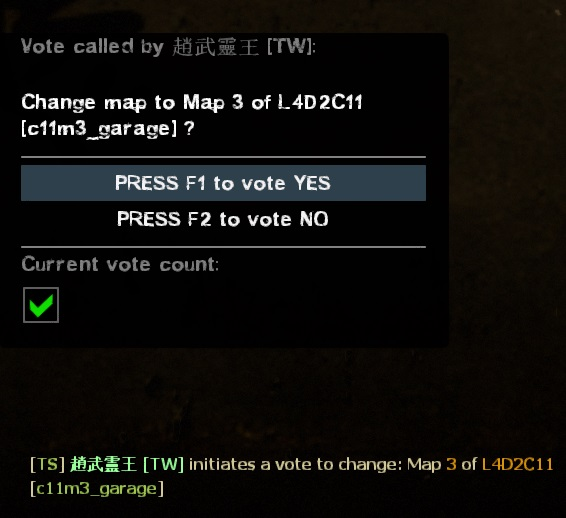
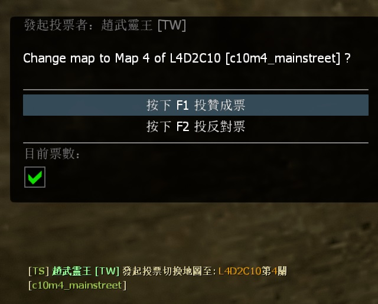

# Description | 內容
Reads all available custom campaigns and display all available missions in menu, provide for admin to change map directly or for player to call vote to change map

> __Note__ <br/>
This plugin is private, Please contact [me](https://github.com/fbef0102/Game-Private_Plugin#私人插件列表-private-plugins-list)<br/>
此為私人插件, 請聯繫[本人](https://github.com/fbef0102/Game-Private_Plugin#私人插件列表-private-plugins-list)<br/>
🟥Dedicated Server Only<br/>
🟥只能安裝在Dedicated Server

* Video | 影片展示
<br/>None

* <details><summary>Image</summary>

	* (Admin) !admin -> Server Commands -> "List of Maps"
	<br/>
	<br/>
	* (Player) !maplist -> call a vote to change map.
	<br/>
</details>

* <details><summary>How does it work?</summary>

	* Admin types !admin -> Server Commands -> "List of Maps" -> choose map -> server change map immediately
	* Player types !maplist -> call a vote to change map.
	* Automatically add all official maps and custom maps to menu list, no need to add map manually.
</details>

* <details><summary>Notice</summary>

  * It require some time to initialize map list at first time server launch. (20 - 60 sec, and < 2 sec. next times)
  * Plugin auto-generates the following files, please **DO NOT modify**
      * data\l4d_all_missions_list_coop.txt
      * data\l4d_all_missions_list_scavenge.txt
      * data\l4d_all_missions_list_survival.txt
      * data\l4d_all_missions_list_versus.txt
</details>

* Require | 必要安裝
	1. [left4dhooks](https://forums.alliedmods.net/showthread.php?t=321696)
	2. [[INC] Multi Colors](https://github.com/fbef0102/L4D1_2-Plugins/releases/tag/Multi-Colors)
	3. [builtinvotes](https://github.com/fbef0102/Game-Private_Plugin/releases/tag/builtinvotes)
	4. [[INC] localizer](https://github.com/dragokas/SM-Localizer/blob/master/localizer.inc)

* <details><summary>ConVar | 指令</summary>

	* cfg/sourcemod/l4d_all_missions_list.cfg
		```php
        // Delay to start another a vote after vote ends.
        l4d_all_missions_list_vote_delay "60"

        // If 1, player can use comamnd !maplist and call a vote to change map.
        l4d_all_missions_list_vote_enable "1"

        // Numbers of real survivor and infected player required to start a vote to change map.
        l4d_all_missions_list_vote_required "2"
		```
</details>

* <details><summary>Command | 命令</summary>
    
	* **Display mission list and vote to change map**
		```php
		sm_maplist
		```

	* **Update mission list manually (Adm required: ADMFLAG_BAN)**
		```php
		sm_mission_list_update
		```
</details>

* Apply to | 適用於
    ```
    L4D1
    L4D2
    ```

* <details><summary>Translation Support | 支援翻譯</summary>

	```
	English
	繁體中文
	简体中文
	```
</details>

* Related Plugin | 相關插件
	1. [l4d_restartmap_command](https://github.com/fbef0102/Game-Private_Plugin/tree/main/Plugin_%E6%8F%92%E4%BB%B6/Map_%E9%97%9C%E5%8D%A1/l4d_restartmap_command): Admin say !restartmap to restart current map + Force of restartmap after Quantity of rounds (tries) events survivors wipe out
    	> 管理員輸入!restartmap能重新地圖關卡 + 滅團N次後重新地圖

* <details><summary>Changelog | 版本日誌</summary>

    * v1.1 (2023-7-8)
        * Add vote system, non-admin players can use command to view mission list and call a vote to change map.

    * v1.0 (2023-7-5)
        * Initial Release
</details>

- - - -
# 中文說明
自動讀取官方地圖與所有三方地圖，並將關卡顯示在列表上，供管理員換圖用或者普通玩家投票換圖

* <details><summary>圖示</summary>

	<br/>
	<br/>
    <br/>
</details>

* 原理
    * 管理員輸入!admin -> 伺服器指令 -> "地圖列表"，即可出現所有地圖與關卡表
      * 管理員選擇關卡之後，立刻換圖
    * 玩家輸入!maplist -> 即可出現所有地圖與關卡表
      * 選擇關卡之後，發起投票換圖

* 功能
	* 自動新增三方圖的地圖與關卡，無須手動新增

* 注意事項
    1. <details><summary>安裝此插件之後</summary>

        * 第一次啟動伺服器時，插件需要花30~60秒讀取分析地圖，因此伺服器卡住是正常的現象，請等待插件跑完
        * 安裝上這個插件並啟動伺服器之後，伺服器會自動產生以下檔案
            * data\l4d_all_missions_list_coop.txt
            * data\l4d_all_missions_list_scavenge.txt
            * data\l4d_all_missions_list_survival.txt
            * data\l4d_all_missions_list_versus.txt
    </details>

    2. <details><summary>安裝新的三方圖</summary>

        * 每當安裝三方圖時，left4dead2\addons\sourcemod\data\內的文件內容會有變化，自動新增三方圖的地圖與關卡
        * 反之，每當移除三方圖時，自動移除三方圖的地圖與關卡
            * data\l4d_all_missions_list_coop.txt
            * data\l4d_all_missions_list_scavenge.txt
            * data\l4d_all_missions_list_survival.txt
            * data\l4d_all_missions_list_versus.txt
    </details>