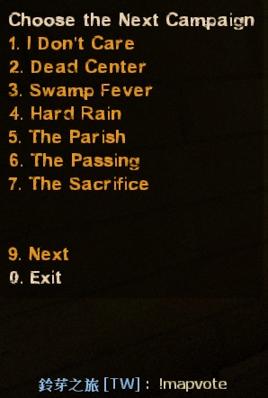
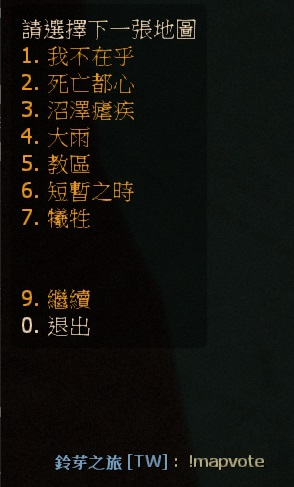

# Description | 內容
Force change to next mission when current mission(final stage) end + Force change to next level when survivors wipe out + Vote to next map (Apply to Versus/Survival/Scavenge).

* Video | 影片展示
<br/>None

* Image
	* Force to change next map when survivors wipe out
	<br/>
	* Vote to next map (including custom map) when survivors leave the saferoom
	* Automatic parsing of custom maps vpk files - no need to add map names manually
	<br/>
	* Switching to the vote winner
	<br/>

* Apply to | 適用於
    ```
    L4D2 coop/survival/versus/realism/scavenge
    ```

* Translation Support | 支援翻譯
	```
	English
	繁體中文
	简体中文
	```

* <details><summary>Changelog | 版本日誌</summary>

	```php
	//Dionys @ 2008~2009
	//Harry @ 2019~2023
	```
    * v1.1h (2023-4-18)
        * Optimize code
		* Fixed next map not working in custom final maps

    * v1.0h (2023-4-17)
		* Support Scavenge Mode. After scavenge match ends, force to change next map
		* Player can vote the next map in survival/scavenge or next campaign in coop/versus
		* Require l4d2_mission_manager

    * v2.6 (2023-3-30)
		* [Old Version](https://github.com/fbef0102/L4D1_2-Plugins/tree/master/sm_l4d_mapchanger)
</details>

* Require | 必要安裝
	1. [left4dhooks](https://forums.alliedmods.net/showthread.php?t=321696)
	2. [[INC] Multi Colors](https://github.com/fbef0102/L4D1_2-Plugins/releases/tag/Multi-Colors)
	3. [l4d2_mission_manager](https://github.com/fbef0102/L4D2-Plugins/tree/master/l4d2_mission_manager)

* Related Plugin | 相關插件
	1. [l4d_restartmap_command](https://github.com/fbef0102/Game-Private_Plugin/tree/main/Plugin_%E6%8F%92%E4%BB%B6/Map_%E9%97%9C%E5%8D%A1/l4d_restartmap_command): Admin say !restartmap to restart current map + Force of restartmap after Quantity of rounds (tries) events survivors wipe out
    	> 管理員輸入!restartmap能重新地圖關卡 + 滅團N次後重新地圖

	2. [l4d_random_map_vote](https://github.com/fbef0102/Game-Private_Plugin/tree/main/Plugin_%E6%8F%92%E4%BB%B6/Map_%E9%97%9C%E5%8D%A1/l4d_random_map_vote):Vote to change map, the map is chosen randomly from data
    	> 投票更換地圖，但是地圖是隨機挑選的

* <details><summary>ConVar | 指令</summary>

	* cfg\sourcemod\sm_l4d_mapchanger.cfg
		```php
		// Enables next mission and how many chances left to advertise to players.
		sm_l4d_fmc_announce "1"

		// Quantity of rounds (tries) events survivors wipe out before force of changelevel on final maps in coop/realism (0=Off)
		sm_l4d_fmc_crec_coop_final "3"

		// Quantity of rounds (tries) events survivors wipe out before force of changelevel on non-final maps in coop/realism (0=Off)
		sm_l4d_fmc_crec_coop_map "3"

		// Quantity of rounds (tries) events survivors wipe out before force of changelevel in survival. (0=Off)
		sm_l4d_fmc_crec_survival_map "5"

		// Mission for change by default on final map in coop/realism.
		// Empty=Use configs/missioncycle.coop.txt map order
		sm_l4d_fmc_def_coop ""

		// Map for change by default in scavenge.
		// Empty=Use configs/missioncycle.scavenge.txt map order
		sm_l4d_fmc_def_scavenge "c14m1_junkyard"

		// Map for change by default in survival.
		// Empty=Use configs/missioncycle.survival.txt map order
		sm_l4d_fmc_def_survival "c5m5_bridge"

		// Mission for change by default on final map in versus.
		// Empty=Use configs/missioncycle.versus.txt map order
		sm_l4d_fmc_def_versus ""

		// After final rescue vehicle leaving, delay before force of changelevel in coop/realism. (0=Don't force to change map)
		sm_l4d_fmc_delay_coop_final "15.0"

		// After scavenge match ends, delay before force of changelevel in scavenge. (0=Don't force to change map)
		sm_l4d_fmc_delay_scavenge "15.0"

		// After quantity of survival rounds (tries), delay before force of changelevel in survival. (0=Don't force to change map)
		sm_l4d_fmc_delay_survival "15.0"

		// After final map finishes, delay before force of changelevel in versus. (0=Don't force to change map)
		sm_l4d_fmc_delay_vs "13.0"

		// Time in seconds between advertisements for the next campaign/map on finales and scavenge maps. (0=Off)
		sm_l4d_fmc_next_map_ad_interval "120.0"

		// How the next campaign/map is advertised during a finale or scavenge map [0 = DISABLED, 1 = HINT TEXT, 2 = CHAT TEXT]
		sm_l4d_fmc_next_map_ad_mode "2"

		// If 1, Excludes current map(s) from the map voting menu
		sm_l4d_fmc_next_map_menu_excludes "1"

		// Controls the maps shown in the next map voting menu [0 = Official and addon maps, 1 = Official maps only, 2 = Depending on the type of the current map ]
		sm_l4d_fmc_next_map_menu_options "0"

		// Controls the order of maps shown in the next map voting menu [0 = Official then addon maps, 1 = Random]
		sm_l4d_fmc_next_map_menu_order "0"

		// If 1, The server automatically switch to the first available official map when no one is playing a 3-rd map
		sm_l4d_fmc_prevent_empty_server "1"

		// Time in seconds to wait after survivors leave the start area to advertise voting system. (0=Off)
		sm_l4d_fmc_voting_ad_delay_time "10.0"

		// If 1, Enables players to vote for the next map or campaign.
		sm_l4d_fmc_voting_system_enabled "1"
		```
</details>

* <details><summary>Command | 命令</summary>
    
   * **Display Next Map**
		```php
		sm_fmc_nextmap
		sm_fmc
		```

   * **Vote the next map**
		```php
		sm_mapvote
		```

   * **See all the votes**
		```php
		sm_mapvotes
		```
</details>

* Example Config
	* data\sm_l4d_mapchanger.txt
		```php
		"ForceMissionChangerSettings"
		{
			"c8m5_rooftop" // current map
			{
				"next mission map" "c9m2_lots"   // <-- next campaign in coop/versus/realism
				"next mission name" "L4D2C9"  	// <-- Translation phase in maps.phrases.txt or missions.phrases.txt
				
				"survival_nextmap" "c1m2_streets"	// <-- next map in survival mode
				"survival_nextname" "c1m2_streets" 	// <-- Translation phase in maps.phrases.txt or missions.phrases.txt

				"scavenge_nextmap" "c2m1_highway" // <-- next map in scavenge mode
				"scavenge_nextname" "c2m1_highway" // <-- Translation phase in maps.phrases.txt or missions.phrases.txt
			}
		} 
		```

	* configs\finale.coop.txt.txt
		```php
		// The following maps will be treated as finale maps in Coop/Versus/Realism mode mode. Example: c1m1_hotel. Do not delete this line!
		l4d2_deathcraft_05_lighthouse
		l4d2_minecraft_evolution
		```

- - - -
# 中文說明
最後一關結束時自動換圖 + 滅團N次後自動切換到下一個關卡 + 玩家投票下一張地圖 (生存/對抗/清道夫模式也適用)

* 圖示
	* 自動切換到下一張地圖
	<br/>
	* 投票選擇下一張地圖 (會自動顯示所有地圖包括三方圖)
	<br/>
	* 最高票的地圖當選為下一張地圖
	<br/>

* 原理
    * 戰役/寫實模式中當倖存者滅團超過N次時，自動切換到下一個關卡
		* 適合用在非常多特效與高難度的戰役伺服器，避免一直卡在同一個關卡，玩家也會疲勞
	* 戰役/寫實模式中最後一關當倖存者滅團超過N次時或成功通關時，自動切換到下一張地圖
	* 對抗模式中最後一關當雙方回合結束之時，自動切換到下一張地圖
    * 生存模式中當倖存者滅團超過N次時，自動切換到下一張地圖
    * 清道夫模式中當比賽結束時，自動切換到下一張地圖
	* 遊戲開始之後自動出現投票菜單，玩家可以投票決定下一張地圖
		* 戰役/對抗/寫實模式最後一關出安全室之後
		* 生存模式計時開始之後
		* 清道夫模式計時開始之後

* 功能
	* 可設定滅團的次數，請查看指令
	* 自動新增三方圖的關卡與地圖名，無須手動新增
	* 玩家可以輸入!mapvote投票決定下一張地圖
	* 可設定文件```data\sm_l4d_mapchanger.txt```決定切換到哪一張地圖
	* 可設定文件```configs\finale.coop.txt.txt```決定哪些關卡為最終章節
	* 可設定三方圖沒有人時，自動換回官方圖

* 文件設定
	* data\sm_l4d_mapchanger.txt
		```php
		"ForceMissionChangerSettings"
		{
			"c8m5_rooftop" // 當前地圖
			{
				"next mission map" "c9m2_lots"   // <-- 戰役/對抗/寫實模式 下一張地圖名 (也可以寫三方圖)
				"next mission name" "L4D2C9"  	// <-- 對應maps.phrases.txt或missions.phrases.txt裡面的翻譯句子，沒有寫翻譯則直接顯示L4D2C9
				
				"survival_nextmap" "c1m2_streets"	// <-- 生存模式 下一張地圖名 (也可以寫三方圖)
				"survival_nextname" "c1m2_streets" // <-- 對應maps.phrases.txt或missions.phrases.txt裡面的翻譯句子，沒有寫翻譯則直接顯示c1m2_streets

				"scavenge_nextmap" "c2m1_highway" // <-- 清道夫模式　下一關的地圖名 (也可以寫三方圖)
				"scavenge_nextname" "c2m1_highway" // <-- 對應maps.phrases.txt或missions.phrases.txt裡面的翻譯句子，沒有寫翻譯則直接顯示c2m1_highway
			}

			// 沒有寫地圖名的其他關卡，則
			// 戰役/寫實模式 下一張地圖是: sm_l4d_fmc_def_coop 所寫的地圖，如指令沒有寫地圖則依照configs\missioncycle.coop.txt的地圖順序
			// 對抗模式 下一張地圖是: sm_l4d_fmc_def_versus 所寫的地圖，如指令沒有寫地圖則依照configs\missioncycle.versus.txt的地圖順序
			// 生存模式 下一張地圖是: sm_l4d_fmc_def_survival 所寫的地圖，如指令沒有寫地圖則依照configs\missioncycle.survival.txt的地圖順序
			// 清道夫模式 下一張地圖是: sm_l4d_fmc_def_scavenge 所寫的地圖，如指令沒有寫地圖則依照configs\missioncycle.scavenge.txt的地圖順序
		} 
		```

	* configs\finale.coop.txt.txt
		```php
		// 戰役/對抗/寫實模式下 這些關卡將視為最終章節，在這些章節可以投票與自動換圖
		// 避免一堆垃圾三方圖明明是救援關卡卻不是最後的章節
		l4d2_deathcraft_05_lighthouse
		l4d2_minecraft_evolution
		```

* 注意事項
    1. <details><summary>安裝此插件之後</summary>

        * 安裝上這個插件並啟動伺服器之後，伺服器會自動產生以下檔案
            * configs\missioncycle.coop.txt
            * configs\missioncycle.scavenge.txt
            * configs\missioncycle.survival.txt
            * configs\missioncycle.versus.txt
            * configs\finale.coop.txt
    </details>

    2. <details><summary>安裝新的三方圖</summary>

        * 每當安裝新的三方圖時，left4dead2\addons\sourcemod\configs\內的文件內容會有變化，自動新增三方圖的關卡與地圖名
            * configs\missioncycle.coop.txt
            * configs\missioncycle.scavenge.txt
            * configs\missioncycle.survival.txt
            * configs\missioncycle.versus.txt
    </details>

    3. <details><summary>刪除三方圖</summary>

        * 每次刪除三方圖檔案的時候，我建議關閉伺服器然後刪除以下檔案
            * configs\missioncycle.coop.txt
            * configs\missioncycle.scavenge.txt
            * configs\missioncycle.survival.txt
            * configs\missioncycle.versus.txt
        * 再重新啟動服務器，如果不這麼做那也沒關係
    </details>

* FAQ
    1. <details><summary>能否修改地圖順序?</summary>

        * 可以更動以下檔案的內容，改變地圖順序
            * configs\missioncycle.coop.txt
            * configs\missioncycle.scavenge.txt
            * configs\missioncycle.survival.txt
            * configs\missioncycle.versus.txt
    </details>