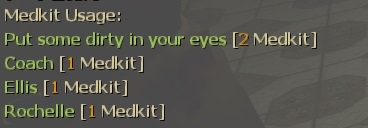

# Description | 內容
Report Personal Medkit Status when player used Medkits

> __Note__ <br/>
This plugin is private, Please contact [me](https://github.com/fbef0102/Game-Private_Plugin#私人插件列表-private-plugins-list)<br/>
此為私人插件, 請聯繫[本人](https://github.com/fbef0102/Game-Private_Plugin#私人插件列表-private-plugins-list)

* Video | 影片展示
<br/>None

* Image | 圖示
	* Display message
		> 顯示訊息
		<br/>

	* All Player Medkit Status
		> 所有玩家的治療包使用量
		<br/>

* Apply to | 適用於
	```
	L4D1 
	L4D2
	```

* <details><summary>Changelog | 版本日誌</summary>

	* v1.0 (2022-12-23)
		* Request by GGM
		* Initial Release
</details>

* Require | 必要安裝
	1. [left4dhooks](https://forums.alliedmods.net/showthread.php?t=321696)
	2. [[INC] Multi Colors](https://forums.alliedmods.net/showthread.php?t=247770)

* <details><summary>ConVar | 指令</summary>

	* cfg/sourcemod/l4d_saferom_prevent_kit.cfg
		```php
		// Changes how message displays. (0: Disable, 1:In chat, 2: In Hint Box, 3: In center text)
		l4d_medkit_status_announce_type "1"

		// Display message to Which player. (1=Person doing the healing, 2=Person being healed, 3=Both)
		l4d_medkit_status_display_player "1"

		// 0=Plugin off, 1=Plugin on.
		l4d_medkit_status_enable "1"

		// If 1, start to count medkit used once survivors leaving saferoom or survival begins (0=Always count)
		l4d_medkit_status_game_start_enable "1"

		// Reset all players data when 0=Map Change, 1=Next New Round, 2=Next Game starts/Survival begins.
		l4d_medkit_status_reset_when "2"
		```
</details>

* <details><summary>Command | 命令</summary>
	
	* **Display All Medkits Stats.**
		```php
		sm_med
		```
</details>

- - - -
# 中文說明
使用治療包時提示個人的治療包使用數量與狀態

* 原理
	* 顯示目前為止使用的治療包數量以及距離上一次使用治療包的時間
	* 倖存者Bot也有
	* 即使玩家離線仍然保留數據

* 功能
	* 輸入!med顯示所有人的治療包使用數量
	* 可設置遊戲開始後才計算治療包使用狀態
		* 離開安全室或生存模式計時開始
	* 可設置何時清除數據