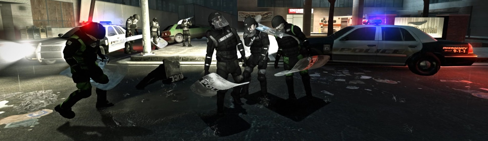

# Description | 內容
You can get shield by killing tank/witch or shield dropped by riot uncommon infected

> __Note__ <br/>
This plugin is private, Please contact [me](https://github.com/fbef0102/Game-Private_Plugin#私人插件列表-private-plugins-list)<br/>
此為私人插件, 請聯繫[本人](https://github.com/fbef0102/Game-Private_Plugin#私人插件列表-private-plugins-list)

* [Video | 影片展示](https://youtu.be/BiTti6O-Gd8)

* <details><summary>Image | 圖示</summary>

	* Shield Weapons
    <br/>
    <br/>
    <br/>
    <br/>
    <br/>
</details>

* Apply to | 適用於
    ```
    L4D2
    ```

* Translation Support | 支援翻譯
	```
	English
	繁體中文
	简体中文
	```

* <details><summary>Changelog | 版本日誌</summary>

	```php
	//panxiaohai @ 2013
	//HarryPotter @ 2023
	```
    * v1.0h (2023-6-25)
		* Remake code, convert code to latest syntax
		* Fix warnings when compiling on SourceMod 1.11.
		* Optimize code and improve performance
		* Translation Support
        * Shield Damage to CI, SI, Tank and Witch by shoving
        * Attach shield model to Riot uncommon infected and drop shield when killed
        * Attach shield model to Tank and drop shield when tank dies
        * Add commands to drop the shield, adm can give a shield
        * Add Shield Glow Color on the ground
        * Allows shoving to stagger chargers, tanks, witches when survivor has shield on hand
        * Customize weapons and melee being equipped with shield.
        * Display shield model on player's back
        * Shield drops when survivor dies
        * Players can take shield to next level in coop/realism mode.

    * v1.3
	    * [Original Plugin By panxiaohai](https://forums.alliedmods.net/showthread.php?p=2006157)
</details>

* Require | 必要安裝
	1. [left4dhooks](https://forums.alliedmods.net/showthread.php?t=321696)
	2. [[INC] Multi Colors](https://github.com/fbef0102/L4D1_2-Plugins/releases/tag/Multi-Colors)
	3. [ThirdPersonShoulder_Detect](https://forums.alliedmods.net/showthread.php?t=298649)

* Related Plugin | 相關插件
	1. [l4d2_spawn_uncommons](/Plugin_插件/Common_Infected_普通感染者/l4d2_spawn_uncommons): Spawn Uncommon Infected on all maps (Support The Last Stand New Model)
		> 所有地圖上可生成特殊一般感染者，有鎮暴警察、CEDA人員、小丑、泥人、工人、吉米賽車手、墮落倖存者

* <details><summary>ConVar | 指令</summary>

    * cfg/sourcemod/l4d2_shield_equip.cfg
        ```php
        // If 1, Allows shoving to stagger chargers when survivor has shield on hand
        l4d2_shield_equip_charger_stagger "1"

        // Shield Glow Color, three values between 0-255 separated by spaces. RGB Color255 - Red Green Blue.
        l4d2_shield_equip_color "150 150 150"

        // Decrease survivor's damage taken from common infected by [0.0, 100.0]% (100=No Dmg)
        l4d2_shield_equip_damage_from_ci "100.0"

        // Decrease survivor's damage taken from special infected by [0.0, 100.0]% (100=No Dmg)
        l4d2_shield_equip_damage_from_si "50.0"

        // Decrease survivor's damage taken from tank by [0.0, 100.0]% (100=No Dmg)
        l4d2_shield_equip_damage_from_tank "50.0"

        // Decrease survivor's damage taken from witch by [0.0, 100.0]% (100=No Dmg)
        l4d2_shield_equip_damage_from_witch "50.0"

        // Damage to common infected by shoving when survivor has shield on hand (0=Off)
        l4d2_shield_equip_damage_to_ci "30"

        // Damage to special infected by shoving when survivor has shield on hand (0=Off)
        l4d2_shield_equip_damage_to_si "100"

        // Damage to tank by shoving when survivor has shield on hand (0=Off)
        l4d2_shield_equip_damage_to_tank "300"

        // Damage to witch by shoving when survivor has shield on hand (0=Off)
        l4d2_shield_equip_damage_to_witch "200"

        // If survivor has shield, chance that shield dropped when player dies [0-100]%
        l4d2_shield_equip_death_chance "100"

        // If 1, Allow dual pistol being equipped with shield
        // (l4d2_shield_equip_weapon must contains 1)
        l4d2_shield_equip_dual_pistol "1"

        // 0=Plugin off, 1=Plugin on.
        l4d2_shield_equip_enable "1"

        // If 1, Enable shield glow when shield is on the ground
        l4d2_shield_equip_glow "1"

        // Time in seconds to remove the shield on ground if no one picks up after it drops
        l4d2_shield_equip_ground_life "30"

        // Empty string to allow all. Allow these melee weapons being equipped with shield, separate by commas (no spaces). See plugin source code for more details.
        // (l4d2_shield_equip_weapon must contains 21)
        l4d2_shield_equip_melee "fireaxe,frying_pan,machete,baseball_bat,crowbar,cricket_bat,tonfa,katana,electric_guitar,knife,golfclub,pitchfork,shovel"

        // How near to Shield do players need to be to enable their glow. (0=Any distance)
        l4d2_shield_equip_range "150"

        // Chance that riot uncommon infected would bring the shield and drop shield when killed [0-100]%
        l4d2_shield_equip_riot_chance "20"

        // Scale the shield model in riot uncommon infected. (Default: 1.2)
        l4d2_shield_equip_riot_scale "1.2"

        // How to show shield on first person view. 1=When Take damage, 2=When Press E button, 4=Shove, 7=All (0=Always)
        l4d2_shield_equip_show_type "0"

        // Scale the shield model in survivor. (Default: 1.2)
        l4d2_shield_equip_survivor_scale "1.2"

        // Chance that tank would bring the shield and drop shield when tank dies [0.0, 100.0]%
        l4d2_shield_equip_tank_chance "30"

        // Scale the shield model in tank. (Default: 1.2)
        l4d2_shield_equip_tank_scale "1.2"

        // If 1, Allows shoving to stagger tanks when survivor has shield on hand
        l4d2_shield_equip_tank_stagger "1"

        // Players with these flags have access to use !shield command to get a shield. (Empty = Everyone, -1: Nobody)
        l4d2_shield_equip_use_command_flag "z"

        // Empty string to allow all. Allow these weapon IDs being equipped with shield, separate by commas (no spaces). See plugin source code for more details.
        l4d2_shield_equip_weapon "1,2,14,20,21"

        // Chance that shield drops when witch dies [0.0, 100.0]%
        l4d2_shield_equip_witch_chance "40"

        // If 1, Allows shoving to stagger witch when survivor has shield on hand
        l4d2_shield_equip_witch_stagger "1"
        ```
</details>

* <details><summary>Command | 命令</summary>
	
	* **Give/Remove a shield**
		```php
		sm_shield
		```

	* **Drop your shield**
		```php
		sm_dropshield
		```

	* **Give Player a shield (Adm Require: ADMFLAG_ROOT)**
		```php
		sm_giveshield <player>
		```
</details>

- - - -
# 中文說明
新武器: 防暴盾牌

* 原理
    * 盾牌為當年L4D2開發到一半放棄的近戰武器，盾牌模組還存在於原始檔案中但是無法作為一個近戰武器使用
    * 這個插件會刷盾牌模組，但並非作為一個正常的武器使用，有限制
    * 如何獲得盾牌
        * 有裝備盾牌的鎮暴警察感染者，死亡時掉落盾牌
        * 有裝備盾牌的Tank，死亡時掉落盾牌
        * Witch死亡時一定機率掉落盾牌
        * 管理員輸入!shield，直接獲得盾牌
        * 有盾牌的隊友死亡
    * 如何使用盾牌
        * 拿起近戰武器或者手槍，左手會自動拿盾牌，第一人稱視角也能看到自己的盾牌
    * 如何丟棄盾牌
        * 輸入!dropshield
    * 盾牌有何用處
        * (被動技能) 降低小僵屍、特感、Tank、Witch造成的傷害
        * (主動技能) 右鍵推可鎮暈Tank、Witch、Charger
        * (主動技能) 右鍵推可造成小僵屍、特感、Tank、Witch巨大傷害

* 功能
    * 戰役/寫實模式下能攜帶盾牌過關到下一個關卡
    * 盾牌未使用時會顯示於後背上
    * 管理員可以輸入!giveshield <玩家名稱>，指定玩家獲得盾牌
    * 可設置盾牌的發光顏色與發光範圍
    * 可設置鎮暴警察感染者、Tank、Witch掉落盾牌的機率
    * 可指定武器同時使用盾牌，不限於近戰武器、手槍
    * 可設置盾牌減傷比與傷害值

* 注意事項
    * 不需要安裝任何解鎖盾牌武器的模組
    * 使用自製的角色模組會導致身上的盾牌模組位置錯亂
        * 只有觀感問題，功能不會受到任何影響
     
