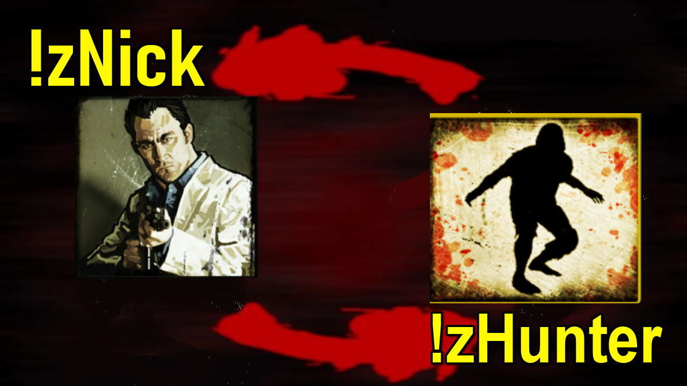

# Description | 內容
Survivor can transform into zombie + zombie can transform into survivor

> __Note__ <br/>
This plugin is private, Please contact [me](https://github.com/fbef0102/Game-Private_Plugin#私人插件列表-private-plugins-list)<br/>
此為私人插件, 請聯繫[本人](https://github.com/fbef0102/Game-Private_Plugin#私人插件列表-private-plugins-list)

* [Video | 影片展示](https://youtu.be/rcO48Jwjru0)

* <details><summary>Image | 圖示</summary>

	<br/>
	<br/>
	<br/>
	<br/>
	<br/>
	<br/>
	<br/>
	<br/>
</details>

* <details><summary>How does it work?</summary>

	* Player can use type cmd
		* ```!zTank```, ```!zSmoker``` ... : Transform yorself from survivor into Zombie class
		* ```!zNick```, ```!zBill``` ... : Transform yorself from infected into character
		* ```!zSur```, ... : Transform yorself from infected into survivor (model not change, can use infected ability)
	* Admin can type ```!zmenu``` to open zombie transform menu
	* API for developers
</details>

* Require | 必要安裝
	1. [left4dhooks](https://forums.alliedmods.net/showthread.php?t=321696)
	2. [[INC] Multi Colors](https://github.com/fbef0102/L4D1_2-Plugins/releases/tag/Multi-Colors)
	3. [spawn_infected_nolimit](https://github.com/fbef0102/L4D1_2-Plugins/tree/master/spawn_infected_nolimit)
	4. [CreateSurvivorBot](https://forums.alliedmods.net/showpost.php?p=2729883&postcount=16)

* <details><summary>ConVar | 指令</summary>

	* cfg\sourcemod\l4d2_zombie_transform.cfg
		```php
		// 0=Plugin off, 1=Plugin on.
		l4d2_zombie_transform_enable "1"

		// Player with these flag have access to use command to open zombie transform menu (Empty=Everyone, -1=No one)
		l4d2_zombie_transform_menu_access "z"

		// Player with these flag have access to use command to transform from survivor intointo zombie class (Empty=Everyone, -1=No one)
		l4d2_zombie_transform_inf_access "z"

		// Player with these flag have access to use command to transform from infected into survivor, can use infected ability (Empty=Everyone, -1=No one)
		l4d2_zombie_transform_sur_access "z"

		// Player with these flag have access to use command to transform from infected into character (Empty=Everyone, -1=No one)
		l4d2_zombie_transform_character_access "z"

		// Only transform zombie or survivor when player is alive
		l4d2_zombie_transform_alive_only "1"
		```
</details>

* <details><summary>Command | 命令</summary>

	* **Open menu to transform player**
		```php
		sm_zmenu
		```

	* **Transform yorself from survivor into Smoker, Usage: sm_zSmoker or sm_zSmoker <0/1/2>, 1=L4D2 Model, 2=L4D1 Model, 0=Random**
		```php
		sm_zSmoker <0/1/2>
		```

	* **Transform yorself from survivor into Boomer, Usage: sm_zBoomer or sm_zBoomer <0/1/2/3>, 1=L4D2 Model, 2=L4D1 Model, 3=Female Boomer, 0=Random**
		```php
		sm_zBoomer <0/1/2/3>
		```

	* **Transform yorself from survivor into Hunter, Usage: sm_zHunter or sm_zHunter <0/1/2>, 1=L4D2 Model, 2=L4D1 Model, 0=Random"**
		```php
		sm_zHunter <0/1/2>
		```

	* **Transform yorself from survivor into Spitter, Usage: sm_zSpitter**
		```php
		sm_zSpitter
		```

	* **Transform yorself from survivor into Jockey, Usage: sm_zJockey**
		```php
		sm_zJockey
		```

	* **Transform yorself from survivor into Charger, Usage: sm_zCharger**
		```php
		sm_zCharger
		```

	* **Transform yorself from survivor into Tank, Usage: sm_zTank or sm_zTank <0/1/2/3>, 1=L4D1 Model, 2=DLC Model, 0=Random**
		```php
		sm_zTank <0/1/2/3>
		```

	* **Transform yorself from infected into survivor (model not change, can use infected ability)**
		```php
		sm_zSurvivor
		sm_zSur
		sm_zT2
		```

	* **Transform yorself from infected into character, Usage: sm_zcsm or sm_zcsm <Nick/Rochelle/Coach/Ellis/Bill/Zoey/Francis/Louis>**
		```php
		sm_zcsm <Nick/Rochelle/Coach/Ellis/Bill/Zoey/Francis/Louis>
		```

	* **Transform yorself from infected into Nick**
		```php
		sm_zNick
		```

	* **Transform yorself from infected into Rochelle**
		```php
		sm_zRochelle
		```

	* **Transform yorself from infected into Coach**
		```php
		sm_zCoach
		```

	* **Transform yorself from infected into Ellis**
		```php
		sm_zEllis
		```

	* **Transform yorself from infected into Bill**
		```php
		sm_zBill
		```

	* **Transform yorself from infected into Zoey**
		```php
		sm_zZoey
		```

	* **Transform yorself from infected into Francis**
		```php
		sm_zFrancis
		```

	* **Transform yorself from infected into Louis**
		```php
		sm_zLouis
		```
</details>

* <details><summary>API | 串接</summary>

	* [l4d2_zombie_transform.inc](scripting\include\l4d2_zombie_transform.inc)
		```php
		library name: l4d2_zombie_transform
		```
</details>

* Apply to | 適用於
	```
	L4D2
	```

* <details><summary>Related Plugin | 相關插件</summary>

	1. [l4d_cso_zombie_Regeneration](https://github.com/fbef0102/L4D1_2-Plugins/tree/master/l4d_cso_zombie_Regeneration): The zombies have grown stronger, now they are able to heal their injuries by standing still without receiving any damage.
		* 殭屍變得更強大，他們只要站著不動便可以自癒傷勢　(仿CSO惡靈降世 殭屍技能)

	2. [l4d2_cso_knockback](/Plugin_插件/Nothing_Impossible_無理改造版/l4d2_cso_knockback): Weapons and Melees now have knockback power like CSO
    	* 武器與近戰都有CSO 殭屍擊退效果
</details>

* <details><summary>Changelog | 版本日誌</summary>

	* v1.2 (2024-7-31)
		* Still can transform when pin survivor or get pinned by infected

	* v1.1 (2024-4-30)
		* Fix spawn error

	* v1.0 (2024-3-25)
		* Initial Release
</details>

- - - -
# 中文說明
人類能變成特感 + 特感能變成人類

* 原理
	* 玩家可以輸入命令
		* ```!zTank```, ```!zSmoker```... : 倖存者變成特感
		* ```!zNick```, ```!zBill``` ... : 特感變成人類角色
		* ```!zSur```, ... : 特感變成人類 (保留特感模型, 可使用特感能力)
	* 管理員輸入 ```!zmenu``` 可以打開選單，幫玩家轉換特感或人類
	* 保留API給其他插件做使用

* <details><summary>指令中文介紹 (點我展開)</summary>

	* cfg\sourcemod\l4d2_zombie_transform.cfg
		```php
		// 0=關閉插件, 1=啟動插件
		l4d2_zombie_transform_enable "1"

		// 擁有這些權限的玩家，才可以輸入!zmenu打開選單 (留白 = 任何人都能, -1: 無人)
		l4d2_zombie_transform_menu_access "z"

		// 擁有這些權限的玩家，才可以輸入命令從人類變成特感 (留白 = 任何人都能, -1: 無人)
		l4d2_zombie_transform_inf_access "z"

		// 擁有這些權限的玩家，才可以輸入命令從特感變成人類, 保留特感能力 (留白 = 任何人都能, -1: 無人)
		l4d2_zombie_transform_sur_access "z"

		// 擁有這些權限的玩家，才可以輸入命令從特感變成人類角色 (留白 = 任何人都能, -1: 無人)
		l4d2_zombie_transform_character_access "z"

		// 為1時，只有當玩家活著才可以轉變
		l4d2_zombie_transform_alive_only "1"
		```
</details>

* <details><summary>命令中文介紹 (點我展開)</summary>

	* **打開介面轉換玩家**
		```php
		sm_zmenu
		```

	* **從倖存者變異成Smoker, 使用方式: sm_zSmoker 或 sm_zSmoker <0/1/2>, 1=L4D2模型, 2=L4D1模型, 0=隨機**
		```php
		sm_zSmoker <0/1/2>
		```

	* **從倖存者變異成Boomer, 使用方式: sm_zBoomer 或 sm_zBoomer <0/1/2/3>, 1=L4D2模型, 2=L4D1模型, 3=女Boomer, 0=隨機**
		```php
		sm_zBoomer <0/1/2/3>
		```

	* **從倖存者變異成Hunter, 使用方式: sm_zHunter 或 sm_zHunter <0/1/2>, 1=L4D2模型, 2=L4D1模型, 0=隨機"**
		```php
		sm_zHunter <0/1/2>
		```

	* **從倖存者變異成Spitter, 使用方式: sm_zSpitter**
		```php
		sm_zSpitter
		```

	* **從倖存者變異成Jockey, 使用方式: sm_zJockey**
		```php
		sm_zJockey
		```

	* **從倖存者變異成Charger, 使用方式: sm_zCharger**
		```php
		sm_zCharger
		```

	* **從倖存者變異成Tank, 使用方式: sm_zTank 或 sm_zTank <0/1/2/3>, 1=L4D1模型, 2=DLC模型, 0=隨機**
		```php
		sm_zTank <0/1/2/3>
		```

	* **從特感變異成人類 (保留特感模型, 可使用特感能力)**
		```php
		sm_zSurvivor
		sm_zSur
		sm_zT2
		```

	* **從特感變異回人類角色, 使用方式: sm_zcsm 或 sm_zcsm <Nick/Rochelle/Coach/Ellis/Bill/Zoey/Francis/Louis>**
		```php
		sm_zcsm <Nick/Rochelle/Coach/Ellis/Bill/Zoey/Francis/Louis>
		```

	* **從特感變異回角色: Nick**
		```php
		sm_zNick
		```

	* **從特感變異回角色: Rochelle**
		```php
		sm_zRochelle
		```

	* **從特感變異回角色: Coach**
		```php
		sm_zCoach
		```

	* **從特感變異回角色: Ellis**
		```php
		sm_zEllis
		```

	* **從特感變異回角色: Bill**
		```php
		sm_zBill
		```

	* **從特感變異回角色: Zoey**
		```php
		sm_zZoey
		```

	* **從特感變異回角色: Francis**
		```php
		sm_zFrancis
		```

	* **從特感變異回角色: Louis**
		```php
		sm_zLouis
		```
</details>