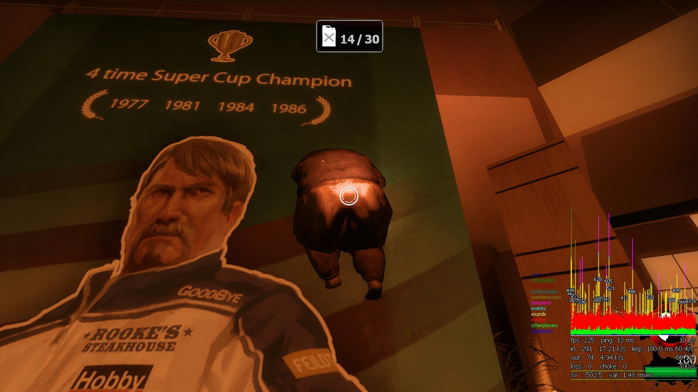

# Description | 內容
Makes Everyone Climb On Walls.

> __Note__ <br/>
This plugin is private, Please contact [me](https://github.com/fbef0102/Game-Private_Plugin#私人插件列表-private-plugins-list)<br/>
此為私人插件, 請聯繫[本人](https://github.com/fbef0102/Game-Private_Plugin#私人插件列表-private-plugins-list)

* Work | 作品展示
    * [Bully Maguire「惡霸麥奎爾」蜘蛛人](https://www.youtube.com/shorts/qJetU6lAGzM)

* [Video | 影片展示](https://youtu.be/MPtEzoKdJXc)

* Image | 圖示
	* Spider Man
		> 蜘蛛人
		<br/>

	* Spider 4 Dead
		> 蜘蛛人
		<br/>

* Apply to | 適用於
	```
	L4D1
	L4D2
	```

* Translation Support | 支援翻譯
	```
	English
	繁體中文
	简体中文
	```

* <details><summary>Changelog | 版本日誌</summary>

	* v1.2h (2023-6-30)
		* Safely create entity and Safely remove entity

	* v1.1h (2023-6-9)
		* Fixed bots stuck on wall if change team while climing

	* v1.0h
		* Translation Support
		* Modify cvars
		* Support [Ready up plugin](https://github.com/fbef0102/Game-Private_Plugin/tree/main/Plugin_%E6%8F%92%E4%BB%B6/Server_%E4%BC%BA%E6%9C%8D%E5%99%A8/readyup), allow to climb wall during ready-up

	* v1.05
		* [Shadowysn's fork](https://forums.alliedmods.net/showpost.php?p=2681114&postcount=99)

	* v1.02
		* [cravenge's fork](https://forums.alliedmods.net/showpost.php?p=2424617&postcount=92)
		* [Original Plugin by panxiaohai](https://forums.alliedmods.net/showthread.php?t=161280)
</details>

* Require | 必要安裝
	1. [[INC] Multi Colors](https://github.com/fbef0102/L4D1_2-Plugins/releases/tag/Multi-Colors)

* <details><summary>ConVar | 指令</summary>

	* cfg/sourcemod/l4d_climb.cfg
	```php
	// Boomer Enable Mode: 0=Off, 1=On
	l4d_climb_boomer "1"

	// Charger Enable Mode: 0=Off, 1=On
	l4d_climb_charger "1"

	// Enable Mode: 0=Off,  1=Coop/Realism Only, 2=All Game Modes
	l4d_climb_enable "2"

	// Hunter Enable Mode: 0=Off, 1=On
	l4d_climb_hunter "1"

	// Jockey Enable Mode: 0=Off, 1=On
	l4d_climb_jockey "1"

	// Limit Of Messages Shown Per Round (0=Disable Message)
	l4d_climb_msg "2"

	// Smoker Enable Mode: 0=Off, 1=On
	l4d_climb_smoker "1"

	// Speed Applied When Climbing
	l4d_climb_speed "80"

	// Speed x multiplier Applied For Boomers
	l4d_climb_speed_boomer_multiplier "1.8"

	// Speed x multiplier Applied For Chargers
	l4d_climb_speed_charger_multiplier "2.5"

	// Speed x multiplier Applied For Hunters
	l4d_climb_speed_hunter_multiplier "2.4"

	// Speed x multiplier Applied For Jockeys
	l4d_climb_speed_jockey_multiplier "2.4"

	// Speed x multiplier Applied For Smokers
	l4d_climb_speed_smoker_multiplier "2.1"

	// Speed x multiplier Applied For Spitters
	l4d_climb_speed_spitter_multiplier "2.0"

	// Speed x multiplier Applied For Survivors
	l4d_climb_speed_survivor_multiplier "1.0"

	// Speed x multiplier Applied For Tanks
	l4d_climb_speed_tank_multiplier "1.5"

	// Spitter Enable Mode: 0=Off, 1=On
	l4d_climb_spitter "1"

	// Tank Enable Mode: 0=Off, 1=On
	l4d_climb_tank "1"

	// Enable Mode: 0=None, 1=Both Teams, 2=Survivors Team Only, 3=Infected Team Only
	l4d_climb_team "1"
	```
</details>

* <details><summary>Command | 命令</summary>
	
	None
</details>

* How to climb the wall
	* Press Jump+E to climb the wall

- - - -
# 中文說明
人類與特感能爬牆

* 原理
	* 跳躍到牆壁上按E鍵即可爬牆
	* Tank也可以
	* 爬空氣牆都不是問題

* 功能
	* 可調整每個特感是否能爬牆
	* 可調整人類與每個特感爬牆的速度
	* 可控制哪個隊伍能爬牆
	* 支援[Ready up插件](https://github.com/fbef0102/Game-Private_Plugin/tree/main/Plugin_%E6%8F%92%E4%BB%B6/Server_%E4%BC%BA%E6%9C%8D%E5%99%A8/readyup)，準備期間可爬牆
