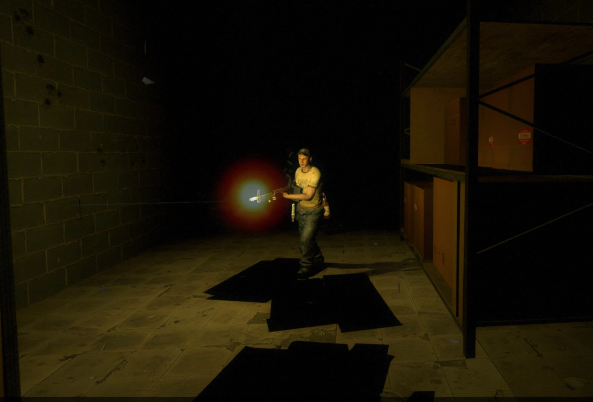

# Description | 內容
Adds dynamic muzzle flash to gunfire

> __Note__ <br/>
This plugin is private, Please contact [me](https://github.com/fbef0102/Game-Private_Plugin#私人插件列表-private-plugins-list)<br/>
此為私人插件, 請聯繫[本人](https://github.com/fbef0102/Game-Private_Plugin#私人插件列表-private-plugins-list)

* [Video | 影片展示](https://youtu.be/wlI10amIbW4)

* Image | 圖示
	* Pistol Muzzle Flash
	> 手槍逼真光源
	<br/>
	* M60 Muzzle Flash
	> M60槍口逼真光源
	<br/>

* Apply to | 適用於
```
L4D1
L4D2
```

* <details><summary>Changelog | 版本日誌</summary>

	```php
	//sereky @ 2012
	//Harry @ 2022
	```
	* v1.0h (2022-11-17)
		* Request by 壹梦
		* Remake code.
		* Add convars to allow specified weapons
		* Probability to change the brightness of the light

	* 1.0
		* [Fork of sereky's Dynamic Muzzle Flash](https://forums.alliedmods.net/showpost.php?p=1765869&postcount=6)
</details>

* Require | 必要安裝
	1. [left4dhooks](https://forums.alliedmods.net/showthread.php?t=321696)

* <details><summary>ConVar | 指令</summary>

	* cfg/sourcemod/l4d_dynamic_muzzle_flash.cfg
	```php
	// 0=No, 1=Allow bots to have dynamic lights.
	l4d_dynamic_muzzle_bots "0"

	// 0=Off. Probability to change the brightness of the light. [1-100]
	l4d_dynamic_muzzle_flash_Chance "50"

	// 0=Plugin off, 1=Plugin on.
	l4d_dynamic_muzzle_flash_allow "1"

	// Brightness of the light. [1-255]
	l4d_dynamic_muzzle_flash_bright "255.0"

	// The maximum brightness of the light when the brightness is changed. [1-255]
	l4d_dynamic_muzzle_flash_bright_max "200"

	// The minimum brightness of the light when the brightness is changed. [1-255]
	l4d_dynamic_muzzle_flash_bright_min "127"

	// The light color. Three values between 0-255 separated by spaces. RGB Color255 - Red Green Blue.
	l4d_dynamic_muzzle_flash_color "250 150 30"

	// Distance the light shines before not lighting up.
	l4d_dynamic_muzzle_flash_distance "30"

	// 0=Show the dynamic light to all players. 1=Hide the dynamic light so only other players can see it. 2=Only show to the owner.
	l4d_dynamic_muzzle_flash_hide "0"

	// 0=Trace directly to where they are aiming. 1=Trace hull to detect nearby entities.
	l4d_dynamic_muzzle_flash_hull "1"

	// Turn on the plugin in these game modes, separate by commas (no spaces). (Empty = all).
	l4d_dynamic_muzzle_flash_modes ""

	// Turn off the plugin in these game modes, separate by commas (no spaces). (Empty = none).
	l4d_dynamic_muzzle_flash_modes_off ""

	// Turn on the plugin in these game modes. 0=All, 1=Coop, 2=Survival, 4=Versus, 8=Scavenge. Add numbers together.
	l4d_dynamic_muzzle_flash_modes_tog "0"

	// The light will disappear after this many seconds.
	l4d_dynamic_muzzle_flash_time "0.1"

	// Empty string to allow all. Allow these weapon IDs being used in this plugin, separate by commas (no spaces). See plugin source code for more details.
	l4d_dynamic_muzzle_flash_weapons "1,2,3,4,5,6,7,8,9,10,11,12,13,14,15,16,17,18,19"
	```
</details>

* <details><summary>Command | 命令</summary>
	
	None
</details>

- - - -
# 中文說明
槍口增加逼真的閃光

* 原理
	* 開槍的時候，槍口產生動態光源，所以從旁觀者角度看，像是出現逼真的槍口焰

* 功能
	1. 可設置槍口焰顏色
	2. 可設置哪一種武器才能出現槍口焰
	3. 可設置槍口焰亮度
	4. 可設置槍口焰亮度改變的機率
