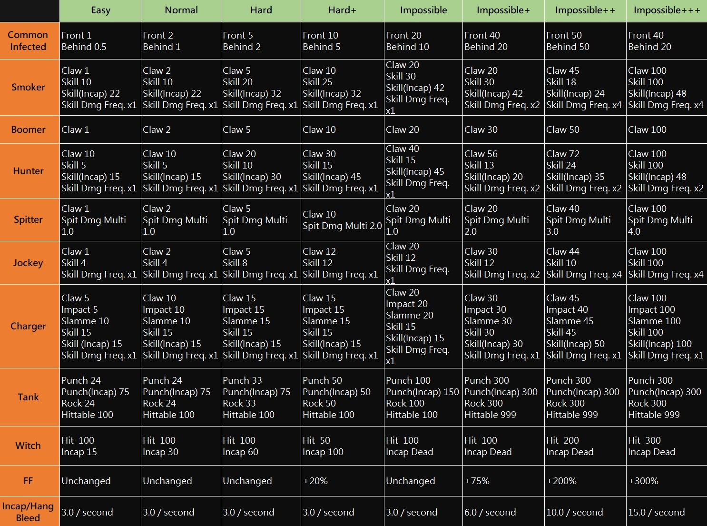
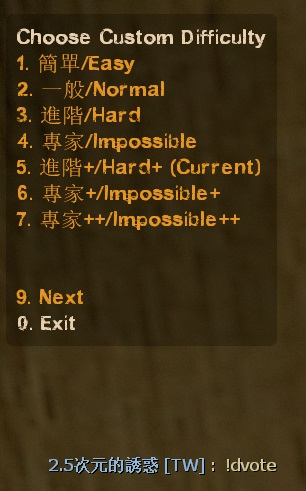
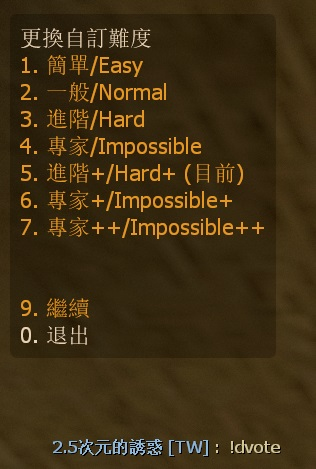

# Description | 內容
Set your own custom difficulty and damage + vote to change custom difficulty

> __Note__ <br/>
This plugin is private, Please contact [me](https://github.com/fbef0102/Game-Private_Plugin#私人插件列表-private-plugins-list)<br/>
此為私人插件, 請聯繫[本人](https://github.com/fbef0102/Game-Private_Plugin#私人插件列表-private-plugins-list)

* Video | 影片展示
<br/>None

* Image
	* Free to modify custom difficulty and damage, image for reference only
	<br/>
	<br/>

* <details><summary>How does it work?</summary>

	* Type ```!dvote``` -> load custom difficulty
	* Modify custom difficulty and damage, file is in ```data/l4d2_custom_difficulty.cfg```
</details>

* Require | 必要安裝
	1. [left4dhooks](https://forums.alliedmods.net/showthread.php?t=321696)
	2. [[INC] Multi Colors](https://github.com/fbef0102/L4D1_2-Plugins/releases/tag/Multi-Colors)
	3. [builtinvotes](https://github.com/fbef0102/Game-Private_Plugin/releases/tag/builtinvotes)

* <details><summary>ConVar | 指令</summary>

	* cfg/sourcemod/l4d2_custom_difficulty.cfg
		```php
		// 0=Plugin off, 1=Plugin on.
		l4d2_custom_difficulty_enable "1"

		// How many players at least to vote Boss Spawns.
		l4d2_custom_difficulty_vote_need_player "1"
		```
</details>

* <details><summary>Command | 命令</summary>

	* **Vote To Change Custom Difficulty**
		```php
		sm_difficultyvote
		sm_dvote
		```
</details>

* <details><summary>API | 串接</summary>

	* ```scripting\include\l4d2_custom_difficulty.inc```
		```php
		Registers a library name: l4d2_custom_difficulty
		```
</details>

* <details><summary>Data Config</summary>

	* Modify custom difficulty and damage
	* ```data/l4d2_custom_difficulty.cfg```
		```php
		"l4d2_custom_difficulty"
		{
			"Total"
			{
				// There are 8 different difficulty
				"num"   "8"
				
				// Load Custom Difficulty by default (0=Off)
				"default" "5"
				
				// First Custom Difficulty
				"1"
				{
					// Modify for your own settings
					...
				}

				...
			}
		}
		```
</details>

* Apply to | 適用於
	```
	L4D2
	```

* <details><summary>Translation Support | 支援翻譯</summary>

	```
	English
	繁體中文
	简体中文
	```
</details>

* <details><summary>Related | 相關插件</summary>

	1. [l4d2_vote_manager3](https://github.com/fbef0102/L4D1_2-Plugins/tree/master/l4d2_vote_manager3): Unable to call valve vote if player does not have access
		* 沒有權限的玩家不能隨意發起官方投票
</details>

* <details><summary>Changelog | 版本日誌</summary>

	* v1.0 (2024-7-17)
		* Initial Release
</details>

- - - -
# 中文說明
自訂遊戲難度、特感傷害、殭屍傷害、Tank傷害、Witch傷害 + 投票更換自訂的難度

* 圖示
	* 可自行增修傷害與難度名稱，圖片僅供參考
	<br/>
	<br/>

* 原理
	* 輸入```!dvote``` -> 選擇項目 -> 發起投票 -> 更換自訂的難度
	* 修改以下對倖存者的傷害
		* 特感傷害
		* 殭屍傷害
		* Tank傷害
		* Witch傷害
		* 友傷
		* 倒地/掛邊流血
	
* <details><summary>指令中文介紹(點我展開)</summary>

	* cfg/sourcemod/l4d2_custom_difficulty.cfg
		```php
		// 0=插件關閉, 1=插件開啟.
		l4d2_custom_difficulty_enable "1"

		// 倖存者與特感隊伍總共要有X位真人玩家在場才能發起投票.
		l4d2_custom_difficulty_vote_need_player "1"
		```
</details>

* <details><summary>命令中文介紹(點我展開)</summary>

	* **打開菜單投票更換難度**
		```php
		sm_difficultyvote
		sm_dvote
		```
</details>

* <details><summary>文件設定範例</summary>

	* 自由修改難度與傷害數值
	* ```data/l4d2_custom_difficulty.cfg```
		```php
		"l4d2_custom_difficulty"
		{
			"Total"
			{
				// 有8種不同的遊戲難度
				"num"   "8"
				
				// 伺服器啟動後預設載入的自製難度	(0=不預設載入)
				"default" "5"
				
				// 第一個自製難度
				"1"
				{
					// 自行修改數據
					...
				}

				...
			}
		}
		```
</details>