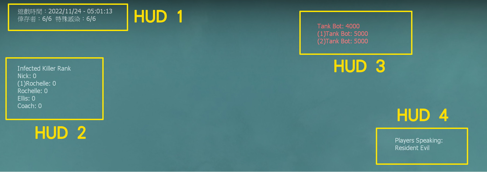
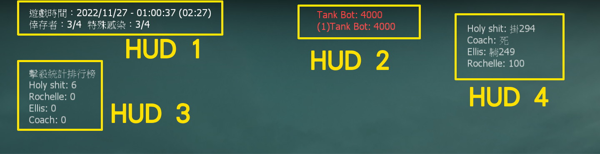
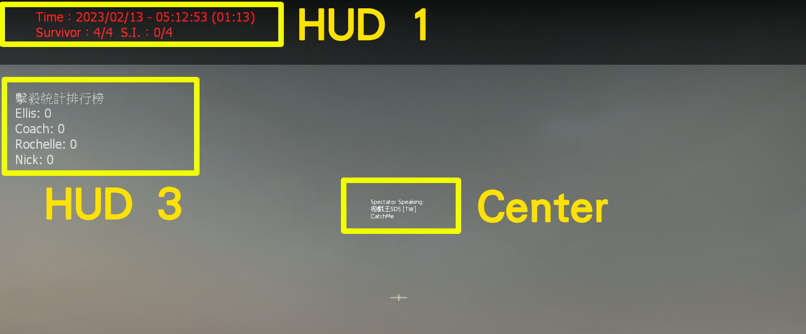
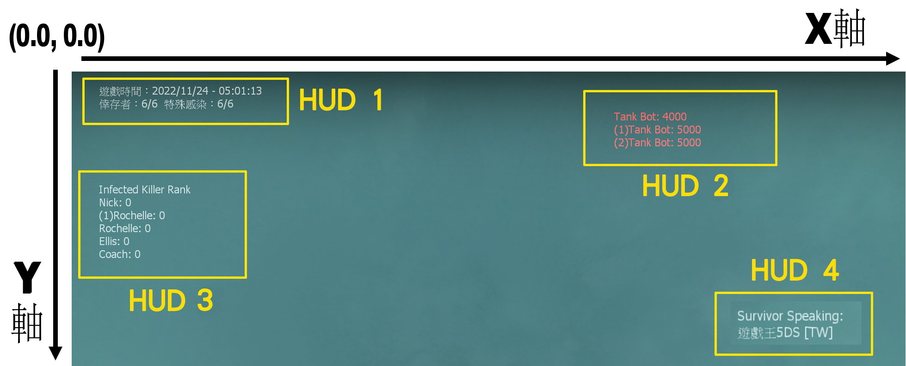

# Description | 內容
Display text for up to 5 scripted HUD slots on the screen.

> __Note__ <br/>
This plugin is private, Please contact [me](https://github.com/fbef0102/Game-Private_Plugin#私人插件列表-private-plugins-list)<br/>
此為私人插件, 請聯繫[本人](https://github.com/fbef0102/Game-Private_Plugin#私人插件列表-private-plugins-list)

* Video | 影片展示
<br/>None

* <details><summary>Image | 圖示</summary>

	* Layout 1 (Survivor) - 版面一 (人類方)
	<br/>
	* Layout 2 (Infected) - 版面二 (特感方)
	<br/>
	* Layout 3 (Spectator) - 版面三 (旁觀者)
	<br/>
	* Layout 4 - 版面四
	<br/>
</details>

* <details><summary>How does it work?</summary>

	* Display HUD Text on player's screen
</details>

* <details><summary>Default HUDX_Text</summary>

	* HUD1_Text: 
		1. Time and Survivor/Infected count
	* HUD2_Text: 
		1. Tank Health
	* HUD3_Text: 
		1. S.I. kills rank
		2. C.I.+S.I.+Tank+Witch kills rank
	* HUD4_Text:
		1. Survivor Mic Speaking
			* Only Survivor&Spectator team can see
		2. Survivor health
	* HUD5_Text: 
		1. Infected Mic Speaking
			* Only Infected team can see
	* Center_Text: 
		1. Spectator Mic Speaking
			* Only Spectator team can see
</details>

* <details><summary>Important</summary>

	* Ensure that you renamed the scripts\vscripts\l4d2_scripted_hud_rename.nut file to your gamemode. (<gamemode>.nut)
		* If you run a coop server. Rename it to "coop.nut"
		* If you run a versus server. Rename it to "versus.nut"
		* If you run a survival server. Rename it to "survival.nut"
		* If you run a scavenge server. Rename it as "scavenge.nut"
		* If you run some mutation gamemode. Rename it to "xxxx.nut" (xxxx= mutation name)
		* You can create multi .nut files

	* Note
		* Load data\l4d2_scripted_hud.cfg "HUD_Texts" => "HUD?" first. If empty, then load ```l4d2_scripted_hud_hud?_text``` cvar text. If both empty, then load GetHUD?_Text functions (? is 1~5) 
		* The limit of each HUD text is up to 127 characters.
		* HUD Text can be moved and animated effect, please read cfg.
</details>

* <details><summary>FAQ</summary>

	* How to switch HUD Text?
		* Modify ```l4d2_scripted_hud_hud?_display``` cvar (? is 1~5)

	* How to switch HUD position?
		* Modify ```l4d2_scripted_hud_hud?_x``` cvar (? is 1~5)
		* Modify ```l4d2_scripted_hud_hud?_y``` cvar (? is 1~5)
		* Coordinate diagram
		<br/>

	* How to write message in HUD text as I want?
		1. Modify ```data\l4d2_scripted_hud.cfg``` "HUD_Texts"
		2. Or Modify ```l4d2_scripted_hud_hud?_text``` cvar (? is 1~5)

	* Why hud disappear or being cut?	
		* The limit of each HUD text is up to 127 characters.
		* hud position depends on Gaming Monitor Resolutions
</details>

* Require | 必要安裝
<br/>None

* <details><summary>ConVar | 指令</summary>

	* cfg/sourcemod/l4d2_scripted_hud.cfg
		```php
		// Enable/Disable the plugin.
		// 0 = Disable, 1 = Enable.
		l4d2_scripted_hud_enable "1"

		// Interval in seconds to update the HUD.
		l4d2_scripted_hud_update_interval "0.5"

		// (HUD 1) Makes the text visible.
		// 0 = OFF, 1 = ON.
		l4d2_scripted_hud_hud1_visible "1"

		// (HUD 1) The text you want to display in the HUD.
		// Note: When cvar is empty "", plugin will use the predefined HUD text set in the code, check GetHUD1_Text functions.
		l4d2_scripted_hud_hud1_text ""

		// (HUD 1) Aligns the text horizontally.
		// 1 = LEFT, 2 = CENTER, 3 = RIGHT.
		l4d2_scripted_hud_hud1_text_align "1"

		// (HUD 1) Makes the text blink from white to red while a tank is alive.
		// 0 = OFF, 1 = ON.
		l4d2_scripted_hud_hud1_blink_tank "0"

		// (HUD 1) Makes the text blink from white to red.
		// 0 = OFF, 1 = ON.
		l4d2_scripted_hud_hud1_blink "1"

		// (HUD 1) Makes the text play a beep sound while blinking.
		// 0 = OFF, 1 = ON. Note: the blink cvar must be "1" to play the beep sound.
		l4d2_scripted_hud_hud1_beep "0"

		// (HUD 1) Shows the text inside a black transparent background.
		// Note: the background may not draw properly when initialized as "0", start the map with "1" to render properly.
		// 0 = OFF, 1 = ON.
		l4d2_scripted_hud_hud1_background "0"

		// (HUD 1) Which team should see the text.
		// 0 = ALL, 1 = SURVIVOR, 2 = INFECTED.
		l4d2_scripted_hud_hud1_team "0"

		// (HUD 1) Overwrite the HUD flag.
		// For debug purposes only.
		// 0 = OFF.
		l4d2_scripted_hud_hud1_flag_debug "0"

		// (HUD 1) X (horizontal) position of the text.
		// Note: setting it to less than 0.0 may cut/hide the text at screen.
		l4d2_scripted_hud_hud1_x "0.0"

		// (HUD 1) Y (vertical) position of the text.
		// Note: setting it to less than 0.0 may cut/hide the text at screen.
		l4d2_scripted_hud_hud1_y "0.015"

		// (HUD 1) Animated X (horizontal) movement speed of the text.
		// 0 = OFF.
		l4d2_scripted_hud_hud1_x_speed "0.002"

		// (HUD 1) Animated Y (vertical) movement speed of the text.
		// 0 = OFF.
		l4d2_scripted_hud_hud1_y_speed "0.0"

		// (HUD 1) Animated X (horizontal) direction that the text will move.
		// 0 = Right to Left, 1 = Left to Right.
		l4d2_scripted_hud_hud1_x_direction "0"

		// (HUD 1) Animated Y (vertical) direction that the text will move.
		// 0 = Top to Bottom, 1 = Bottom to Top.
		l4d2_scripted_hud_hud1_y_direction "0"

		// (HUD 1) Animated X (horizontal) minimum position that the HUD can reach.
		l4d2_scripted_hud_hud1_x_min "0.0"

		// (HUD 1) Animated Y (vertical) minimum position that the HUD can reach.
		l4d2_scripted_hud_hud1_y_min "0.0"

		// (HUD 1) Animated X (horizontal) maximum position that the HUD can reach.
		l4d2_scripted_hud_hud1_x_max "1.0"

		// (HUD 1) Animated Y (vertical) maximum position that the HUD can reach.
		l4d2_scripted_hud_hud1_y_max "1.0"

		// (HUD 1) Text area Width.
		l4d2_scripted_hud_hud1_width "1.5"

		// (HUD 1) Text area Height.
		l4d2_scripted_hud_hud1_height "0.026"

		// (HUD 2) Makes the text visible.
		// 0 = OFF, 1 = ON.
		l4d2_scripted_hud_hud2_visible "1"

		// (HUD 2) The text you want to display in the HUD.
		// Note: When cvar is empty "", plugin will use the predefined HUD text set in the code, check GetHUD2_Text functions.
		l4d2_scripted_hud_hud2_text ""

		// (HUD 2) Aligns the text horizontally.
		// 1 = LEFT, 2 = CENTER, 3 = RIGHT.
		l4d2_scripted_hud_hud2_text_align "1"

		// (HUD 2) Makes the text blink from white to red while a tank is alive.
		// 0 = OFF, 1 = ON.
		l4d2_scripted_hud_hud2_blink_tank "1"

		// (HUD 2) Makes the text blink from white to red.
		// 0 = OFF, 1 = ON.
		l4d2_scripted_hud_hud2_blink "0"

		// (HUD 2) Makes the text play a beep sound while blinking.
		// 0 = OFF, 1 = ON. Note: the blink cvar must be "1" to play the beep sound.
		l4d2_scripted_hud_hud2_beep "0"

		// (HUD 2) Shows the text inside a black transparent background.
		// Note: the background may not draw properly when initialized as "0", start the map with "1" to render properly.
		// 0 = OFF, 1 = ON.
		l4d2_scripted_hud_hud2_background "0"

		// (HUD 2) Which team should see the text.
		// 0 = ALL, 1 = SURVIVOR, 2 = INFECTED.
		l4d2_scripted_hud_hud2_team "0"

		// (HUD 2) Overwrite the HUD flag.
		// For debug purposes only.
		// 0 = OFF.
		l4d2_scripted_hud_hud2_flag_debug "0"

		// (HUD 2) X (horizontal) position of the text.
		// Note: setting it to less than 0.0 may cut/hide the text at screen.
		l4d2_scripted_hud_hud2_x "0.75"

		// (HUD 2) Y (vertical) position of the text.
		// Note: setting it to less than 0.0 may cut/hide the text at screen.
		l4d2_scripted_hud_hud2_y "0.1"

		// (HUD 2) Animated X (horizontal) movement speed of the text.
		// 0 = OFF.
		l4d2_scripted_hud_hud2_x_speed "0.0"

		// (HUD 2) Animated Y (vertical) movement speed of the text.
		// 0 = OFF.
		l4d2_scripted_hud_hud2_y_speed "0.0"

		// (HUD 2) Animated X (horizontal) direction that the text will move.
		// 0 = Left to Right, 1 = Right to Left.
		l4d2_scripted_hud_hud2_x_direction "0"

		// (HUD 2) Animated Y (vertical) direction that the text will move.
		// 0 = Top to Bottom, 1 = Bottom to Top.
		l4d2_scripted_hud_hud2_y_direction "0"

		// (HUD 2) Animated X (horizontal) minimum position that the HUD can reach.
		l4d2_scripted_hud_hud2_x_min "0.0"

		// (HUD 2) Animated Y (vertical) minimum position that the HUD can reach.
		l4d2_scripted_hud_hud2_y_min "0.0"

		// (HUD 2) Animated X (horizontal) maximum position that the HUD can reach.
		l4d2_scripted_hud_hud2_x_max "1.0"

		// (HUD 2) Animated Y (vertical) maximum position that the HUD can reach.
		l4d2_scripted_hud_hud2_y_max "1.0"

		// (HUD 2) Text area Width.
		l4d2_scripted_hud_hud2_width "1.5"

		// (HUD 2) Text area Height.
		l4d2_scripted_hud_hud2_height "0.026"

		// (HUD 3) Makes the text visible.
		// 0 = OFF, 1 = ON.
		l4d2_scripted_hud_hud3_visible "1"

		// (HUD 3) The text you want to display in the HUD.
		// Note: When cvar is empty "", plugin will use the predefined HUD text set in the code, check GetHUD3_Text functions.
		l4d2_scripted_hud_hud3_text ""

		// (HUD 3) Aligns the text horizontally.
		// 1 = LEFT, 2 = CENTER, 3 = RIGHT.
		l4d2_scripted_hud_hud3_text_align "1"

		// (HUD 3) Makes the text blink from white to red while a tank is alive.
		// 0 = OFF, 1 = ON.
		l4d2_scripted_hud_hud3_blink_tank "1"

		// (HUD 3) Makes the text blink from white to red.
		// 0 = OFF, 1 = ON.
		l4d2_scripted_hud_hud3_blink "0"

		// (HUD 3) Makes the text play a beep sound while blinking.
		// 0 = OFF, 1 = ON. Note: the blink cvar must be "1" to play the beep sound.
		l4d2_scripted_hud_hud3_beep "0"

		// (HUD 3) Shows the text inside a black transparent background.
		// Note: the background may not draw properly when initialized as "0", start the map with "1" to render properly.
		// 0 = OFF, 1 = ON.
		l4d2_scripted_hud_hud3_background "0"

		// (HUD 3) Which team should see the text.
		// 0 = ALL, 1 = SURVIVOR, 2 = INFECTED.
		l4d2_scripted_hud_hud3_team "0"

		// (HUD 3) Overwrite the HUD flag.
		// For debug purposes only.
		// 0 = OFF.
		l4d2_scripted_hud_hud3_flag_debug "0"

		// (HUD 3) X (horizontal) position of the text.
		// Note: setting it to less than 0.0 may cut/hide the text at screen.
		l4d2_scripted_hud_hud3_x "0.75"

		// (HUD 3) Y (vertical) position of the text.
		// Note: setting it to less than 0.0 may cut/hide the text at screen.
		l4d2_scripted_hud_hud3_y "0.1"

		// (HUD 3) Animated X (horizontal) movement speed of the text.
		// 0 = OFF.
		l4d2_scripted_hud_hud3_x_speed "0.0"

		// (HUD 3) Animated Y (vertical) movement speed of the text.
		// 0 = OFF.
		l4d2_scripted_hud_hud3_y_speed "0.0"

		// (HUD 3) Animated X (horizontal) direction that the text will move.
		// 0 = Left to Right, 1 = Right to Left.
		l4d2_scripted_hud_hud3_x_direction "0"

		// (HUD 3) Animated Y (vertical) direction that the text will move.
		// 0 = Top to Bottom, 1 = Bottom to Top.
		l4d2_scripted_hud_hud3_y_direction "0"

		// (HUD 3) Animated X (horizontal) minimum position that the HUD can reach.
		l4d2_scripted_hud_hud3_x_min "0.0"

		// (HUD 3) Animated Y (vertical) minimum position that the HUD can reach.
		l4d2_scripted_hud_hud3_y_min "0.0"

		// (HUD 3) Animated X (horizontal) maximum position that the HUD can reach.
		l4d2_scripted_hud_hud3_x_max "1.0"

		// (HUD 3) Animated Y (vertical) maximum position that the HUD can reach.
		l4d2_scripted_hud_hud3_y_max "1.0"

		// (HUD 3) Text area Width.
		l4d2_scripted_hud_hud2_width "1.5"

		// (HUD 3) Text area Height.
		l4d2_scripted_hud_hud3_height "0.026"

		// (HUD 4) Makes the text visible.
		// 0 = OFF, 1 = ON.
		l4d2_scripted_hud_hud4_visible "1"

		// (HUD 4) The text you want to display in the HUD.
		// Note: When cvar is empty "", plugin will use the predefined HUD text set in the code, check GetHUD4_Text functions.
		l4d2_scripted_hud_hud4_text ""

		// (HUD 4) Aligns the text horizontally.
		// 1 = LEFT, 2 = CENTER, 3 = RIGHT.
		l4d2_scripted_hud_hud4_text_align "1"

		// (HUD 4) Makes the text blink from white to red while a tank is alive.
		// 0 = OFF, 1 = ON.
		l4d2_scripted_hud_hud4_blink_tank "1"

		// (HUD 4) Makes the text blink from white to red.
		// 0 = OFF, 1 = ON.
		l4d2_scripted_hud_hud4_blink "0"

		// (HUD 4) Makes the text play a beep sound while blinking.
		// 0 = OFF, 1 = ON. Note: the blink cvar must be "1" to play the beep sound.
		l4d2_scripted_hud_hud4_beep "0"

		// (HUD 4) Shows the text inside a black transparent background.
		// Note: the background may not draw properly when initialized as "0", start the map with "1" to render properly.
		// 0 = OFF, 1 = ON.
		l4d2_scripted_hud_hud4_background "0"

		// (HUD 4) Which team should see the text.
		// 0 = ALL, 1 = SURVIVOR, 2 = INFECTED.
		l4d2_scripted_hud_hud4_team "0"

		// (HUD 4) Overwrite the HUD flag.
		// For debug purposes only.
		// 0 = OFF.
		l4d2_scripted_hud_hud4_flag_debug "0"

		// (HUD 4) X (horizontal) position of the text.
		// Note: setting it to less than 0.0 may cut/hide the text at screen.
		l4d2_scripted_hud_hud4_x "0.75"

		// (HUD 4) Y (vertical) position of the text.
		// Note: setting it to less than 0.0 may cut/hide the text at screen.
		l4d2_scripted_hud_hud4_y "0.1"

		// (HUD 4) Animated X (horizontal) movement speed of the text.
		// 0 = OFF.
		l4d2_scripted_hud_hud4_x_speed "0.0"

		// (HUD 4) Animated Y (vertical) movement speed of the text.
		// 0 = OFF.
		l4d2_scripted_hud_hud4_y_speed "0.0"

		// (HUD 4) Animated X (horizontal) direction that the text will move.
		// 0 = Left to Right, 1 = Right to Left.
		l4d2_scripted_hud_hud4_x_direction "0"

		// (HUD 4) Animated Y (vertical) direction that the text will move.
		// 0 = Top to Bottom, 1 = Bottom to Top.
		l4d2_scripted_hud_hud4_y_direction "0"

		// (HUD 4) Animated X (horizontal) minimum position that the HUD can reach.
		l4d2_scripted_hud_hud4_x_min "0.0"

		// (HUD 4) Animated Y (vertical) minimum position that the HUD can reach.
		l4d2_scripted_hud_hud4_y_min "0.0"

		// (HUD 4) Animated X (horizontal) maximum position that the HUD can reach.
		l4d2_scripted_hud_hud4_x_max "1.0"

		// (HUD 4) Animated Y (vertical) maximum position that the HUD can reach.
		l4d2_scripted_hud_hud4_y_max "1.0"

		// (HUD 4) Text area Width.
		l4d2_scripted_hud_hud4_width "1.5"

		// (HUD 4) Text area Height.
		l4d2_scripted_hud_hud4_height "0.026"

		// (HUD 5) Makes the text visible.
		// 0 = OFF, 1 = ON.
		l4d2_scripted_hud_hud5_visible "1"

		// (HUD 5) The text you want to display in the HUD.
		// Note: When cvar is empty "", plugin will use the predefined HUD text set in the code, check GetHUD5_Text functions.
		l4d2_scripted_hud_hud5_text ""

		// (HUD 5) Aligns the text horizontally.
		// 1 = LEFT, 2 = CENTER, 3 = RIGHT.
		l4d2_scripted_hud_hud5_text_align "1"

		// (HUD 5) Makes the text blink from white to red while a tank is alive.
		// 0 = OFF, 1 = ON.
		l4d2_scripted_hud_hud5_blink_tank "0"

		// (HUD 5) Makes the text blink from white to red.
		// 0 = OFF, 1 = ON.
		l4d2_scripted_hud_hud5_blink "0"

		// (HUD 5) Makes the text play a beep sound while blinking.
		// 0 = OFF, 1 = ON. Note: the blink cvar must be "1" to play the beep sound.
		l4d2_scripted_hud_hud5_beep "0"

		// (HUD 5) Shows the text inside a black transparent background.
		// Note: the background may not draw properly when initialized as "0", start the map with "1" to render properly.
		// 0 = OFF, 1 = ON.
		l4d2_scripted_hud_hud5_background "0"

		// (HUD 5) X (horizontal) position of the text.
		// Note: setting it to less than 0.0 may cut/hide the text at screen.
		l4d2_scripted_hud_hud5_x "0.75"

		// (HUD 5) Y (vertical) position of the text.
		// Note: setting it to less than 0.0 may cut/hide the text at screen.
		l4d2_scripted_hud_hud5_y "0.5"

		// (HUD 5) Text area Width.
		l4d2_scripted_hud_hud5_width "1.5"

		// (HUD 5) Text area Height.
		l4d2_scripted_hud_hud5_height "0.3"

		// (Center) Makes the text visible.
		// 0 = OFF, 1 = ON.
		l4d2_scripted_hud_center_visible "1"
		```
</details>

* <details><summary>Command | 命令</summary>
	None
</details>

* Apply to | 適用於
	```
	L4D2
	```

* <details><summary>Related Plugin | 相關插件</summary>

	1. [l4d2_cs_kill_hud](https://github.com/fbef0102/L4D2-Plugins/tree/master/l4d2_cs_kill_hud): HUD with cs kill info list.
		> L4D2擊殺提示改成CS遊戲的擊殺列表
</details>

* <details><summary>Changelog | 版本日誌</summary>

	* v1.1h (2023-11-21)
		* Optimize code and improve performance

	* v1.1.0 (2023-02-13)
		* Display Survivors, Infected, and Spectator MIC Speaking text separately
		* Add HUD 5 for Infected Mic Speaking
		* Add Center text for Spectator Mic Speaking

	* v1.0.5 (2022-11-27)
		* HUD3_TEXT + C.I.+S.I.+Tank+Witch kills rank
		* HUD4_TEXT + Survivor health
		* Add cvars to switch HUDX_TEXT text

	* v1.0.4 (2022-11-24)
		* Kill Infected Counter Rank (HUD3_Text)
		* Time and Survivor/Infected count (HUD1_Text)

	* v1.0.2
		* [By Marttt](https://forums.alliedmods.net/showthread.php?t=331212)
</details>

- - - -
# 中文說明
在玩家畫面上方五個Hud位置顯示不同的特殊文字

* 功能
	1. 可自定義文字顯示內容
	2. 可利用指令移動HUD的位置，查看指令設置X與Y的座標
	3. 可利用指令達成文字移動或閃紅色的動畫效果，請自行閱讀指令列表
	4. 多達五個HUD，可個別顯示或關閉文字

* <details><summary>預設的 HUDX 文字 (點我展開)</summary>

	* HUD1: 
		1. 目前遊戲時間、倖存者數量、感染者數量
	* HUD2: 
		1. Tank 血量
	* HUD3: 
		1. 特感擊殺統計排行榜
		2. 擊殺統計排行榜 (普通感染者+特感+Tank+Witch)
	* HUD4: 
		1. 倖存者語音說話
			* 只顯示給倖存者隊伍與旁觀者
		2. 倖存者血量狀態
	* HUD5: 
		1. 特感語音說話
			* 只顯示給特感隊伍
	* Center: 
		1. 旁觀者語音說話
			* 只顯示給旁觀者
</details>

* <details><summary>重要說明</summary>

	* 確保 scripts\vscripts\l4d2_scripted_hud_rename.nut 檔名名稱更改成伺服器的遊戲模式. (<遊戲模式名稱>.nut)
		* 戰役模式. 改成名 "coop.nut"
		* 對抗模式. 改成名 "versus.nut"
		* 生存模式. 改成名 "survival.nut"
		* 清道夫模式. 改成名 "scavenge.nut"
		* 突變模式. 改成名 "<突變模式英文名>.nut"
		* 可以創建多個.nut檔案
		> __Note__ (如果已有.nut檔案，可以先備份)

	* 注意事項
		* 插件先讀取 data\l4d2_scripted_hud.cfg "HUD_Texts" => "HUD?" 文字. 如果空白則讀取 ```l4d2_scripted_hud_hud?_text``` 指令文字. 如果兩者皆空, 使用插件內建的 GetHUD?_Text 文字 (? 是 1~5)
		* 每個Hud文字上限為127，遊戲限制不能增加，認真你就輸了，再問就是Valve的鍋
		* 每個Hud文字可有滑動跟閃紅光的特效，請詳細閱讀指令
</details>

* <details><summary>問題區</summary>

	* 如何更換預設的 HUD 文字?
		* 請修改 ```l4d2_scripted_hud_hud?_display``` 指令(?為數字1~5)

	* 如何改變 HUD 位置?
		* 修改 ```l4d2_scripted_hud_hud?_x``` 指令 (? 是數字1~5)
		* 修改 ```l4d2_scripted_hud_hud?_y``` 指令 (? 是數字1~5)
		* 座標圖
		<br/>

	* 如何修改在 HUD 加入自己寫的文字?
		1. 請修改 ```data\l4d2_scripted_hud.cfg``` 的 "HUD_Texts" 格子
		2. 或修改 ```l4d2_scripted_hud_hud?_text``` 指令(? 是數字1~5)

	* 為何 HUD 會移位或被切掉?	
		* 每個Hud文字上限為127，遊戲限制不能增加
		* 根據玩家自己的遊戲分辨率，看到的Hud位置會有不同，請斟酌修改位置
</details>

* <details><summary>指令中文介紹 (點我展開)</summary>

	* cfg/sourcemod/l4d2_scripted_hud.cfg
		```php
		// 0=關閉插件, 1=啟動插件
		l4d2_scripted_hud_enable "1"

		// 更新HUD的頻率 (單位: 秒)，秒數越低，更新頻率越大，伺服器越卡
		l4d2_scripted_hud_update_interval "0.5"

		// (HUD 1) 
		// 0 = 不顯示, 1 = 顯示.
		l4d2_scripted_hud_hud1_visible "1"

		// (HUD 1) 寫下想要顯示的內容
		// 注意: 如果空白, 插件會自行使用內建的文字, 查看程式碼內 GetHUD1_Text 涵式.
		l4d2_scripted_hud_hud1_text ""

		// (HUD 1) 文字水平排版
		// 1 = 置左, 2 = 置中, 3 = 置右.
		l4d2_scripted_hud_hud1_text_align "1"

		// (HUD 1) 當Tank存活時，文字紅白閃爍
		// 0 = 關閉, 1 = 開啟.
		l4d2_scripted_hud_hud1_blink_tank "0"

		// (HUD 1) 文字紅白閃爍
		//  0 = 關閉, 1 = 開啟.
		l4d2_scripted_hud_hud1_blink "1"

		// (HUD 1) 文字紅白閃爍時發出beep音效
		// 0 = 關閉, 1 = 開啟.
		// 注意: 必須先開啟 HUD 1 文字紅白閃爍
		l4d2_scripted_hud_hud1_beep "0"

		// (HUD 1) 文字有黑底背景.
		// 注意: 修改這項指令可能要重啟地圖才會生效
		// 0 = 關閉, 1 = 開啟.
		l4d2_scripted_hud_hud1_background "0"

		// (HUD 1) 哪些隊伍能看到文字
		// 0 = 全部, 1 = 倖存者, 2 = 特感.
		l4d2_scripted_hud_hud1_team "0"

		// (HUD 1) 覆蓋文字的指令
		// 給工程師除錯用，請勿修改
		// 0 = 關閉.
		l4d2_scripted_hud_hud1_flag_debug "0"

		// (HUD 1) X軸位置
		// 注意: 數值低於0可能會導致文字被切掉
		l4d2_scripted_hud_hud1_x "0.0"

		// (HUD 1) Y軸位置
		// 注意: 數值低於0可能會導致文字被切掉
		l4d2_scripted_hud_hud1_y "0.015"

		// (HUD 1) 文字水平移動的動畫速度
		// 0 = 關閉.
		l4d2_scripted_hud_hud1_x_speed "0.002"

		// (HUD 1) 文字垂直移動的動畫速度
		// 0 = 關閉.
		l4d2_scripted_hud_hud1_y_speed "0.0"

		// (HUD 1) 文字水平移動的動畫方向
		// 0 = 從右至左, 1 = 從左至右.
		l4d2_scripted_hud_hud1_x_direction "0"

		// (HUD 1) 文字垂直移動的動畫方向
		// 0 = 從上至下, 1 = 從下至上.
		l4d2_scripted_hud_hud1_y_direction "0"

		// (HUD 1) 文字水平移動的動畫X軸起始點
		l4d2_scripted_hud_hud1_x_min "0.0"

		// (HUD 1) 文字水平移動的動畫Y軸起始點
		l4d2_scripted_hud_hud1_y_min "0.0"

		// (HUD 1) 文字水平移動的動畫X軸終點
		l4d2_scripted_hud_hud1_x_max "1.0"

		// (HUD 1) 文字水平移動的動畫Y軸終點
		l4d2_scripted_hud_hud1_y_max "1.0"

		// (HUD 1) 文字框的寬度
		// 非文字變大
		l4d2_scripted_hud_hud1_width "1.5"

		// (HUD 1) 文字框的高度
		// 非文字變大
		l4d2_scripted_hud_hud1_height "0.026"

		// (HUD 2) 
		// 0 = 不顯示, 1 = 顯示.
		l4d2_scripted_hud_hud2_visible "1"

		// (HUD 2) 寫下想要顯示的內容
		// 注意: 如果空白, 插件會自行使用內建的文字, 查看程式碼內 GetHUD2_Text 涵式.
		l4d2_scripted_hud_hud2_text ""

		// (HUD 2) 文字水平排版
		// 1 = 置左, 2 = 置中, 3 = 置右.
		l4d2_scripted_hud_hud2_text_align "1"

		// (HUD 2) 當Tank存活時，文字紅白閃爍
		// 0 = 關閉, 1 = 開啟.
		l4d2_scripted_hud_hud2_blink_tank "0"

		// (HUD 2) 文字紅白閃爍
		//  0 = 關閉, 1 = 開啟.
		l4d2_scripted_hud_hud2_blink "1"

		// (HUD 2) 文字紅白閃爍時發出beep音效
		// 0 = 關閉, 1 = 開啟.
		// 注意: 必須先開啟 HUD 2 文字紅白閃爍
		l4d2_scripted_hud_hud2_beep "0"

		// (HUD 2) 文字有黑底背景.
		// 注意: 修改這項指令可能要重啟地圖才會生效
		// 0 = 關閉, 1 = 開啟.
		l4d2_scripted_hud_hud2_background "0"

		// (HUD 2) 哪些隊伍能看到文字
		// 0 = 全部, 1 = 倖存者, 2 = 特感.
		l4d2_scripted_hud_hud2_team "0"

		// (HUD 2) 覆蓋文字的指令
		// 給工程師除錯用，請勿修改
		// 0 = 關閉.
		l4d2_scripted_hud_hud2_flag_debug "0"

		// (HUD 2) X軸位置
		// 注意: 數值低於0可能會導致文字被切掉
		l4d2_scripted_hud_hud2_x "0.0"

		// (HUD 2) Y軸位置
		// 注意: 數值低於0可能會導致文字被切掉
		l4d2_scripted_hud_hud2_y "0.015"

		// (HUD 2) 文字水平移動的動畫速度
		// 0 = 關閉.
		l4d2_scripted_hud_hud2_x_speed "0.002"

		// (HUD 2) 文字垂直移動的動畫速度
		// 0 = 關閉.
		l4d2_scripted_hud_hud2_y_speed "0.0"

		// (HUD 2) 文字水平移動的動畫方向
		// 0 = 從右至左, 1 = 從左至右.
		l4d2_scripted_hud_hud2_x_direction "0"

		// (HUD 2) 文字垂直移動的動畫方向
		// 0 = 從上至下, 1 = 從下至上.
		l4d2_scripted_hud_hud2_y_direction "0"

		// (HUD 2) 文字水平移動的動畫X軸起始點
		l4d2_scripted_hud_hud2_x_min "0.0"

		// (HUD 2) 文字水平移動的動畫Y軸起始點
		l4d2_scripted_hud_hud2_y_min "0.0"

		// (HUD 2) 文字水平移動的動畫X軸終點
		l4d2_scripted_hud_hud2_x_max "1.0"

		// (HUD 2) 文字水平移動的動畫Y軸終點
		l4d2_scripted_hud_hud2_y_max "1.0"

		// (HUD 2) 文字框的寬度
		// 非文字變大
		l4d2_scripted_hud_hud2_width "1.5"

		// (HUD 2) 文字框的高度
		// 非文字變大
		l4d2_scripted_hud_hud2_height "0.026"

		// (HUD 3) 
		// 0 = 不顯示, 1 = 顯示.
		l4d2_scripted_hud_hud3_visible "1"

		// (HUD 3) 寫下想要顯示的內容
		// 注意: 如果空白, 插件會自行使用內建的文字, 查看程式碼內 GetHUD3_Text 涵式.
		l4d2_scripted_hud_hud3_text ""

		// (HUD 3) 文字水平排版
		// 1 = 置左, 2 = 置中, 3 = 置右.
		l4d2_scripted_hud_hud3_text_align "1"

		// (HUD 3) 當Tank存活時，文字紅白閃爍
		// 0 = 關閉, 1 = 開啟.
		l4d2_scripted_hud_hud3_blink_tank "0"

		// (HUD 3) 文字紅白閃爍
		//  0 = 關閉, 1 = 開啟.
		l4d2_scripted_hud_hud3_blink "1"

		// (HUD 3) 文字紅白閃爍時發出beep音效
		// 0 = 關閉, 1 = 開啟.
		// 注意: 必須先開啟 HUD 3 文字紅白閃爍
		l4d2_scripted_hud_hud3_beep "0"

		// (HUD 3) 文字有黑底背景.
		// 注意: 修改這項指令可能要重啟地圖才會生效
		// 0 = 關閉, 1 = 開啟.
		l4d2_scripted_hud_hud3_background "0"

		// (HUD 3) 哪些隊伍能看到文字
		// 0 = 全部, 1 = 倖存者, 2 = 特感.
		l4d2_scripted_hud_hud3_team "0"

		// (HUD 3) 覆蓋文字的指令
		// 給工程師除錯用，請勿修改
		// 0 = 關閉.
		l4d2_scripted_hud_hud3_flag_debug "0"

		// (HUD 3) X軸位置
		// 注意: 數值低於0可能會導致文字被切掉
		l4d2_scripted_hud_hud3_x "0.0"

		// (HUD 3) Y軸位置
		// 注意: 數值低於0可能會導致文字被切掉
		l4d2_scripted_hud_hud3_y "0.015"

		// (HUD 3) 文字水平移動的動畫速度
		// 0 = 關閉.
		l4d2_scripted_hud_hud3_x_speed "0.002"

		// (HUD 3) 文字垂直移動的動畫速度
		// 0 = 關閉.
		l4d2_scripted_hud_hud3_y_speed "0.0"

		// (HUD 3) 文字水平移動的動畫方向
		// 0 = 從右至左, 1 = 從左至右.
		l4d2_scripted_hud_hud3_x_direction "0"

		// (HUD 3) 文字垂直移動的動畫方向
		// 0 = 從上至下, 1 = 從下至上.
		l4d2_scripted_hud_hud3_y_direction "0"

		// (HUD 3) 文字水平移動的動畫X軸起始點
		l4d2_scripted_hud_hud3_x_min "0.0"

		// (HUD 3) 文字水平移動的動畫Y軸起始點
		l4d2_scripted_hud_hud3_y_min "0.0"

		// (HUD 3) 文字水平移動的動畫X軸終點
		l4d2_scripted_hud_hud3_x_max "1.0"

		// (HUD 3) 文字水平移動的動畫Y軸終點
		l4d2_scripted_hud_hud3_y_max "1.0"

		// (HUD 3) 文字框的寬度
		// 非文字變大
		l4d2_scripted_hud_hud3_width "1.5"

		// (HUD 3) 文字框的高度
		// 非文字變大
		l4d2_scripted_hud_hud3_height "0.026"

		// (HUD 4) 
		// 0 = 不顯示, 1 = 顯示.
		l4d2_scripted_hud_hud4_visible "1"

		// (HUD 4) 寫下想要顯示的內容
		// 注意: 如果空白, 插件會自行使用內建的文字, 查看程式碼內 GetHUD4_Text 涵式.
		l4d2_scripted_hud_hud4_text ""

		// (HUD 4) 文字水平排版
		// 1 = 置左, 2 = 置中, 3 = 置右.
		l4d2_scripted_hud_hud4_text_align "1"

		// (HUD 4) 當Tank存活時，文字紅白閃爍
		// 0 = 關閉, 1 = 開啟.
		l4d2_scripted_hud_hud4_blink_tank "0"

		// (HUD 4) 文字紅白閃爍
		//  0 = 關閉, 1 = 開啟.
		l4d2_scripted_hud_hud4_blink "1"

		// (HUD 4) 文字紅白閃爍時發出beep音效
		// 0 = 關閉, 1 = 開啟.
		// 注意: 必須先開啟 HUD 4 文字紅白閃爍
		l4d2_scripted_hud_hud4_beep "0"

		// (HUD 4) 文字有黑底背景.
		// 注意: 修改這項指令可能要重啟地圖才會生效
		// 0 = 關閉, 1 = 開啟.
		l4d2_scripted_hud_hud4_background "0"

		// (HUD 4) 哪些隊伍能看到文字
		// 0 = 全部, 1 = 倖存者, 2 = 特感.
		l4d2_scripted_hud_hud4_team "0"

		// (HUD 4) 覆蓋文字的指令
		// 給工程師除錯用，請勿修改
		// 0 = 關閉.
		l4d2_scripted_hud_hud4_flag_debug "0"

		// (HUD 4) X軸位置
		// 注意: 數值低於0可能會導致文字被切掉
		l4d2_scripted_hud_hud4_x "0.0"

		// (HUD 4) Y軸位置
		// 注意: 數值低於0可能會導致文字被切掉
		l4d2_scripted_hud_hud4_y "0.015"

		// (HUD 4) 文字水平移動的動畫速度
		// 0 = 關閉.
		l4d2_scripted_hud_hud4_x_speed "0.002"

		// (HUD 4) 文字垂直移動的動畫速度
		// 0 = 關閉.
		l4d2_scripted_hud_hud4_y_speed "0.0"

		// (HUD 4) 文字水平移動的動畫方向
		// 0 = 從右至左, 1 = 從左至右.
		l4d2_scripted_hud_hud4_x_direction "0"

		// (HUD 4) 文字垂直移動的動畫方向
		// 0 = 從上至下, 1 = 從下至上.
		l4d2_scripted_hud_hud4_y_direction "0"

		// (HUD 4) 文字水平移動的動畫X軸起始點
		l4d2_scripted_hud_hud4_x_min "0.0"

		// (HUD 4) 文字水平移動的動畫Y軸起始點
		l4d2_scripted_hud_hud4_y_min "0.0"

		// (HUD 4) 文字水平移動的動畫X軸終點
		l4d2_scripted_hud_hud4_x_max "1.0"

		// (HUD 4) 文字水平移動的動畫Y軸終點
		l4d2_scripted_hud_hud4_y_max "1.0"

		// (HUD 4) 文字框的寬度
		// 非文字變大
		l4d2_scripted_hud_hud4_width "1.5"

		// (HUD 4) 文字框的高度
		// 非文字變大
		l4d2_scripted_hud_hud4_height "0.026"

		// (HUD 5)
		// 0 = 不顯示, 1 = 顯示.
		l4d2_scripted_hud_hud5_visible "1"

		// (HUD 5) 寫下想要顯示的內容
		// 注意: 如果空白, 插件會自行使用內建的文字, 查看程式碼內 GetHUD5_Text 涵式.
		l4d2_scripted_hud_hud5_text ""

		// (HUD 5) 文字水平排版
		// 1 = 置左, 2 = 置中, 3 = 置右.
		l4d2_scripted_hud_hud5_text_align "1"

		// (HUD 5) 當Tank存活時，文字紅白閃爍
		// 0 = 關閉, 1 = 開啟.
		l4d2_scripted_hud_hud5_blink_tank "0"

		// (HUD 5) 文字紅白閃爍
		// 0 = 關閉, 1 = 開啟.
		l4d2_scripted_hud_hud5_blink "0"

		// (HUD 4) 文字紅白閃爍時發出beep音效
		// 0 = 關閉, 1 = 開啟.
		// 注意: 必須先開啟 HUD 1 文字紅白閃爍
		l4d2_scripted_hud_hud5_beep "0"

		// (HUD 5) 文字有黑底背景.
		// 注意: 修改這項指令可能要重啟地圖才會生效
		// 0 = 關閉, 1 = 開啟.
		l4d2_scripted_hud_hud5_background "0"

		// (HUD 5) X軸位置
		// 注意: 數值低於0可能會導致文字被切掉
		l4d2_scripted_hud_hud5_x "0.75"

		// (HUD 5) Y軸位置
		// 注意: 數值低於0可能會導致文字被切掉
		l4d2_scripted_hud_hud5_y "0.5"

		// (HUD 5) 文字框的寬度
		// 非文字變大
		l4d2_scripted_hud_hud5_width "1.5"

		// (HUD 5) 文字框的高度
		// 非文字變大
		l4d2_scripted_hud_hud5_height "0.3"

		// (Center)
		// 0 = 不顯示, 1 = 顯示.
		l4d2_scripted_hud_center_visible "1"
		```
</details>