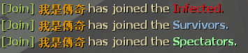

# Description | 內容
Informs other players when a client connects to the server and changes teams.

> __Note__ <br/>
This plugin is private, Please contact [me](https://github.com/fbef0102/Game-Private_Plugin#私人插件列表-private-plugins-list)<br/>
此為私人插件, 請聯繫[本人](https://github.com/fbef0102/Game-Private_Plugin#私人插件列表-private-plugins-list)

* Video | 影片展示
<br/>None

* Image
	<br/>
	<br/>

* <details><summary>How does it work?</summary>

	* Display player name, country, city when player joins server or leaves server
	* Display player joined team
</details>

* Notice
	* To retrieve data from client, You must [install country and city database](/Tutorial_%E6%95%99%E5%AD%B8%E5%8D%80/English/Server/Install_Other_File#country-and-city-database)

* Require | 必要安裝
	1. [[INC] Multi Colors](https://github.com/fbef0102/L4D1_2-Plugins/releases/tag/Multi-Colors)

* <details><summary>ConVar | 指令</summary>

	* cfg\sourcemod\l4d_playerjoining.cfg
		```php
		// If 1, inform other players when a client changes team
		l4d_playerjoining_change_team_notify_enable "1"

		// inform other players with these flags when a client connects to server. (Empty = Everyone, -1: Nobody)
		l4d_playerjoining_connnect_server_notify_access ""

		// inform other players with these flags when a client left the server. (Empty = Everyone, -1: Nobody)
		l4d_playerjoining_leave_server_notify_access ""
		```
</details>

* <details><summary>Command | 命令</summary>

	None
</details>

* Apply to | 適用於
	```
	L4D1
	L4D2
	```

* <details><summary>Translation Support | 支援翻譯</summary>

	```
	English
	繁體中文
	简体中文
	```
</details>

* <details><summary>TSimilar Plugin | 相似插件</summary>
	
	1. [cannounce](https://github.com/fbef0102/L4D1_2-Plugins/tree/master/cannounce): Replacement of default player connection message, allows for custom connection messages
    	> 顯示玩家進來遊戲或離開遊戲的提示訊息 (IP、國家、Steam ID 等等)
</details>

* <details><summary>Changelog | 版本日誌</summary>

	* v1.0 (2022-12-1)
		* Initial Release
</details>

- - - -
# 中文說明
當玩家更換隊伍、連線、離開伺服器之時，通知所有玩家

* 圖示
	* 當玩家更換隊伍時
	<br/>
	* 當玩家連線、離開伺服器之時
	<br/>

* 原理
    * 玩家連線進來伺服器之後，抓取玩家的地理位置並顯示在聊天視窗當中
    * 也有更換隊伍提示

* 功能
    * 可關閉更換隊伍提示
    * 可設置只有特地權限的玩家才能看到連線、離開伺服器的提示
	* 想要新增更多提示譬如IP、伺服器人數、Steam ID，請聯繫我修改

* 必看步驟
	* 抓取玩家的地理位置，需[安裝國家與城市的資料庫](/Tutorial_%E6%95%99%E5%AD%B8%E5%8D%80/Chinese_%E7%B9%81%E9%AB%94%E4%B8%AD%E6%96%87/Server/%E5%AE%89%E8%A3%9D%E5%85%B6%E4%BB%96%E6%AA%94%E6%A1%88%E6%95%99%E5%AD%B8#%E5%AE%89%E8%A3%9D%E5%9C%8B%E5%AE%B6%E8%88%87%E5%9F%8E%E5%B8%82%E7%9A%84%E8%B3%87%E6%96%99%E5%BA%AB)


