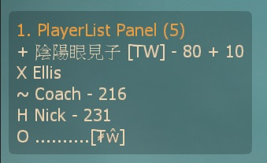
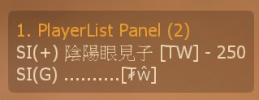

# Description | 內容
Display a sourcemod panel when players press the SCORE key.

> __Note__ <br/>
This plugin is private, Please contact [me](https://github.com/fbef0102/Game-Private_Plugin#私人插件列表-private-plugins-list)<br/>
此為私人插件, 請聯繫[本人](https://github.com/fbef0102/Game-Private_Plugin#私人插件列表-private-plugins-list)

* Image | 圖示
	* A = Afk (Idle Player), X = Dead, ~ = Incapacitated, + = Alive, H = Hanging from ledge, 0 = Spectator, number = HP
		> A = Afk (閒置玩家), X = 死亡, ~ = 倒地, + = 活著站立, H = 掛邊, 0 = 旁觀者, 數字為玩家的血量
		<br/>
	* SI(+) = Alive Infected, SI(G) = Ghost Infected, number = HP
		> SI(+) = 活著的特感玩家, SI(G) = 靈魂特感玩家, 數字為玩家的血量
		<br/>

* Apply to | 適用於
	```
	L4D1
	L4D2
	```

* <details><summary>Changelog | 版本日誌</summary>

	* v1.1 (2023-1-8)
	    * Draw more details on panel

	* v1.0 (2023-1-5)
	    * Original Request by maclarens
		* Initial Release
</details>

* Require | 必要安裝
	1. [left4dhooks](https://forums.alliedmods.net/showthread.php?t=321696)

* Note
	* The game default scoreboard is client side, so unfortunately can't block it.

* <details><summary>ConVar | 指令</summary>

	* cfg/sourcemod/l4d_scoreboard_panel.cfg
		```php
		// Symbol for afk players (idle survivor)
		l4d_scoreboard_panel_afk_symbol "A"

		// If 1, display health on panel
		l4d_scoreboard_panel_display_health "1"

		// Panel display time.
		l4d_scoreboard_panel_display_time "8"

		// 0=Plugin off, 1=Plugin on.
		l4d_scoreboard_panel_enable "1"

		// Symbol for survivors hanging from ledge
		l4d_scoreboard_panel_hanging_symbol "H"

		// Symbol for incapacitated survivors
		l4d_scoreboard_panel_incapacitated_symbol "~"

		// Symbol for alive infected players
		l4d_scoreboard_panel_infected_alive_symbol "SI(+)"

		// Symbol for dead infected players
		l4d_scoreboard_panel_infected_dead_symbol "SI(-)"

		// Symbol for ghost infected players
		l4d_scoreboard_panel_infected_ghost_symbol "SI(G)"

		// Symbol for infected players (Only display to survivor)
		l4d_scoreboard_panel_infected_team_symbol "SI"

		// Symbol for spectator players
		l4d_scoreboard_panel_spectator_team_symbol "O"

		// Symbol for alive survivors
		l4d_scoreboard_panel_survior_alive_symbol "+"

		// Symbol for black and white survivors (last life)
		l4d_scoreboard_panel_survivor_bw_symbol "!!"

		// Symbol for dead survivors
		l4d_scoreboard_panel_survivor_dead_symbol "X"
		
		// Cold down in seconds can a player press tab key to display panel again.
		l4d_scoreboard_panel_tab_cooldown "1.0"
		```
</details>

* <details><summary>Command | 命令</summary>

	None
</details>

- - - -
# 中文說明
按下Tab之後出現玩家列表介面，顯示每個玩家的狀態

* 原理
	* 按下Tab之後顯示每個玩家的狀態，特感也有
	* 人類看不到特感玩家的狀態
	* 適合用於多人連線的伺服器，因為遊戲內的記分板最多只能顯示五個人類與五個特感玩家狀態

* 功能
	1. 可設置介面顯示時間
	2. 可設置每個狀態的特殊符號

* 注意事項
	* 原本遊戲的記分板依然會顯示，那是客戶端的文件，伺服器無法阻擋 (認真你就輸了)
	<br/>
