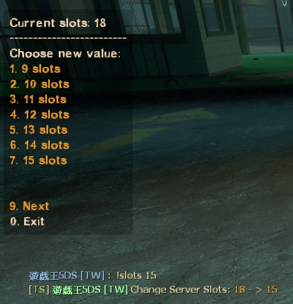
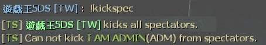
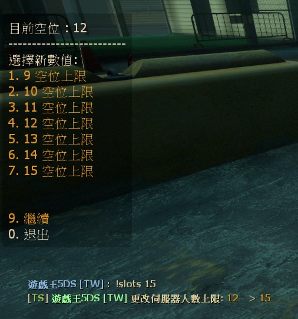

# Description | 內容
Allow players to change server slots by using vote. + Kick non-admin spectators

> __Note__ <br/>
This plugin is private, Please contact [me](https://github.com/fbef0102/Game-Private_Plugin#私人插件列表-private-plugins-list)<br/>
此為私人插件, 請聯繫[本人](https://github.com/fbef0102/Game-Private_Plugin#私人插件列表-private-plugins-list)<br/>
🟥Dedicated Server Only<br/>
🟥只能安裝在Dedicated Server

* [Video | 影片展示](https://youtu.be/HyKyNw80x7Y)

* Image | 圖示
	* Change server slots
	<br/>
	* Kick all spectators
	<br/>

* <details><summary>How does it work?</summary>

	* Change server slots
		* Admin types ```!slots X``` to change server slots (X is number)
		* Normal player types ```!slots X``` to call vote to change server slots (X is number)
	* Kick all spectators
		* Admin types ```!kickspec``` to kick all spectators except for admins.
		* Normal player types ```!kickspec``` to call vote to kick all spectators except for admins.
</details>

* Require
	1. [l4dtoolz](/Tutorial_%E6%95%99%E5%AD%B8%E5%8D%80/English/Server/Install_Other_File#l4dtoolz)
	2. [[INC] Multi Colors](https://github.com/fbef0102/L4D1_2-Plugins/releases/tag/Multi-Colors)
	3. [builtinvotes](https://github.com/L4D-Community/builtinvotes/actions)

* <details><summary>ConVar | 指令</summary>

	* cfg/sourcemod/l4d_slot_vote.cfg
		```php
		// Players with these flags can change slot or kick spectators directly without vote
		l4d_slot_vote_admin_flag "z"

		// Delay to start another a teamlock vote after vote ends.
		l4d_slot_vote_delay "5"

		// If 1, Enabled this plugin.
		l4d_slot_vote_enabled "1"

		// Players with these flags have immune to be kicked in spectator team.
		l4d_slot_vote_immue_kick_flag "z"

		// If 1, players can type comamnd to votekick all spectators.
		l4d_slot_vote_kick_spec "1"

		// Maximum allowed number of server slots (this value must be equal or greater than l4d_slot_vote_min).
		l4d_slot_vote_max "28"

		// Minimum allowed number of server slots (this value must be equal or lesser than l4d_slot_vote_max).
		l4d_slot_vote_min "9"

		// (L4D1) Pass vote percentage.
		l4d_slot_vote_pass_percentage "0.60"

		// Minimum # of players in game to start the vote
		l4d_slot_vote_player_limit "3"

		// If 1, non-admin can not call vote to change slots or kick spectators
		l4d_slot_vote_player_vote_block "1"
		```
</details>

* <details><summary>Command | 命令</summary>

	* **Vote to change Server Slots, Admin can change without vote (Require:Admin_Generic)**
		```php
		sm_slots <number>
		sm_maxslots <number>
		```

	* **Vote to kick all non-admin spectators, Admin can kick without vote (Require:Admin_Generic)**
		```php
		sm_nospec
		sm_nospecs
		sm_kickspec
		sm_kickspecs
		```

	* **Lock server slots Server, so nobody can change server slots (Server Console Only)**
		```php
		sm_lock_slots
		```

	* **Unlock server slots Server, so anyone can change server slots (Server Console Only)**
		```php
		sm_unlock_slots
		```
</details>

* Apply to | 適用於
	```
	L4D1
	L4D2
	```

* <details><summary>Translation Support | 支援翻譯</summary>

	```
	English
	繁體中文
	简体中文
	```
</details>

* <details><summary>Changelog | 版本日誌</summary>

	* v2.4 (2023-2-2)
		* Use the L4D2 built-in vote screens for l4d2
		* Require "builtinvotes" extension (l4d2 only)

	* v2.3
		* Initial Release
</details>

- - - -
# 中文說明
允許玩家使用命令更改伺服器人數上限 + 踢除非管理員的所有旁觀者

* 圖示
	* 更改伺服器人數上限
	<br/>
	* 踢出所有非管理員的旁觀者
	<br/>

* 必要安裝
	1. [l4dtoolz](/Tutorial_%E6%95%99%E5%AD%B8%E5%8D%80/English/Server/Install_Other_File#l4dtoolz): 解鎖伺服器人數上限
	2. [[INC] Multi Colors](https://github.com/fbef0102/L4D1_2-Plugins/releases/tag/Multi-Colors)
	3. [builtinvotes](https://github.com/L4D-Community/builtinvotes/actions)

* 原理
	* 玩家可投票調整伺服器的人數上限，管理員可以不用投票
	* 投票踢出所有非管理員的旁觀者，管理員可以不用投票

* 用意在哪
	* 時常有一群傻B來伺服器掛機旁觀不知道衝三小所以才有了此插件
	* 也可以更改伺服器人數上限，方便管理人員進出

* 功能
	* 可設置至少需要一定的玩家數量才能投票
	* 可設置非管理員的玩家不准發起投票