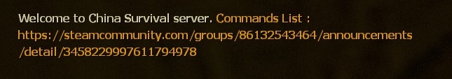

# Description | 內容
Display Welcome Message to new players (support translation)

> __Note__ <br/>
This plugin is private, Please contact [me](https://github.com/fbef0102/Game-Private_Plugin#私人插件列表-private-plugins-list)<br/>
此為私人插件, 請聯繫[本人](https://github.com/fbef0102/Game-Private_Plugin#私人插件列表-private-plugins-list)

* Video | 影片展示
<br/>None

* Image
	* English Welcome Message
	<br/>

* Apply to | 適用於
```
L4D1 
L4D2
```

* <details><summary>Changelog | 版本日誌</summary>

	* v1.1 (2022-12-6)
		* Request by Yabi
		* Display welcome message each time after changing map

	* v1.0 (2022-12-4)
		* Request by GGM
		* Initial Release
</details>

* Require | 必要安裝
	1. [[INC] Multi Colors](https://github.com/fbef0102/L4D1_2-Plugins/releases/tag/Multi-Colors)

* <details><summary>ConVar | 指令</summary>

	* cfg/sourcemod/server_welcome_message.cfg
		```php
		// Delay to display welcome message after new player joins server
		server_welcome_message_delay "5.0"

		// If 1, display welcome message each time after changing map
		server_welcome_message_each_map "0"
		```
</details>

* <details><summary>Command | 命令</summary>
	
	None
</details>

- - - -
# 中文說明
玩家加入伺服器後，聊天視窗顯示歡迎訊息 (支援多國語言)

* 圖示
	* 歡迎提示
	<br/>

* 原理
	* 玩家加入伺服器後，根據玩家的語言顯示歡迎訊息
	* 只顯示一次，玩家重新進入伺服器才再顯示 (切換關卡後不會顯示)

* 功能
	* 可以自行修改歡迎訊息，到translations\server_welcome_message.phrases.txt修改