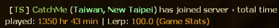

# Description | 內容
Showing the time played on record in Game Stats while player joins the server
(Get Game total time played even if the steam profile is publicly visible. Private, friends-only, and other privacy settings)

> __Note__ <br/>
This plugin is private, Please contact [me](https://github.com/fbef0102/Game-Private_Plugin#私人插件列表-private-plugins-list)<br/>
此為私人插件, 請聯繫[本人](https://github.com/fbef0102/Game-Private_Plugin#私人插件列表-private-plugins-list)

* Video | 影片展示
<br>None

* Image | 圖示
	* Name, country, city, play time, lerp
	<br/>

* Apply to | 適用於
	```
	L4D1
	L4D2
	```

* Translation Support | 支援翻譯
	```
	English
	繁體中文
	简体中文
	```

* <details><summary>Changelog | 版本日誌</summary>

	* v2.2 (2023-3-14)
		* Remove lerp
		* Delay to display message, so player can see his own time played on record.

	* v2.1 (2023-3-1)
		* Add lerp

	* v2.0 (2023-2-26)
		* Add country and city

	* v1.9 (2023-2-21)
		* Remake code and require SteamWorks
		* Get Game total time played even if the steam profile is publicly visible. Private, friends-only, and other privacy settings

	* v1.8
	    * Original Request by 壹梦
</details>

* Require | 必要安裝
	1. [[INC] Multi Colors](https://github.com/fbef0102/L4D1_2-Plugins/releases/tag/Multi-Colors)
	2. [SteamWorks](https://github.com/hexa-core-eu/SteamWorks/releases)

* <details><summary>ConVar | 指令</summary>

	* cfg/sourcemod/sm_PlayerTime.cfg
		```php
		// If 1, Announce the time played on record when player joins the server.
		sm_playtime_announce "1"

		// Application ID of current game. L4D (500), L4D2 (550)
		sm_playtime_appid "550"

		// Ban duration (Mins) (0=Permanent)
		sm_playtime_block_ban_time "1440"

		// Check and unblock players with these flags. (Empty = Everyone, -1: Nobody)
		sm_playtime_block_immue_flag "z"

		// Any player whose total time played on record is higher this value can not join the server. (Mins) (0=off)
		sm_playtime_block_long "0"

		// Any player whose total time played on record is below this value can not join the server. (Mins) (0=off)
		sm_playtime_block_short "6000"

		// Any player whose total time played on record is unknown can not join the server. (0=off)
		sm_playtime_block_unknown "0"

		// If 1, record to file. (Path: sourcemod/logs/PlayerTime.log)
		sm_playtime_log "1"
		```
</details>

* <details><summary>Command | 命令</summary>

	* **Check total time played of every player in game**
		```php
		sm_timedisplay
		```
</details>

* Important Step
	* To retrieve country and city from client, You must [install country and city database](https://github.com/fbef0102/Game-Private_Plugin/tree/main/Tutorial_%E6%95%99%E5%AD%B8%E5%8D%80/English/Server/Install_Other_File#country-and-city-database)

- - - -
# 中文說明
當玩家連線進來伺服器之後，顯示玩家的遊戲時數

* 原理
	* 玩家進來伺服器之時，抓取他的實際遊玩時數 (與'Steam個人檔案上顯示的遊戲時數'會有所不同)
	* 即使玩家的steam個人資料或頁面設定為未公開，依然可以抓取實際遊玩時數

* 功能
	* logs記錄檔
	* 遊戲時數過少的菜B八將會被踢出伺服器
	* 遊戲時數過高的大佬將會被踢出伺服器
	* 遊戲時數未知的神祕高手將會被踢出伺服器

* 必看步驟
	* 抓取玩家的地理位置，需[安裝國家與城市的資料庫](https://github.com/fbef0102/Game-Private_Plugin/tree/main/Tutorial_%E6%95%99%E5%AD%B8%E5%8D%80/Chinese_%E7%B9%81%E9%AB%94%E4%B8%AD%E6%96%87/Server/%E5%AE%89%E8%A3%9D%E5%85%B6%E4%BB%96%E6%AA%94%E6%A1%88%E6%95%99%E5%AD%B8#%E5%AE%89%E8%A3%9D%E5%9C%8B%E5%AE%B6%E8%88%87%E5%9F%8E%E5%B8%82%E7%9A%84%E8%B3%87%E6%96%99%E5%BA%AB)
