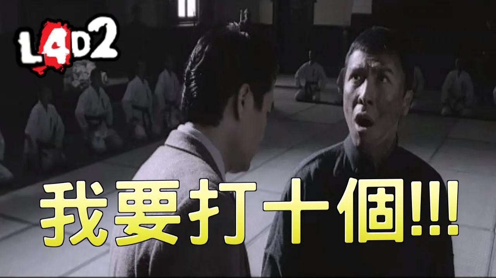

# Description | 內容
Special infected incaps survivors and die + set each scratch damage + skip getup animation

> __Note__ <br/>
This plugin is private, Please contact [me](https://github.com/fbef0102/Game-Private_Plugin#私人插件列表-private-plugins-list)<br/>
此為私人插件, 請聯繫[本人](https://github.com/fbef0102/Game-Private_Plugin#私人插件列表-private-plugins-list)

* [Video | 影片展示](https://youtu.be/ssLsbaKLLmk)

* <details><summary>Image | 圖示</summary>

    <br/>
    <br/>
    <br/>
    <br/>
</details>

* <details><summary>How does it work?</summary>

	* Special infected incaps survivors and die instantly
    * Set each Special infected scratch damage
    * Skip Survivor getup animation after release
</details>

* Require | 必要安裝
    1. [left4dhooks](https://forums.alliedmods.net/showthread.php?t=321696)
    2. [[INC] Multi Colors](https://github.com/fbef0102/L4D1_2-Plugins/releases/tag/Multi-Colors)

* <details><summary>ConVar | 指令</summary>

    * cfg/sourcemod/1vSpecials.cfg
        ```php
        // Modfiy Smoker attack damage when pulling before suicides. (-1=Disable)
        1vSpecials_smoker_attack_dmg "20"

        // Modfiy Hunter attack damage when pouncing before suicides. (-1=Disable)
        1vSpecials_hunter_attack_dmg "25"

        // Modfiy Jockey attack damage when riddiung before suicides. (-1=Disable)
        1vSpecials_jockey_attack_dmg "30"

        // Modfiy Charger attack damage when charging before suicides. (-1=Disable)
        1vSpecials_charger_attack_dmg "35"

        // Smoker claw Dmg. (-1=Default value dmg)
        1vSpecials_smoker_claw_dmg "-1"

        // Boomer claw Dmg. (-1=Default value dmg)
        1vSpecials_boomer_claw_dmg "-1"

        // Hunter claw Dmg. (-1=Default value dmg)
        1vSpecials_hunter_claw_dmg "-1"

        // Spitter claw Dmg. (-1=Default value dmg)
        1vSpecials_spitter_claw_dmg "-1"

        // Jockey claw Dmg. (-1=Default value dmg)
        1vSpecials_jockey_claw_dmg "-1"

        // Charger claw Dmg. (-1=Default value dmg)
        1vSpecials_charger_claw_dmg "-1"

        // If 1, Announce SI Health Left before SI suicides.
        1vSpecials_dmgannounce "1"

        // If 1, Skip Survivor Get Up Animation.
        1vSpecials_skip_getup "1"

        // 1=Kill All Infected, 2=Only Kill Attacker (0=Off)
        1vSpecials_kill_all "2"

        // If 1, this plugin only takes effect when infected attacking bot.
        1vSpecials_apply_bot_only "0"

        // If 1, this plugin removes god frame when capped by special infected.
        1vSpecials_remove_godframe "1"
        ```
</details>

* <details><summary>Command | 命令</summary>

    None
</details>

* Apply to | 適用於
    ```
    L4D1
    L4D2
    ```

* <details><summary>Related Plugin | 相關插件</summary>

    1. [l4dinfectedbots](https://github.com/fbef0102/L4D1_2-Plugins/tree/master/l4dinfectedbots): Spawns infected bots in L4D1 versus, and gives greater control of the infected bots in L4D1/L4D2 without being limited by the director.
        > 生成多特感控制插件
    2. [AI_HardSI](https://github.com/fbef0102/L4D2-Plugins/tree/master/AI_HardSI): Improves the AI behaviour of special infected
        > 增強特感攻擊行為
</details>

* <details><summary>Changelog | 版本日誌</summary>

    * v2.5 (2023-7-13)
        * Fixed Smoker does not suicide when dragging victim

    * v2.4 (2023-2-19)
    * Remake all cvars description
    * Set each Special Infected claw damage
    * Add new cvars
        ```php
        // Boomer claw Dmg. (-1=Default value dmg)
        1vSpecials_boomer_claw_dmg "-1"

        // Spitter claw Dmg. (-1=Default value dmg)
        1vSpecials_spitter_claw_dmg "-1"
        ```
    * v2.3
        * Initial Release
</details>

- - - -
# 中文說明
特感控到倖存者之後造成一定傷害並處死 + 設置每個特感的抓傷 + 略過起身動畫

* 原理
  * 特感控到倖存者之後造成一定傷害並自動死亡，倖存者可以繼續前進
  * 控制每隻特感的抓傷的傷害值
  * 倖存者解除特感控制後會略過起身狀態與動畫
  * 可配合多特感強化插件達成自己一人在伺服器訓練擊殺特感

* <details><summary>指令中文說明(點我展開)</summary>

    * cfg/sourcemod/1vSpecials.cfg
        ```php
        // Smoker 抓到倖存者後造成20點傷害並自殺 (-1=關閉這項功能)
        1vSpecials_smoker_attack_dmg "20"

        // Hunter 抓到倖存者後造成25點傷害並自殺 (-1=關閉這項功能)
        1vSpecials_hunter_attack_dmg "25"

        // Jockey 抓到倖存者後造成25點傷害並自殺 (-1=關閉這項功能)
        1vSpecials_jockey_attack_dmg "30"

        // Charger 抓到倖存者後造成25點傷害並自殺 (-1=關閉這項功能)
        1vSpecials_charger_attack_dmg "35"

        // 修改 Smoker 右鍵抓傷的傷害值 (-1=官方預設值)
        1vSpecials_smoker_claw_dmg "-1"

        // 修改 Boomer 右鍵抓傷的傷害值 (-1=官方預設值)
        1vSpecials_boomer_claw_dmg "-1"

        // 修改 Hunter 右鍵抓傷的傷害值 (-1=官方預設值)
        1vSpecials_hunter_claw_dmg "-1"

        // 修改 Spitter 右鍵抓傷的傷害值 (-1=官方預設值)
        1vSpecials_spitter_claw_dmg "-1"

        // 修改 Jockey 右鍵抓傷的傷害值 (-1=官方預設值)
        1vSpecials_jockey_claw_dmg "-1"

        // 修改 Charger 右鍵抓傷的傷害值 (-1=官方預設值)
        1vSpecials_charger_claw_dmg "-1"

        // 為1時，特感自殺前提示剩餘的血量
        1vSpecials_dmgannounce "1"

        // 為1時，倖存者解除特感控制後會略過起身狀態與動畫
        1vSpecials_skip_getup "1"

        // 1=殺死所有特感, 2=只殺死攻擊倖存者的特感 (0=不殺死任何特感)
        1vSpecials_kill_all "2"

        // 為1時，這插件只對AI Bot的倖存者有效果
        1vSpecials_apply_bot_only "0"

        // 為1時，移除人類的無敵狀態 (運作更順暢)
        1vSpecials_remove_godframe "1"
        ```
</details>