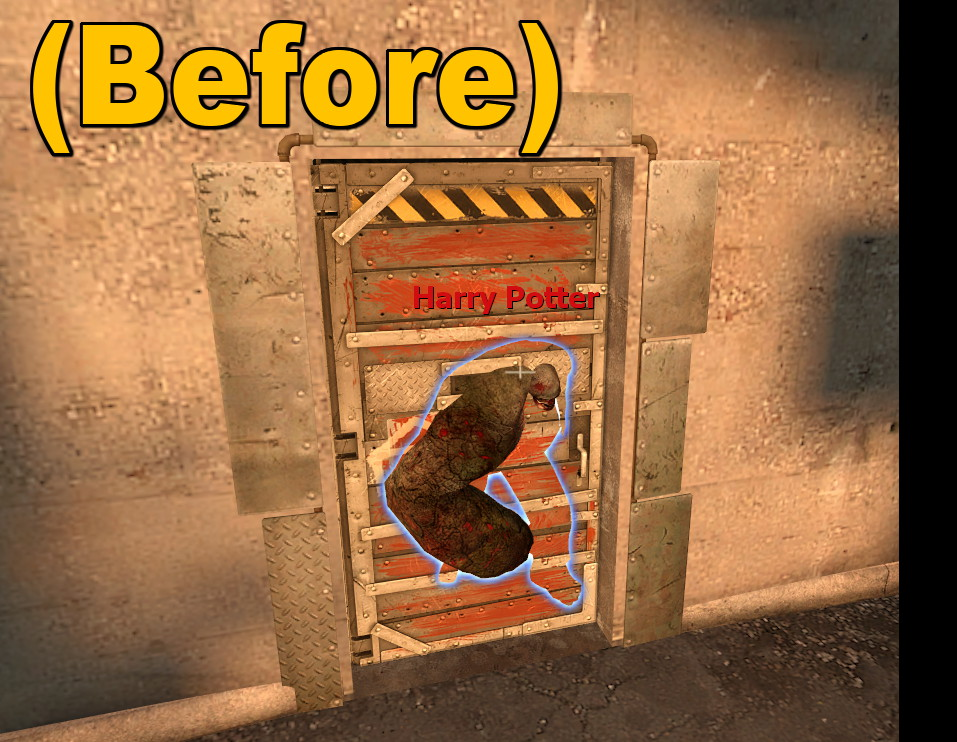

# Description | 內容
Teleport ci/si/tank outside the end saferoom if they spawn inside

> __Note__ <br/>
This plugin is private, Please contact [me](https://github.com/fbef0102/Game-Private_Plugin#私人插件列表-private-plugins-list)<br/>
此為私人插件, 請聯繫[本人](https://github.com/fbef0102/Game-Private_Plugin#私人插件列表-private-plugins-list)

* Video | 影片展示
<br/>None

* Image | 圖示
	<br/>
	<br/>

* <details><summary>How does it work?</summary>

	* Teleport ci/si/tank outside the end saferoom if they spawn inside
	* Auto disable teleport when 
		* A survivor reaches the end saferoom
		* Saferoom door is open
</details>

* Require | 必要安裝
	1. [left4dhooks](https://forums.alliedmods.net/showthread.php?t=321696)

* <details><summary>ConVar | 指令</summary>

	* cfg/sourcemod/end_safedoor_teleport.cfg
		```php
		// 0=Plugin off, 1=Plugin on.
		end_safedoor_teleport_enable "1"

		// 0=Teleport ci/si/tank, 1=Kill ci/si/tank, 2=Kick si/tank bot + Kill si/tank player + kill ci
		end_safedoor_teleport_type "0"
		```
</details>

* <details><summary>Command | 命令</summary>
	
	None
</details>

* Apply to | 適用於
	```
	L4D1
	L4D2
	```

* <details><summary>Related Plugin | 相關插件</summary>

	1. [lockdown_system-l4d2](https://github.com/fbef0102/L4D1_2-Plugins/tree/master/lockdown_system-l4d2): Locks Saferoom Door Until Someone Opens It.
		* 倖存者必須等待時間到並合力對抗屍潮與Tank才能打開終點安全門
	2. [l4dinfectedbots](https://github.com/fbef0102/L4D1_2-Plugins/tree/master/l4dinfectedbots): Spawns multi infected bots in any mode + allows playable special infected in coop/survival + unlock infected slots (10 VS 10 available)
		* 多特感生成插件，倖存者人數越多，生成的特感越多，且不受遊戲特感數量限制 + 解除特感隊伍的人數限制 (可達成對抗 10 VS 10 玩法)
</details>


* <details><summary>Changelog | 版本日誌</summary>

	* v1.1 (2024-3-8)
		* Update cvars

	* v1.0 (2024-2-19)
		* Initial Release
</details>

- - - -
# 中文說明
如果 普通感染者/特感/Tank 生在終點安全室裡面，則將他們傳送到門前 (避免卡在終點安全室裡面)

* 原理
	* 普通感染者/特感/Tank 生在終點安全室裡面，則將他們傳送到門前
	* 達到以下任一情況自動關閉傳送
		* 人類已抵達安全室內
		* 安全門已經打開

* 用意在哪?
    * 有使用多特感插件的伺服器，經常特感生在終點安全室裡面，無法出來

* <details><summary>指令中文介紹 (點我展開)</summary>

	* cfg/sourcemod/end_safedoor_teleport.cfg
		```php
		// 0=關閉插件, 1=啟動插件
		end_safedoor_teleport_enable "1"

		// 處理方式, 0=傳送普通感染者/特感/Tank到門前, 1=殺死普通感染者/特感/Tank, 2=踢出特感bot/Tank bot + 殺死特感玩家/Tank玩家/普通感染者
		end_safedoor_teleport_type "0"
		```
</details>
