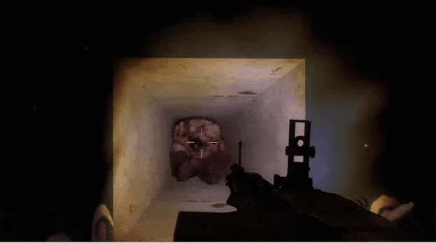
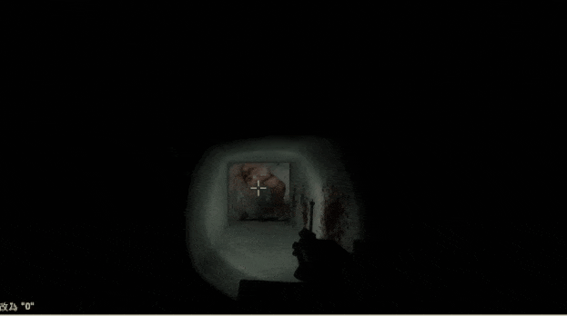

# Description | 內容
Manages the gunfire slowdown for infected team (Also apply to AI)

> __Note__ <br/>
This plugin is private, Please contact [me](https://github.com/fbef0102/Game-Private_Plugin#私人插件列表-private-plugins-list)<br/>
此為私人插件, 請聯繫[本人](https://github.com/fbef0102/Game-Private_Plugin#私人插件列表-private-plugins-list)

* [Video | 影片展示](https://youtu.be/TtGyesF7mhs)

* Image | 圖示
	* Before (裝此插件之前)
	<br/>
	* After (裝此插件之後)
	<br/>

* <details><summary>How does it work?</summary>

	* Modify movement speed while special infected get shot by survivor
	* No gunfire slowdown, make special infected move faster and smoother
	* Apply to both human and AI infected
</details>

* Require | 必要安裝
	1. [left4dhooks](https://forums.alliedmods.net/showthread.php?t=321696)

* <details><summary>ConVar | 指令</summary>

	* cfg/sourcemod/l4d_si_slowdown_gunfire.cfg
		```php
		// Maximum slowdown from gunfire for AI SI (-1: Game default settings; 0.0: No slowdown, 0.01-1.0: 1%%-100%% slowdown)
		l4d_si_slowdown_gunfire_ai "0.0"

		// Maximum slowdown from gunfire for SI Player (-1: Game default settings; 0.0: No slowdown, 0.01-1.0: 1%%-100%% slowdown)
		l4d_si_slowdown_gunfire_player "0.0"

		// Maximum slowdown from gunfire for the AI Tank (-1: Game default settings; 0.0: No slowdown, 0.01-1.0: 1%%-100%% slowdown)
		l4d_si_slowdown_gunfire_tank_ai "0.17"

		// Maximum slowdown from gunfire for the Tank Player (-1: Game default settings; 0.0: No slowdown, 0.01-1.0: 1%%-100%% slowdown)
		l4d_si_slowdown_gunfire_tank_player "0.1"

		// Fire causes this much slowdown * SI/Tank Maximum slowdown. (-1: Game default settings; 0.0: No slowdown)
		l4d_si_slowdown_gunfire_fire_percent "0.0"

		// Pistols cause this much slowdown * SI/Tank Maximum slowdown. (-1: Game default settings; 0.0: No slowdown)
		l4d_si_slowdown_gunfire_pistol_percent "-1.0"

		// Deagles cause this much slowdown * SI/Tank Maximum slowdown. (-1: Game default settings; 0.0: No slowdown)
		l4d_si_slowdown_deagle_percent "0.3"

		// Unsilenced uzis cause this much slowdown * SI/Tank Maximum slowdown. (-1: Game default settings; 0.0: No slowdown)
		l4d_si_slowdown_gunfire_uzi_percent "0.3"

		// MP5s cause this much slowdown * SI/Tank Maximum slowdown. (-1: Game default settings; 0.0: No slowdown)
		l4d_si_slowdown_gunfire_mp5_percent "0.32"

		// Silenced Uzis cause this much slowdown * SI/Tank Maximum slowdown. (-1: Game default settings; 0.0: No slowdown)
		l4d_si_slowdown_gunfire_mac_percent "0.3"

		// AKs cause this much slowdown * SI/Tank Maximum slowdown. (-1: Game default settings; 0.0: No slowdown)
		l4d_si_slowdown_gunfire_ak_percent "0.6"

		// M4s cause this much slowdown * SI/Tank Maximum slowdown. (-1: Game default settings; 0.0: No slowdown)
		l4d_si_slowdown_gunfire_m4_percent "0.6"

		// Scars cause this much slowdown * SI/Tank Maximum slowdown. (-1: Game default settings; 0.0: No slowdown)
		l4d_si_slowdown_gunfire_scar_percent "0.6"

		// Pump Shotguns cause this much slowdown * SI/Tank Maximum slowdown. (-1: Game default settings; 0.0: No slowdown)
		l4d_si_slowdown_gunfire_pump_percent "0.6"

		// Chrome Shotguns cause this much slowdown * SI/Tank Maximum slowdown. (-1: Game default settings; 0.0: No slowdown)
		l4d_si_slowdown_gunfire_chrome_percent "0.6"

		// Auto Shotguns cause this much slowdown * SI/Tank Maximum slowdown. (-1: Game default settings; 0.0: No slowdown)
		l4d_si_slowdown_gunfire_auto_percent "0.6"

		// Hunting Rifles cause this much slowdown * SI/Tank Maximum slowdown. (-1: Game default settings; 0.0: No slowdown)
		l4d_si_slowdown_gunfire_rifle_percent "0.6"

		// Scouts cause this much slowdown * SI/Tank Maximum slowdown. (-1: Game default settings; 0.0: No slowdown)
		l4d_si_slowdown_gunfire_scout_percent "0.8"

		// Military Rifles cause this much slowdown * SI/Tank Maximum slowdown. (-1: Game default settings; 0.0: No slowdown)
		l4d_si_slowdown_gunfire_military_percent "0.6"

		// AWP cause this much slowdown * SI/Tank Maximum slowdown. (-1: Game default settings; 0.0: No slowdown)
		l4d_si_slowdown_gunfire_awp_percent "0.8"

		// M60 cause this much slowdown * SI/Tank Maximum slowdown. (-1: Game default settings; 0.0: No slowdown)
		l4d_si_slowdown_gunfire_m60_percent "1.0"

		// Grenade Launcher cause this much slowdown * SI/Tank Maximum slowdown. (-1: Game default settings; 0.0: No slowdown)
		l4d_si_slowdown_gunfire_grenade_launcher_percent "1.0"

		// Minigun cause this much slowdown * SI/Tank Maximum slowdown. (-1: Game default settings; 0.0: No slowdown)
		l4d_si_slowdown_gunfire_minigun_percent "-1.0"

		// 50cal Machine gun cause this much slowdown * SI/Tank Maximum slowdown. (-1: Game default settings; 0.0: No slowdown)
		l4d_si_slowdown_gunfire_50cal_percent "-1.0"

		// Bomb Explosion cause this much slowdown * SI/Tank Maximum slowdown. (-1: Game default settings; 0.0: No slowdown)
		l4d_si_slowdown_gunfire_bomb_percent "-1.0"

		// Slowdown multiplier when crouch, _weapon_percent * SI/Tank Maximum slowdown * this value. (-1: Unchanged; 0.0: No slowdown)
		l4d_si_slowdown_gunfire_crouch_multi "0.5"
		```
</details>

* <details><summary>Command | 命令</summary>
	
	None
</details>

* <details><summary>Gunfire Slowdown Calculation Formula</summary>
	
	* Tank current speed is 210
		```php
		// If AI Tank being shot by ak47 bullet, speed is 210 - (210 * 0.17 * 0.6) = 188
		// If Tank Player being shot by ak47 bullet, speed is 210 - (210 * 0.1 * 0.6) = 197
		l4d_si_slowdown_gunfire_tank_ai "0.17"
		l4d_si_slowdown_gunfire_tank_player "0.1"
		l4d_si_slowdown_gunfire_ak_percent "0.6"
		```

	* Infected
		```php
		// If AI Infected being shot by any weapon, game default slowdown settings
		l4d_si_slowdown_gunfire_ai "-1.0"

		// If Infected Player being shot by any weapon, no slowdown
		l4d_si_slowdown_gunfire_player "0.0"
		```

	* Tank crouch speed is 75
		```php
		// If Tank Player being shot by ak47 bullet when crouch, speed is 75 - (75 * 0.8 * 1.0 * 0.5) = 45
		l4d_si_slowdown_gunfire_tank_player "0.8"
		l4d_si_slowdown_gunfire_ak_percent "1.0"

		l4d_si_slowdown_gunfire_crouch_multi "0.5"
		```
</details>

* Apply to | 適用於
	```
	L4D1
	L4D2
	```

* <details><summary>Changelog | 版本日誌</summary>

	* v1.1h (2024-2-28)
		* Control slowdown when crouch
		* Update cvars

	* v1.0h (2024-2-6)
		* Update cvars
		* Add MP5 and bomb explosion

	* v3.1 (2023-2-13)
		* Add a cvar
		* Remodify cvar name

	* v3.0
		* Remove water slowdown, couch speed control, only gunfire slowdown control
		* Add all weapons gunfire slowdown control including Minigun and 50cal Machine gun
		* Add AI infected and Player infected cvars
		* Modify gunfire slowdown calculation formula
		* Support L4D1

	* v2.7.1
		* [By Visor, Sir, darkid, Forgetest, A1m`, Derpduck](https://github.com/SirPlease/L4D2-Competitive-Rework/blob/master/addons/sourcemod/scripting/l4d2_slowdown_control.sp)
</details>

- - - -
# 中文說明
依據槍械種類修改特感的槍緩速度 (AI特感也適用)

* 原理
	* 遊戲中特感被倖存者射中時，特感會停頓下然後移動速度變慢，此插件就是修改特感被子彈射中之後的速度，俗稱"槍緩"
	* 真人與AI特感玩家都適用

* 用意在哪?
	* 特感移動快速與順暢，不會因為被子彈射中而停頓

* <details><summary>指令中文介紹 (點我展開)</summary>

	* cfg/sourcemod/l4d_si_slowdown_gunfire.cfg
		```php
		// AI 特感的槍緩 (-1: 遊戲預設; 0.0: 無槍緩，滿速移動, 0.01-1.0: 1%%-100%% 槍緩減少移動速度)
		l4d_si_slowdown_gunfire_ai "0.0"

		// 真人特感玩家的槍緩 (-1: 遊戲預設; 0.0: 無槍緩，滿速移動, 0.01-1.0: 1%%-100%% 槍緩減少移動速度)
		l4d_si_slowdown_gunfire_player "0.0"

		// AI Tank的槍緩 (-1: 遊戲預設; 0.0: 無槍緩，滿速移動, 0.01-1.0: 1%%-100%% 槍緩減少移動速度)
		l4d_si_slowdown_gunfire_tank_ai "0.17"

		// 真人Tank的槍緩 (-1: 遊戲預設; 0.0: 無槍緩，滿速移動, 0.01-1.0: 1%%-100%% 槍緩減少移動速度)
		l4d_si_slowdown_gunfire_tank_player "0.1"

		// 火焰傷害造成速度變慢，移動速度計算：此數值乘上 特感/Tank的槍緩值. (-1:遊戲預設; 0.0: 無緩慢，滿速移動)
		l4d_si_slowdown_gunfire_fire_percent "0.0"

		// 手槍傷害造成速度變慢，移動速度計算：此數值乘上 特感/Tank的槍緩值. (-1:遊戲預設; 0.0: 無槍緩，滿速移動)
		l4d_si_slowdown_gunfire_pistol_percent "-1.0"

		// 瑪格南手槍傷害造成速度變慢，移動速度計算：此數值乘上 特感/Tank的槍緩值. (-1:遊戲預設; 0.0: 無槍緩，滿速移動)
		l4d_si_slowdown_gunfire_deagle_percent "0.3"

		// UZI機槍 傷害造成速度變慢，移動速度計算：此數值乘上 特感/Tank的槍緩值. (-1:遊戲預設; 0.0: 無槍緩，滿速移動)
		l4d_si_slowdown_gunfire_uzi_percent "0.3"

		// MP5機槍 傷害造成速度變慢，移動速度計算：此數值乘上 特感/Tank的槍緩值. (-1:遊戲預設; 0.0: 無槍緩，滿速移動)
		l4d_si_slowdown_gunfire_mp5_percent "0.32"

		// 消音機槍 傷害造成速度變慢，移動速度計算：此數值乘上 特感/Tank的槍緩值. (-1:遊戲預設; 0.0: 無槍緩，滿速移動)
		l4d_si_slowdown_gunfire_mac_percent "0.3"

		// AK47 傷害造成速度變慢，移動速度計算：此數值乘上 特感/Tank的槍緩值. (-1:遊戲預設; 0.0: 無槍緩，滿速移動)
		l4d_si_slowdown_gunfire_ak_percent "0.6"

		// M16步槍 傷害造成速度變慢，移動速度計算：此數值乘上 特感/Tank的槍緩值. (-1:遊戲預設; 0.0: 無槍緩，滿速移動)
		l4d_si_slowdown_gunfire_m4_percent "0.6"

		// 三連發步槍 傷害造成速度變慢，移動速度計算：此數值乘上 特感/Tank的槍緩值. (-1:遊戲預設; 0.0: 無槍緩，滿速移動)
		l4d_si_slowdown_gunfire_scar_percent "0.6"

		// 木製單發散彈槍 傷害造成速度變慢，移動速度計算：此數值乘上 特感/Tank的槍緩值. (-1:遊戲預設; 0.0: 無槍緩，滿速移動)
		l4d_si_slowdown_gunfire_pump_percent "0.6"

		// 鐵製單發散彈槍 傷害造成速度變慢，移動速度計算：此數值乘上 特感/Tank的槍緩值. (-1:遊戲預設; 0.0: 無槍緩，滿速移動)
		l4d_si_slowdown_gunfire_chrome_percent "0.6"

		// 自動連發散彈槍 傷害造成速度變慢，移動速度計算：此數值乘上 特感/Tank的槍緩值. (-1:遊戲預設; 0.0: 無槍緩，滿速移動)
		l4d_si_slowdown_gunfire_auto_percent "0.6"

		// 獵槍 傷害造成速度變慢，移動速度計算：此數值乘上 特感/Tank的槍緩值. (-1:遊戲預設; 0.0: 無槍緩，滿速移動)
		l4d_si_slowdown_gunfire_rifle_percent "0.6"

		// Scout狙擊槍 傷害造成速度變慢，移動速度計算：此數值乘上 特感/Tank的槍緩值. (-1:遊戲預設; 0.0: 無槍緩，滿速移動)
		l4d_si_slowdown_gunfire_scout_percent "0.8"

		// 軍用狙擊槍 傷害造成速度變慢，移動速度計算：此數值乘上 特感/Tank的槍緩值. (-1:遊戲預設; 0.0: 無槍緩，滿速移動)
		l4d_si_slowdown_gunfire_military_percent "0.6"

		// AWP 傷害造成速度變慢，移動速度計算：此數值乘上 特感/Tank的槍緩值. (-1:遊戲預設; 0.0: 無槍緩，滿速移動)
		l4d_si_slowdown_gunfire_awp_percent "0.8"

		// M60 重型機關槍 傷害造成速度變慢，移動速度計算：此數值乘上 特感/Tank的槍緩值. (-1:遊戲預設; 0.0: 無槍緩，滿速移動)
		l4d_si_slowdown_gunfire_m60_percent "1.0"

		// 榴彈發射器 傷害造成速度變慢，移動速度計算：此數值乘上 特感/Tank的槍緩值. (-1:遊戲預設; 0.0: 無槍緩，滿速移動)
		l4d_si_slowdown_gunfire_grenade_launcher_percent "1.0"

		// Mini 機關槍砲台，傷害造成速度變慢，移動速度計算：此數值乘上 特感/Tank的槍緩值. (-1:遊戲預設; 0.0: 無槍緩，滿速移動)
		l4d_si_slowdown_gunfire_minigun_percent "-1.0"

		// 50cal 機關槍，傷害造成速度變慢，移動速度計算：此數值乘上 特感/Tank的槍緩值. (-1:遊戲預設; 0.0: 無槍緩，滿速移動)
		l4d_si_slowdown_gunfire_50cal_percent "-1.0"

		// 土製炸彈 傷害造成速度變慢，移動速度計算：此數值乘上 特感/Tank的槍緩值. (-1:遊戲預設; 0.0: 無槍緩，滿速移動)
		l4d_si_slowdown_gunfire_bomb_percent "-1.0"

		// 特感蹲下時的槍緩速度倍率調整, l4d_slowdown_武器_percent 乘上 特感/Tank的槍緩值 乘上 此數值. (-1: 不改變槍緩; 0.0: 無槍緩，滿速移動)
		l4d_si_slowdown_gunfire_crouch_multi "0.5"
		```
</details>

* <details><summary>槍緩速度計算 (點我展開)</summary>

	* Tank移動速度為210
		```php
		// AI Tank被AK47射中時，速度變成210 - (210 * 0.17 * 0.6) = 188
		// 真人Tank被AK47射中時，速度變成210 - (210 * 0.1 * 0.6) = 197
		l4d_si_slowdown_gunfire_ai "0.17"
		l4d_si_slowdown_gunfire_player "0.1"
		l4d_si_slowdown_gunfire_ak_percent "0.6"
		```

	* 當特感射中
		```php
		// 當AI特感被任一槍械射中時，槍緩減速為遊戲預設
		l4d_si_slowdown_gunfire_ai "-1.0"

		// 當真人特感被任一槍械射中時，沒有槍緩減速
		l4d_si_slowdown_gunfire_player "0.0"
		```

	* Tank蹲下速度為75
		```php
		// 真人Tank蹲下狀態被AK47射中時，速度變成 75 - (75 * 0.8 * 1.0 * 0.5) = 45
		l4d_si_slowdown_gunfire_tank_player "0.8"
		l4d_si_slowdown_gunfire_ak_percent "1.0"

		l4d_si_slowdown_gunfire_crouch_multi "0.5"
		```
</details>
