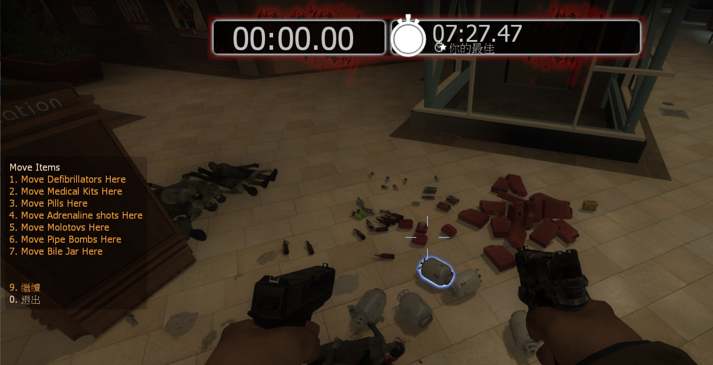

# Description | 內容
Open Menu to teleport items on the map.

> __Note__ <br/>
This plugin is private, Please contact [me](https://github.com/fbef0102/Game-Private_Plugin#私人插件列表-private-plugins-list)<br/>
此為私人插件, 請聯繫[本人](https://github.com/fbef0102/Game-Private_Plugin#私人插件列表-private-plugins-list)

* [Video | 影片展示](https://youtu.be/hlEiyPxE_Eo)

* Image | 圖示
	* teleport all items on the map (生存模式節省搬運時間必備插件)
	<br/>

* Require | 必要安裝
<br/>None

* <details><summary>ConVar | 指令</summary>

	* cfg/sourcemod/l4d_Teleport_Item.cfg
		```php
		// Players with these flags have access to use command to open menu. (Empty = Everyone, -1: Nobody)
		l4d_Teleport_Item__access_flag ""

		// 0=Plugin off, 1=Plugin on.
		l4d_Teleport_Item_allow "1"

		// Turn off the plugin in these maps, separate by commas (no spaces). (0=All maps, Empty = none).
		l4d_Teleport_Item_map_off ""

		// Turn on the plugin in these game modes, separate by commas (no spaces). (Empty = all).
		l4d_Teleport_Item_modes ""

		// Turn off the plugin in these game modes, separate by commas (no spaces). (Empty = none).
		l4d_Teleport_Item_modes_off ""

		// Turn on the plugin in these game modes. 0=All, 1=Coop, 2=Survival, 4=Versus, 8=Scavenge. Add numbers together.
		l4d_Teleport_Item_modes_tog "0"
		```
</details>

* <details><summary>Command | 命令</summary>
	
	* **Display Item menu**
		```php
		sm_tpmenu
		```
</details>

* Apply to | 適用於
	```
	L4D1
	L4D2
	```

* <details><summary>Changelog | 版本日誌</summary>

	* v1.0
		* Initial Release
</details>

- - - -
# 中文說明
打開菜單傳送地圖上所有物品到身邊

* 原理
	* 你是否有過經驗在生存模式之下浪費時間搬運汽油桶與物資，安裝這插件能節省你大量的時間

* 功能
	1. 可設置特定人士才能傳送
	2. 可選擇物品進行傳送
	3. 不能傳送武器
