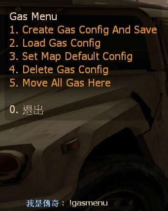

# Description | 內容
Save and load gas configs

> __Note__ <br/>
This plugin is private, Please contact [me](https://github.com/fbef0102/Game-Private_Plugin#私人插件列表-private-plugins-list)<br/>
此為私人插件, 請聯繫[本人](https://github.com/fbef0102/Game-Private_Plugin#私人插件列表-private-plugins-list)

* [Video | 影片展示](https://youtu.be/78Ed0eMKk1U)

* Image | 圖示
	* Display Menu
    > 輸入!gasmenu打開設定介面
	<br/>
	* Support Gascan, Firework Crate, Propane Tank, Oxygen Tank, Explosive Pack, Incendiary Pack
    > 載入不同的汽油桶擺放配置
	<br/>

* Apply to | 適用於
```
L4D1 Survival
L4D2 Survival
```

* <details><summary>Changelog | 版本日誌</summary>

    * v1.0h (2022-11-29)
	    * Request by Horizon
	    * Remake code
		* Convert code to latest syntax
		* Changes to fix warnings when compiling on SourceMod 1.11.
        * Support Gascan, Firework Crate, Propane Tank, Oxygen Tank, Explosive Pack, Incendiary Pack
        * Fix errors

    * v1.0
        * [Original Plugin by khan](https://github.com/graviti666/Some-Plugins/tree/master/Gas%20Configs)
</details>

* Require | 必要安裝
	1. [left4dhooks](https://forums.alliedmods.net/showthread.php?t=321696)
	2. [[INC] Multi Colors](https://forums.alliedmods.net/showthread.php?t=247770)
    3. [[INC] l4d2_weapons](https://github.com/fbef0102/Game-Private_Plugin/blob/main/left4dead2/scripting/include/l4d2_weapons.inc)

* Related Plugin | 相關插件
	1. [l4d_survival_setup](/Plugin_插件/Survival_生存模式/l4d_survival_setup): Set up weapon slots before survival starts
        > 生存模式開始之前設定自己想要拿取的武器與物品，下次回合開始之時會自動裝備

    2. [l4d_Teleport_Item](/Plugin_插件/Survival_生存模式/l4d_Teleport_Item): Open Menu to teleport items on the map.
        > 打開菜單傳送地圖上所有物品到身邊

* <details><summary>ConVar | 指令</summary>

    * cfg/sourcemod/l4d_survival_GasConfig.cfg
        ```php
        // Max number of gas setups to allow per map
        l4d_survival_GasConfig_limit "20"
        ```
</details>

* <details><summary>Command | 命令</summary>
    
    * **Loads the gas menu**
        ```php
        sm_gasmenu
        ```
    
    * **Moves all the gascans to the player**
        ```php
        sm_gashere
        ```
</details>

* Data File
	* Auto create files in data/GasConfigs folder to save gas config
    * Don't try to modify unless you know what you are doing

- - - -
# 中文說明
生存模式開始之前設定汽油桶位置，下次回合開始之時汽油桶自動擺放

* 如何使用
    1. 先擺放好地圖上的汽油桶位置
    2. 輸入!gasmenu -> "Create Gas Config And Save" -> 聊天視窗輸入文字為這個配置命名
    3. 輸入!gasmenu -> "Set Map Default Config" -> 選擇剛才命名的配置
    4. 重新地圖

* 原理
    * 載入地圖或者回合重新開始時，自動擺放好玩家設定的汽油桶位置
    * 所有設定會自動保存到配置文件中
    * 節省生存模式搬運物品時間

* 功能
    * 支援汽油桶、瓦斯桶、氧氣罐、煙火盒、火焰包、高爆彈

* Data 文件
	* 此插件會自動創建文件於data/GasConfigs資料夾，用來儲存汽油桶的擺放位置設定
    * 沒事別改動文件除非你知道這是在幹嗎


