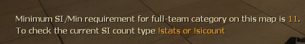
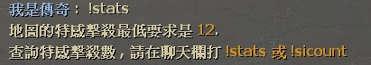

# Description | 內容
Display Minimum SI requirement for full-team on each survival map.

> __Note__ <br/>
This plugin is private, Please contact [me](https://github.com/fbef0102/Game-Private_Plugin#私人插件列表-private-plugins-list)<br/>
此為私人插件, 請聯繫[本人](https://github.com/fbef0102/Game-Private_Plugin#私人插件列表-private-plugins-list)

* Video | 影片展示
<br/>None

* Image
	* display message when survival begins
	<br/>

* Apply to | 適用於
	```
	L4D1 Survival
	L4D2 Survival
	```

* Translation Support | 支援翻譯
	```
	English
	繁體中文
	简体中文
	```

* <details><summary>Changelog | 版本日誌</summary>

	* v1.1 (2023-2-10)
		* Display different SI requirement numbers based on how many alive survivors when survival begins

	* v1.0
		* Initial Release
</details>

* Require | 必要安裝
	1. [left4dhooks](https://forums.alliedmods.net/showthread.php?t=321696)
	2. [[INC] Multi Colors](https://github.com/fbef0102/L4D1_2-Plugins/releases/tag/Multi-Colors)

* <details><summary>ConVar | 指令</summary>

	None
</details>

* <details><summary>Command | 命令</summary>

	* **Minimum SI/Min requirement for full-team category on this map**
		```php
		sm_stats
		sm_sicount
		```
</details>

* Data Example
	* data/l4d_survival_min_si_require.cfg
		```php
		"l4d_survival_min_si_require"
		{
			"c1m2_streets" // map name
			{
				"SI_Requirement_4"	"12" // if 4 alive survivors
				"SI_Requirement_3"	"9" // if 3 alive survivors
				"SI_Requirement_2"	"6" // if 2 alive survivors
				"SI_Requirement_1"	"3" // if 1 alive survivor
			}
			"c1m4_atrium"
			{
				"SI_Requirement_4"	"15" // if 4 alive survivors
				"SI_Requirement_3"	"10" // if 3 alive survivors
				"SI_Requirement_2"	"5" // if 2 alive survivors
				"SI_Requirement_1"	"4" // if 1 alive survivor
			}
		}
		```

- - - -
# 中文說明
在聊天欄顯示該生存地圖的最少特感擊殺數

* 圖示
	* 提示訊息
	<br/>

* 原理
	* 只適用於生存模式
	* 平均每分鐘，最少要擊殺多少特感，不同地圖不同要求

* Data設定範例
	* data/l4d_survival_min_si_require.cfg
		```php
		"l4d_survival_min_si_require"
		{
			"c1m2_streets" // 地圖名
			{
				"SI_Requirement_4"	"12" // 此地圖(4人隊伍)每分鐘特感擊殺最低要求是 12
				"SI_Requirement_3"	"9" // 此地圖(3人隊伍)每分鐘特感擊殺最低要求是 9
				"SI_Requirement_2"	"6" // 此地圖(2人隊伍)每分鐘特感擊殺最低要求是 6
				"SI_Requirement_1"	"3" // 此地圖(只有1人)每分鐘特感擊殺最低要求是 3
			}
			"c1m4_atrium"
			{
				"SI_Requirement_4"	"15" // 此地圖(4人隊伍)每分鐘特感擊殺最低要求是 15
				"SI_Requirement_3"	"10" // 此地圖(3人隊伍)每分鐘特感擊殺最低要求是 10
				"SI_Requirement_2"	"5" // 此地圖(2人隊伍)每分鐘特感擊殺最低要求是 5
				"SI_Requirement_1"	"4" // 此地圖(只有1人)每分鐘特感擊殺最低要求是 4
			}
		}
		```

