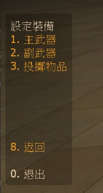

# Description | 內容
Set up weapon slots before survival starts

> __Note__ <br/>
This plugin is private, Please contact [me](https://github.com/fbef0102/Game-Private_Plugin#私人插件列表-private-plugins-list)<br/>
此為私人插件, 請聯繫[本人](https://github.com/fbef0102/Game-Private_Plugin#私人插件列表-private-plugins-list)

* [Video | 影片展示](https://youtu.be/P3Y1ExRmBIU)

* Image
    * Display Menu
    <br/>
    * Define Setup
    <br/>

* <details><summary>How does it work?</summary>

    * Type ```!setup``` -> aim the weapon or item on the map -> save -> auto pickup or equip on survival round start
    * Can't equip laser if there is no laser sight on the map
</details>

* Require | 必要安裝
    1. [left4dhooks](https://forums.alliedmods.net/showthread.php?t=321696)
    2. [[INC] Multi Colors](https://github.com/fbef0102/L4D1_2-Plugins/releases/tag/Multi-Colors)
    3. [[INC] l4d2_weapons](/left4dead2/scripting/include/l4d2_weapons.inc)

* Related Plugin | 相關插件
    1. [l4d_survival_GasConfig](/Plugin_插件/Survival_生存模式/l4d_survival_GasConfig): Save and load gas configs
        > 生存模式開始之前設定汽油桶位置，下次回合開始之時汽油桶自動擺放位置

* <details><summary>ConVar | 指令</summary>

    * cfg/sourcemod/l4d_survival_setup.cfg
        ```php
        // 0=Plugin off, 1=Plugin on.
        l4d_survival_setup_enable "1"

        // Changes how message displays. (0: Disable, 1:In chat, 2: In Hint Box, 3: In center text)
        l4d_survival_setup_announce_type "1"
        ```
</details>

* <details><summary>Command | 命令</summary>
    
    * **Open Setup menu for survival mod**
        ```php
        sm_setup
        ```
</details>

* <details><summary>Data File</summary>

    * Auto create ```data/l4d_survival_setup/l4d_survival_setup.cfg``` to save and record players' weapons and items setup
    * Don't try to modify unless you know what you are doing
</details>

* Apply to | 適用於
    ```
    L4D1 Survival
    L4D2 Survival
    ```

* <details><summary>Translation Support | 支援翻譯</summary>

    ```
    English
    繁體中文
    简体中文
    ```
</details>

* <details><summary>Changelog | 版本日誌</summary>

    * v1.1 (2023-2-4)
        * Translation Support
        * Disable laser if there is no any laser sight on the map

    * v1.0 (2022-11-09)
        * Initial Release
</details>

- - - -
# 中文說明
生存模式開始之前設定自己的生存開場裝備，下次回合開始之時會自動裝備所設定的武器與物品

* 圖示
    * 輸入!setup打開設定介面
    <br/>
    * 設定生存裝備
    <br/>

* 原理
    * 輸入```!setup```打開介面開始設定自己的生存開場裝備
    * 設定的武器與物品必須是地圖上已經存在的東西
    * 所有設定會自動保存到文件中，所以離開伺服器或伺服器重啟都還會保存檔案
    * 節省生存模式預備時間
    * 沒有紅外線升級裝置的地圖，無法設定雷射紅外線

* <details><summary>ConVar | 指令</summary>

    * cfg/sourcemod/l4d_survival_setup.cfg
        ```php
        // 0=Plugin off, 1=Plugin on.
        l4d_survival_setup_enable "1"
        
        // Changes how message displays. (0: Disable, 1:In chat, 2: In Hint Box, 3: In center text)
        l4d_survival_setup_announce_type "1"
        ```
</details>

* <details><summary>Data 文件</summary>

    * 此插件會自動創建data/l4d_survival_setup/l4d_survival_setup.cfg，並儲存與紀錄玩家的武器與物品設定
    * 沒事別改動文件除非你知道這是在幹嗎
</details>


