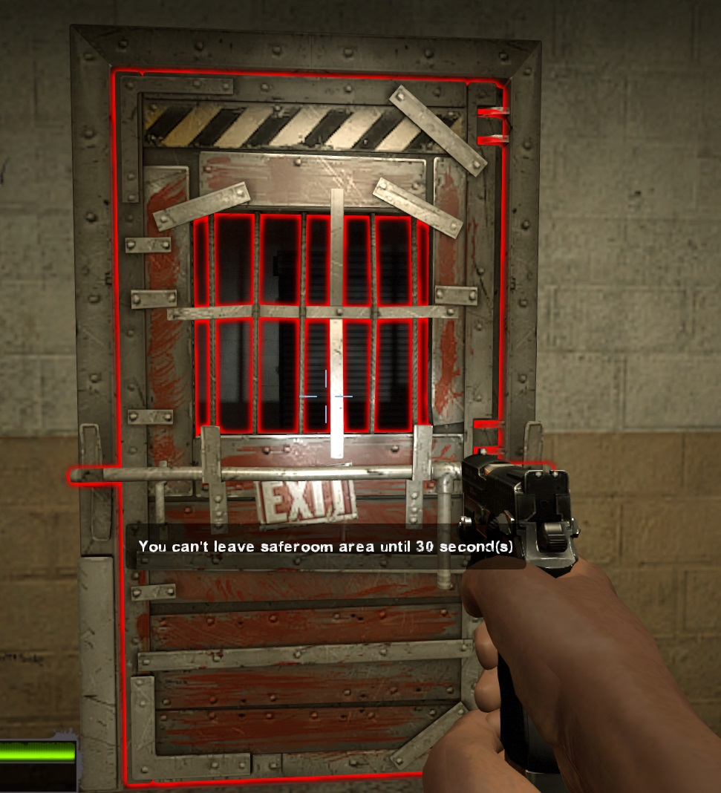

# Description | 內容
Start Saferoom door anti open + teleport survivor back to safe area when leaving out saferoom until certain time pass

> __Note__ <br/>
This plugin is private, Please contact [me](https://github.com/fbef0102/Game-Private_Plugin#私人插件列表-private-plugins-list)<br/>
此為私人插件, 請聯繫[本人](https://github.com/fbef0102/Game-Private_Plugin#私人插件列表-private-plugins-list)

* [Video | 影片展示](https://youtu.be/b3A14C7Qie8)

* Image | 圖示
	* Display timeleft when someone tries to open door
        > 顯示剩餘秒數
        <br/>
	* Make the first saferoom door automatically fall
        > 安全起始大門自由落下
        <br/>

* Apply to | 適用於
    ```
    L4D1
    L4D2
    ```

* <details><summary>Changelog | 版本日誌</summary>

	* v2.4 (2023-2-13)
        * Request by fe
        * Add a cvar 
            ```c
            // Changes how count down timer displays.
            antisaferoomdooropen_countdown_announce_type "2"
            ```

	* v2.3
        * Initial Release
</details>

* Require | 必要安裝
	1. [left4dhooks](https://forums.alliedmods.net/showthread.php?t=321696)
	2. [[INC] Multi Colors](https://github.com/fbef0102/L4D1_2-Plugins/releases/tag/Multi-Colors)

* Related Plugin | 相關插件
	1. [lockdown_system-l4d2](https://github.com/fbef0102/L4D1_2-Plugins/tree/master/lockdown_system-l4d2): Locks Saferoom Door Until Someone Opens It.
		> 終點安全門鎖住直到時間結束

* <details><summary>ConVar | 指令</summary>

	* cfg/sourcemod/antisaferoomdooropen.cfg
        ```php
        // Changes how count down timer displays. (0: Disable, 1:In chat, 2: In Hint Box, 3: In center text)
        antisaferoomdooropen_countdown_announce_type "2"

        // Enable anti saferoom door open plugin. [0-Disable,1-Enable]
        antisaferoomdooropen_enable "1"

        // Enable anti saferoom door fade after open drop. [0-Disable,1-Enable]
        antisaferoomdooropen_fade "1"

        // If 1, replace saferoom door with fake door after door open
        antisaferoomdooropen_fake "1"

        // saferoom door auto open after this amount of time, even if survivors are still inside the safe room. (0=off)
        antisaferoomdooropen_force_start_time "60"

        // (L4D2) Set A Glow For The Saferoom Doors
        antisaferoomdooropen_glow_enable "1"

        // (L4D2) Set The Glow Range For Saferoom Doors
        antisaferoomdooropen_glow_range "500"

        // Allow player to leave safe area after this amount of time. (0=off) (useful if map doesn't have Start saferoom door)
        antisaferoomdooropen_left_start_area_time "41"

        // (L4D2) Set Saferoom Lock Glow Color, (0-255) Separated By Spaces.
        antisaferoomdooropen_lock_glow_color "255 0 0"

        // Turn on the plugin in these game modes. 0=All, 1=Coop, 2=Survival, 4=Versus, 8=Scavenge. Add numbers together.
        antisaferoomdooropen_modes_tog "0"

        // saferoom door anti open by survivor after this amount of time.
        antisaferoomdooropen_open "40"

        // If 1, Spawn player to safe area if player dies before door open
        antisaferoomdooropen_open_spawn_player "0"

        // If 1, return player to safe area if player spawns or takes over bot before door open.
        antisaferoomdooropen_return_player "0"

        // (L4D2) Set Saferoom Unlock Glow Color, (0-255) Separated By Spaces.
        antisaferoomdooropen_unlock_glow_color "0 255 0"
        ```
</details>

* <details><summary>Command | 命令</summary>

	None
</details>

- - - -
# 中文說明
起始安全室的安全門將會鎖住直到時間結束 + 沒有安全門的關卡一旦離開安全區域會傳送回起始安全區域

* 原理
	* 第一個真人玩家載入伺服器後才計時
    * 計時開始後到時間結束之前不得打開安全室的門
    * 如果關卡沒有安全室，則一旦離開安全區域會傳送回去

* 功能
	* 自訂時間
	* 安全門開啟後自動消失
	* 沒有安全門的第一關也適用
	* 自定義顏色與發光距離
	* 可關閉顏色