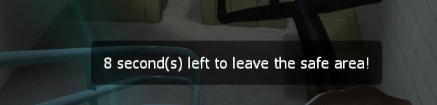

# Description | 內容
Start Saferoom door anti open + teleport survivor back to safe area when leaving out saferoom until certain time pass

> __Note__ <br/>
This plugin is private, Please contact [me](https://github.com/fbef0102/Game-Private_Plugin#私人插件列表-private-plugins-list)<br/>
此為私人插件, 請聯繫[本人](https://github.com/fbef0102/Game-Private_Plugin#私人插件列表-private-plugins-list)

* [Video | 影片展示](https://youtu.be/b3A14C7Qie8)

* Image
    <br/>
    <br/>
    <br/>

* <details><summary>How does it work?</summary>

	* Lock start saferoom door until time pass
    * Teleport survivor back to safe area until time pass
    * Saferoom door drops after door open
</details>

* Require | 必要安裝
    1. [left4dhooks](https://forums.alliedmods.net/showthread.php?t=321696)
    2. [[INC] Multi Colors](https://github.com/fbef0102/L4D1_2-Plugins/releases/tag/Multi-Colors)

* <details><summary>ConVar | 指令</summary>

    * cfg/sourcemod/antisaferoomdooropen.cfg
        ```php
        // Enable anti saferoom door open plugin. [0-Disable,1-Enable]
        antisaferoomdooropen_enable "1"

        // Turn on the plugin in these game modes. 0=All, 1=Coop, 2=Survival, 4=Versus, 8=Scavenge. Add numbers together.
        antisaferoomdooropen_modes_tog "0"

        // saferoom door auto open after this amount of time, even if survivors are still inside the safe room. (0=off)
        antisaferoomdooropen_force_start_time "60"

        // saferoom door anti open by survivor after this amount of time.
        antisaferoomdooropen_open "40"

        // If 1, saferoom door drops after door open
        antisaferoomdooropen_fake "1"

        // Enable anti saferoom door fade after open drop. [0-Disable,1-Enable]
        antisaferoomdooropen_fade "1"

        // Allow player to leave safe area after this amount of time. (0=off)
        // Only work if map doesn't have start saferoom door
        antisaferoomdooropen_left_start_area_time "41"

        // If 1, Players won't take any damage before _left_start_area_time cvar time up
        // Only work if map doesn't have start saferoom door
        antisaferoomdooropen_left_start_area_god "1"

        // If 1, Spawn player to safe area if player dies before door open
        antisaferoomdooropen_open_spawn_player "0"

        // If 1, return player to safe area if player spawns or takes over bot before door open.
        antisaferoomdooropen_return_player "0"

        // Changes how count down timer displays. (0: Disable, 1:In chat, 2: In Hint Box, 3: In center text)
        antisaferoomdooropen_countdown_announce_type "2"

        // (L4D2) Set A Glow For The Saferoom Doors
        antisaferoomdooropen_glow_enable "1"

        // (L4D2) Set The Glow Range For Saferoom Doors
        antisaferoomdooropen_glow_range "500"

        // (L4D2) Set Saferoom Lock Glow Color, (0-255) Separated By Spaces.
        antisaferoomdooropen_lock_glow_color "255 0 0"

        // (L4D2) Set Saferoom Unlock Glow Color, (0-255) Separated By Spaces.
        antisaferoomdooropen_unlock_glow_color "0 255 0"
        ```
</details>

* <details><summary>Command | 命令</summary>

	* **Return all players to start safe area. (Adm Required: ADMFLAG_ROOT)**
		```php
		sm_returnall
		```
</details>

* Apply to | 適用於
    ```
    L4D1
    L4D2
    ```

* <details><summary>Related Plugin | 相關插件</summary>

    1. [lockdown_system-l4d2](https://github.com/fbef0102/L4D1_2-Plugins/tree/master/lockdown_system-l4d2): Locks Saferoom Door Until Someone Opens It.
        > 終點安全門鎖住直到時間結束
</details>

* <details><summary>Changelog | 版本日誌</summary>

    * v2.6 (2024-8-27)
        * Update cvars

    * v2.5 (2023-10-31)
        * Add translation file

    * v2.4 (2023-2-13)
        * Add a cvar to display count down timer

    * v2.3
        * Initial Release
</details>

- - - -
# 中文說明
起始安全室的安全門將會鎖住直到時間結束 + 沒有安全門的關卡一旦離開安全區域會傳送回起始安全區域

* 圖示
    <br/>
    <br/>

* 原理
	* 回合開始時，將安全室的門鎖住，任何人不得打開安全室的門直到時間結束
    * 如果關卡沒有安全室，則一旦離開安全區域會被傳送回去
    * 大門打開後，門自動掉落 (不能再關回去)

* 用意在哪?
    * 讓隊友等待玩家
    * 防止每次過關後有傻B不等人直接打開安全門衝出去
    * 禁止跑回起始安全室關閉大門，躲避特感或者Witch追殺

* <details><summary>指令中文介紹 (點我展開)</summary>

    * cfg/sourcemod/antisaferoomdooropen.cfg
        ```php
        // 0=關閉插件, 1=啟動插件
        antisaferoomdooropen_enable "1"

        // 什麼模式下啟動此插件. 0=所有模式, 1=戰役, 2=生存, 4=對抗, 8=清道夫. 請將數字相加起來
        antisaferoomdooropen_modes_tog "0"

        // 60秒後，安全室的門自動打開 (0=關閉這項功能)
        antisaferoomdooropen_force_start_time "60"

        // 每回合開始時安全門會鎖住，40秒後，倖存者才可以打開安全門
        antisaferoomdooropen_open "40"

        // 為1時，安全門打開後會自動掉落且不能再關回去
        antisaferoomdooropen_fake "1"

        // 為1時，安全門掉落地上後自動消失
        antisaferoomdooropen_fade "1"

        // 41秒後，倖存者才能離開安全區域 (0=關閉這項功能)
        // 關卡沒有安全室才會生效，則一旦離開安全區域會被傳送回去
        antisaferoomdooropen_left_start_area_time "41"

        // 為1時，倖存者們不會受到任何傷害直到 _left_start_area_time 設置的時間結束
        // 關卡沒有安全室才會生效
        antisaferoomdooropen_left_start_area_god "1"

        // 為1時，如果玩家在安全室內死亡則會復活 (時間到之前)
        antisaferoomdooropen_open_spawn_player "0"

        // 為1時，玩家取代Bot時會返回安全區域 (時間到之前)
        antisaferoomdooropen_return_player "0"

        // 時間倒數提示該如何顯示. (0: 不提示, 1: 聊天框, 2: 黑底白字框, 3: 螢幕正中間)
        antisaferoomdooropen_countdown_announce_type "2"

        // (L4D2) 為1時，安全室的大門有光環
        antisaferoomdooropen_glow_enable "1"

        // (L4D2) 安全室的大門發光範圍
        antisaferoomdooropen_glow_range "500"

        // (L4D2) 安全室的大門鎖住時的光圈顏色，填入RGB三色 (三個數值介於0~255，需要空格)
        antisaferoomdooropen_lock_glow_color "255 0 0"

        // (L4D2) 安全室的大門解除鎖住時的光圈顏色，填入RGB三色 (三個數值介於0~255，需要空格)
        antisaferoomdooropen_unlock_glow_color "0 255 0"
        ```
</details>

* <details><summary>命令中文介紹 (點我展開)</summary>

	* **將所有倖存者返回安全室. (權限: ADMFLAG_ROOT)**
		```php
		sm_returnall
		```
</details>