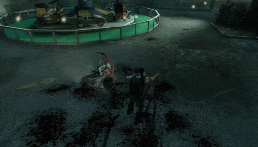
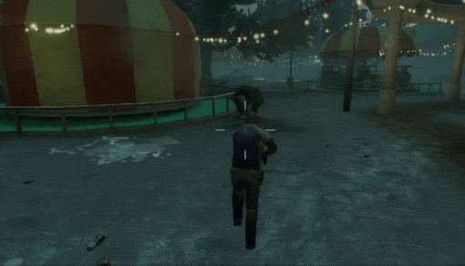

# Description | 內容
Survivors are invincible, unstoppable. S.Is, C.Is, tanks and witches are unable to pin them or deal any damage.

> __Note__ <br/>
This plugin is private, Please contact [me](https://github.com/fbef0102/Game-Private_Plugin#私人插件列表-private-plugins-list)<br/>
此為私人插件, 請聯繫[本人](https://github.com/fbef0102/Game-Private_Plugin#私人插件列表-private-plugins-list)

* [Video | 影片展示](https://youtu.be/HIRajcZE5ro)

* Image | 圖示
    <br/>
    <br/>
    <br/>

* <details><summary>How does it work?</summary>

    * Type ```!protect``` to gain protect power
        * Hunter is unable to pounce on you and stagger back.
        * Jockey is unable to ride on you and stagger back.
        * Smoker is unable to drag you and stagger back.
        * Charger is unable to charge on you and stagger back.
        * Tank is unable to rock or punch on you and stagger back.
        * Witch is unable to deal damag and stagger back.
        * Common infected is unable to deal damag and stagger back.
</details>

* Require | 必要安裝
	1. [left4dhooks](https://forums.alliedmods.net/showthread.php?t=321696)
    2. [[INC] Multi Colors](https://github.com/fbef0102/L4D1_2-Plugins/releases/tag/Multi-Colors)
	
* <details><summary>ConVar | 指令</summary>

    * cfg/sourcemod/l4d2_survivor_protect_power.cfg
        ```php
        // 0=Plugin off, 1=Plugin on.
        l4d2_survivor_protect_power_allow "1"

        // Turn on the plugin in these game modes, separate by commas (no spaces). (Empty = all).
        l4d2_survivor_protect_power_modes ""

        // Turn off the plugin in these game modes, separate by commas (no spaces). (Empty = none).
        l4d2_survivor_protect_power_modes_off ""

        // Turn on the plugin in these game modes. 0=All, 1=Coop, 2=Survival, 4=Versus, 8=Scavenge. Add numbers together.
        l4d2_survivor_protect_power_modes_tog "0"

        // Player with these flag have access to enable the protect power (Empty=Everyone, -1=No one)
        l4d2_survivor_protect_power_flags ""

        // If 1, turn on protect power for players by default
        l4d2_survivor_protect_power_default "0"

        // If 1, Block Spit Damage
        l4d2_survivor_protect_power_spit "1"

        // Push players/infected by this much force if protect power. (0=Off)
        l4d2_survivor_protect_power_push "800"

        // 0=Stagger, 1=Push Away Smoker.
        l4d2_survivor_protect_power_smoker "0"

        // 0=Stagger, 1=Push Away Boomer.
        l4d2_survivor_protect_power_boomer "1"

        // 0=Stagger, 1=Push Away Hunter.
        l4d2_survivor_protect_power_hunter "1"

        // 0=Stagger, 1=Push Away Spitter.
        l4d2_survivor_protect_power_spitter "1"

        // 0=Stagger, 1=Push Away Jockey.
        l4d2_survivor_protect_power_jockey "1"

        // 0=Stagger, 1=Push Away Charger.
        l4d2_survivor_protect_power_charger "1"

        // 0=Stagger, 1=Push Away Tank.
        l4d2_survivor_protect_power_tank "0"

        // Protect Sound file path (relative to to sound/, empty=disable)
        l4d2_survivor_protect_power_soundfile "physics/metal/metal_grate_impact_hard2.wav"
        ```
</details>

* <details><summary>Command | 命令</summary>
	
	* **Turn on/off protect power**
		```php
		sm_protect
		```
</details>

* Apply to | 適用於
    ```
    L4D2
    ```

* <details><summary>Changelog | 版本日誌</summary>

    * 1.0 (2023-8-16)
	    * Initial Release
</details>

- - - -
# 中文說明
義和團，刀槍不入，神功護體

* 原理
    * 輸入 ```!protect``` 獲得以下能力
        * Hunter 無法撲中你，而且會被反彈
        * Jockey 無法騎中你，而且會被反彈
        * Smoker 無法拉你，而且會被反彈
        * Charger 無法撞你，而且會被反彈
        * Tank 無法用石頭砸或拳頭你，而且會被反彈
        * Witch 無法對你造成傷害，而且會被反彈
        * Common 無法對你造成傷害，而且會被反彈
        
* <details><summary>指令中文介紹 (點我展開)</summary>

    * cfg/sourcemod/l4d2_survivor_protect_power.cfg
        ```php
        // 0=關閉插件, 1=啟動插件
        l4d2_survivor_protect_power_allow "1"

        // 什麼模式下啟動此插件, 逗號區隔 (無空白). (留白 = 所有模式)
        l4d2_survivor_protect_power_modes ""

       // 什麼模式下關閉此插件, 逗號區隔 (無空白). (留白 = 無)
        l4d2_survivor_protect_power_modes_off ""

        // 什麼模式下啟動此插件. 0=所有模式, 1=戰役, 2=生存, 4=對抗, 8=清道夫. 請將數字相加起來
        l4d2_survivor_protect_power_modes_tog "0"

        // 擁有這些權限的玩家，才可以有神功護體 (留白 = 任何人都能, -1: 無人)
        l4d2_survivor_protect_power_flags ""

        // 為1時，預設幫玩家開啟神功護體的能力
        l4d2_survivor_protect_power_default "0"

        // 為1時，Spitter的酸液無法造成傷害
        l4d2_survivor_protect_power_spit "1"

        // 特感或殭屍被神功護體彈開的力道值. (0=不彈開)
        l4d2_survivor_protect_power_push "800"

        // 如何反彈Smoker? 0=震退, 1=彈開.
        l4d2_survivor_protect_power_smoker "0"

        // 如何反彈Boomer? 0=震退, 1=彈開.
        l4d2_survivor_protect_power_boomer "1"

        // 如何反彈Hunter? 0=震退, 1=彈開.
        l4d2_survivor_protect_power_hunter "1"

        // 如何反彈Spitter? 0=震退, 1=彈開.
        l4d2_survivor_protect_power_spitter "1"

        // 如何反彈Jockey? 0=震退, 1=彈開.
        l4d2_survivor_protect_power_jockey "1"

        // 如何反彈Charger? 0=震退, 1=彈開.
        l4d2_survivor_protect_power_charger "1"

        // 如何反彈Tank? 0=震退, 1=彈開.
        l4d2_survivor_protect_power_tank "0"

        // 反彈的音效檔案，請填入路徑 (路徑相對於 sound 資料夾, 留白=關閉音效)
        l4d2_survivor_protect_power_soundfile "physics/metal/metal_grate_impact_hard2.wav"
        ```
</details>
