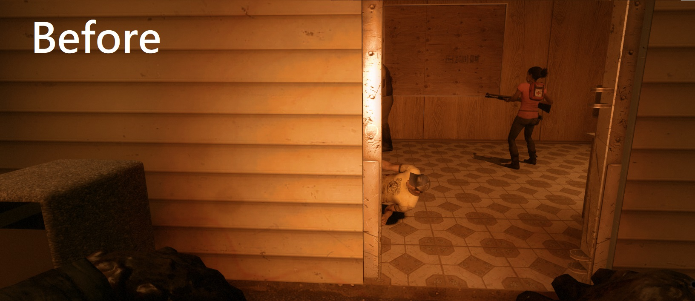

# Description | 內容
Gives the Survivors a health glow around them.
<br/>+
<br/>For the infected, survivors always glow with a non-disappearing aura. (Even if survivor doesn't move or walk)

> __Note__ <br/>
This plugin is private, Please contact [me](https://github.com/fbef0102/Game-Private_Plugin#私人插件列表-private-plugins-list)<br/>
此為私人插件, 請聯繫[本人](https://github.com/fbef0102/Game-Private_Plugin#私人插件列表-private-plugins-list)

* [Video | 影片展示](https://youtu.be/0MkBgAibf3U)

* <details><summary>Image | 圖示</summary>

	* Last life, low health, medium health, high health 
		> 黑白狀態、低生命值、中生命值、高生命值
		<br/>
	* For the infected, survivors always glow with a non-disappearing aura. (Even if survivor doesn't move or walk)
		> 對抗模式中，特感永遠能看到人類光圈 (即使人類靜走或不動)
		<br/>
		<br/>
</details>

* Apply to | 適用於
	```
	L4D2
	```

* <details><summary>Changelog | 版本日誌</summary>

	```php
	//Mr. Zero @ 2011-2012
	//HarryPotter @ 2022-2023
	```
	* v1.1h (2023-7-21)
		* For the infected, survivors always glow with a non-disappearing aura. (Even if survivor doesn't move or walk)
		* Add cvars about Incap or hanging from ledge Health Glow
		* Filter which teams can see the health glow.
		* Interval in seconds to upate the glow rendering
		* Optimize code and improve performance

	* v1.0h (2022-11-27)
		* Remake Code
		* Convert code to latest syntax
		* Add convars, users no need to recompile to change the colors of the glows
		* Changes to fix warnings when compiling on SourceMod 1.11.
		* All in one .sp file

	* v1.0.1
		* [Original Plugin by Mr. Zero](https://forums.alliedmods.net/showthread.php?t=174088)
</details>

* Require | 必要安裝
	1. [left4dhooks](https://forums.alliedmods.net/showthread.php?t=321696)

* Similar Plugin | 相似插件
	1. [LMC_Black_and_White_Notifier](https://github.com/fbef0102/L4D2-Plugins/tree/master/LMC_Black_and_White_Notifier): Notifies selected team(s) when someone is on final strike and add glow
		> 顯示誰是黑白狀態，有更多的提示與支援LMC模組

* <details><summary>ConVar | 指令</summary>

	* cfg/sourcemod/l4d2healthglow.cfg
		```php
		// 0=Plugin off, 1=Plugin on.
		l4d2healthglow_enable "1"

		// High Health Glow Color. Three values between 0-255 separated by spaces. RGB Color255 - Red Green Blue.
		l4d2healthglow_high_color "0 200 0"

		// If 1, High Health Glow Flashing
		l4d2healthglow_high_flashing "0"

		// High Health Glow Mini Range
		l4d2healthglow_high_mini_range "0"

		// High Health Glow Range
		l4d2healthglow_high_range "0"

		// Medium Health Glow Color. Three values between 0-255 separated by spaces. RGB Color255 - Red Green Blue.
		l4d2healthglow_medium_color "200 200 0"

		// If 1, Medium Health Glow Flashing
		l4d2healthglow_medium_flashing "0"

		// Medium health must be equal to or lower than this value
		l4d2healthglow_medium_hp "39"

		// Medium Health Glow Mini Range
		l4d2healthglow_medium_mini_range "0"

		// Medium health Glow Range
		l4d2healthglow_medium_range "0"

		// Low Health Glow Color. Three values between 0-255 separated by spaces. RGB Color255 - Red Green Blue.
		l4d2healthglow_low_color "200 0 0"

		// If 1, Low Health Glow Flashing
		l4d2healthglow_low_flashing "0"

		// Low health must be equal to or lower than this value
		l4d2healthglow_low_hp "24"

		// Low Health Glow Mini Range
		l4d2healthglow_low_mini_range "0"

		// Low Health Glow Range
		l4d2healthglow_low_range "0"

		// Last Life Glow Color. Three values between 0-255 separated by spaces. RGB Color255 - Red Green Blue.
		l4d2healthglow_last_life_color "127 127 127"

		// If 1, Last Life Glow Flashing
		l4d2healthglow_last_life_flashing "1"

		// Last Life Glow Mini Range
		l4d2healthglow_last_life_mini_range "0"

		// Last Life Glow Range
		l4d2healthglow_last_life_range "0"

		// Incap or hanging from ledge Health Glow Color. Three values between 0-255 separated by spaces. RGB Color255 - Red Green Blue. (Glow for infected and spectator only)
		l4d2healthglow_incap_color "200 0 0"

		// Incap or hanging from ledge Health Glow Flashing (Glow for infected and spectator only)
		l4d2healthglow_incap_flashing "0"

		// Incap or hanging from ledge Health Glow Mini Range (Glow for infected and spectator only)
		l4d2healthglow_incap_mini_range "0"

		// Incap or hanging from ledge Health Glow Range (Glow for infected and spectator only)
		l4d2healthglow_incap_range "0"

		// If 1, survivor temp health + hard health
		// If 0, survivor hard health only
		l4d2healthglow_consider_temp_health "1"

		// Which teams can see the health glow.
		// 0 = NONE, 1 = SURVIVOR, 2 = INFECTED, 4 = SPECTATOR.
		// Add numbers greater than 0 for multiple options.
		// Example: "3", enables for SURVIVOR and INFECTED.
		l4d2healthglow_team "7"

		// Interval in seconds to upate the glow rendering. (visibility, color and frame)
		l4d2healthglow_upate_interval "0.5"
		```
</details>

* <details><summary>Command | 命令</summary>

	None
</details>

- - - -
# 中文說明
根據玩家生命值狀態給予輪廓光圈適當的顏色
<br/>+ 
<br/>對抗模式中，特感永遠能看到人類光圈 (即使人類靜走或不動)

* 原理
	* 所有人類身上會有輪廓光圈，根據生命值與狀態給予適當的顏色
    	* 高生命值 - HP 40以上：綠色
    	* 中生命值 - HP 25~39：黃色
    	* 低生命值 - HP 1~24：紅色
    	* 黑白狀態：黑白色閃爍
    	* 倒地或掛邊：紅色 (只顯示給特感與旁觀者)
	* 被特感抓住、被Boomer嘔吐、倒地、掛邊之類等等則不會顯示顏色光圈
	* 所有人能看到輪廓光圈，如要篩選隊伍，請查看指令

* 功能
	* 查看下方"指令中文介紹"

* <details><summary>指令中文介紹(點我展開)</summary>

	* 安裝上此插件後，會自動產生文件```cfg/sourcemod/l4d2healthglow.cfg```
		```php
		// 0=關閉插件, 1=啟動插件.
		l4d2healthglow_enable "1"

		// 高生命值時的光圈顏色. 三個0-255的數值，需要空白間隔. (RGB 三色)
		l4d2healthglow_high_color "0 200 0"

		// 為1時，高生命值時的光圈會閃爍
		l4d2healthglow_high_flashing "0"

		// 高生命值時的光圈最小發光範圍
		l4d2healthglow_high_mini_range "0"

		// 高生命值時的光圈最遠發光範圍
		l4d2healthglow_high_range "0"

		// 小於或等於這個數值視為 "中生命值"
		l4d2healthglow_medium_hp "39"

		// 中生命值時的光圈顏色. 三個0-255的數值，需要空白間隔. (RGB 三色)
		l4d2healthglow_medium_color "200 200 0"

		// 為1時，中生命值時的光圈會閃爍
		l4d2healthglow_medium_flashing "0"

		// 中生命值時的光圈最小發光範圍
		l4d2healthglow_medium_mini_range "0"

		// 中生命值時的光圈最遠發光範圍
		l4d2healthglow_medium_range "0"

		// 小於或等於這個數值視為 "低生命值"
		l4d2healthglow_low_hp "24"

		// 低生命值時的光圈顏色. 三個0-255的數值，需要空白間隔. (RGB 三色)
		l4d2healthglow_low_color "200 0 0"

		// 為1時，低生命值時的光圈會閃爍
		l4d2healthglow_low_flashing "0"

		// 低生命值時的光圈最小發光範圍
		l4d2healthglow_low_mini_range "0"

		// 低生命值時的光圈最遠發光範圍
		l4d2healthglow_low_range "0"

		// 黑白狀態時的光圈顏色. 三個0-255的數值，需要空白間隔. (RGB 三色)
		l4d2healthglow_last_life_color "127 127 127"

		// 為1時，黑白狀態時的光圈會閃爍
		l4d2healthglow_last_life_flashing "1"

		// 黑白狀態時的光圈最小發光範圍
		l4d2healthglow_last_life_mini_range "0"

		// 黑白狀態時的光圈最遠發光範圍
		l4d2healthglow_last_life_range "0"

		// 倒地或掛邊時的光圈顏色. 三個0-255的數值，需要空白間隔. (RGB 三色) (只適用於給特感與旁觀者看到)
		l4d2healthglow_incap_color "200 0 0"

		// 為1時，倒地或掛邊時的光圈會閃爍 (只適用於給特感與旁觀者看到)
		l4d2healthglow_incap_flashing "0"

		// 倒地或掛邊時的光圈最小發光範圍 (只適用於給特感與旁觀者看到)
		l4d2healthglow_incap_mini_range "0"

		// 倒地或掛邊時的光圈最遠發光範圍 (只適用於給特感與旁觀者看到)
		l4d2healthglow_incap_range "0"

		// 為1時，生命值計算人類的實血與虛血
		// 為0時，生命值只計算人類的實血
		l4d2healthglow_consider_temp_health "1"

		// 哪些隊伍能看到輪廓光圈
		// 0 = 無, 1 = 倖存者, 2 = 特感, 4 = 旁觀者.
		// 將數字相加起來.
		// 舉例: 3 = 只有倖存者與特感能看到輪廓光圈
		l4d2healthglow_team "7"

		// 渲染輪廓光圈的秒數間隔. (更新狀態、顏色、範圍等等)
		l4d2healthglow_upate_interval "0.5"
		```
</details>