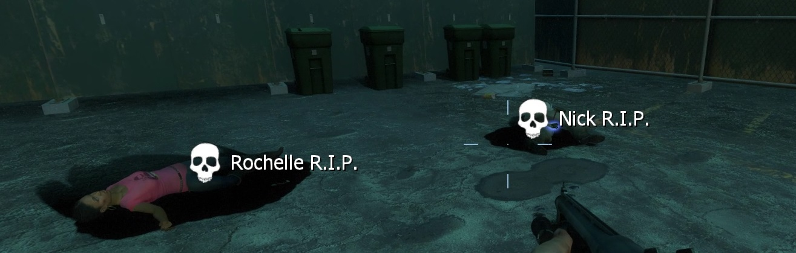
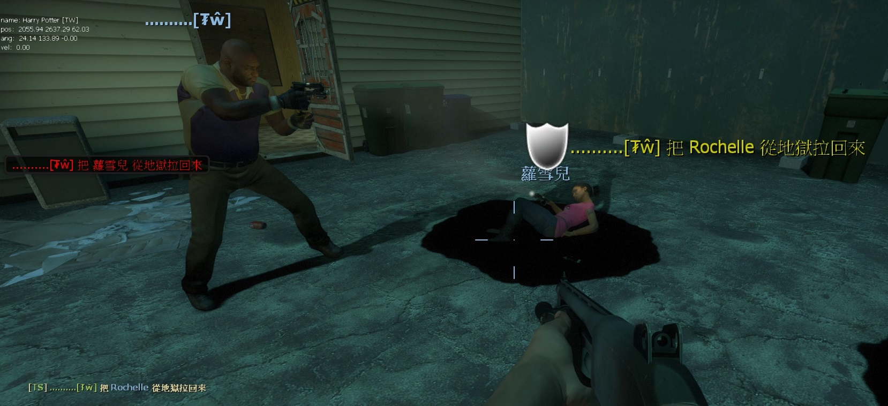

# Description | 內容
Notify people when survivor is dead or someone uses defibrillator to revive

> __Note__ <br/>
This plugin is private, Please contact [me](https://github.com/fbef0102/Game-Private_Plugin#私人插件列表-private-plugins-list)<br/>
此為私人插件, 請聯繫[本人](https://github.com/fbef0102/Game-Private_Plugin#私人插件列表-private-plugins-list)

* [Video | 影片展示](https://youtu.be/krdGPEqaE_g)

* Image | 圖示
	* Display director hint when survivor dead
		> 當玩家死亡時，提示導演系統訊息
		<br/>
	* Display director hint when survivor uses defibrillator to revive dead player
		> 當玩家被電擊器救活時，提示導演系統訊息
		<br/>

* Apply to | 適用於
	```
	L4D2
	```

* Translation Support | 支援翻譯
	```
	English
	繁體中文
	简体中文
	```

* <details><summary>Changelog | 版本日誌</summary>

	* v1.0
		* Initial Release
</details>

* Require | 必要安裝
	1. [[INC] Multi Colors](https://github.com/fbef0102/L4D1_2-Plugins/releases/tag/Multi-Colors)

* Related Plugin | 相關插件
	1. [LMC_Black_and_White_Notifier](https://github.com/fbef0102/L4D2-Plugins/tree/master/LMC_Black_and_White_Notifier): Notifies selected team(s) when someone is on final strike and add glow
		> (公開) 顯示誰是黑白狀態，有更多的提示與支援LMC模組

* <details><summary>ConVar | 指令</summary>

	* cfg/sourcemod/l4d_dead_save_nodify.cfg
		```php
		// Changes how message displays on survivor dead. 0=Disable, 1=In chat, 2=In Hint Box, 4=In center text, 8=Director hint. Add numbers together. (15=All)
		l4d_dead_save_nodify_dead_announce_type "9"

		// Director hint color on survivor dead.
		l4d_dead_save_nodify_dead_director_color "255 255 255"

		// Director hint icon name on survivor dead. (For more icons: https://developer.valvesoftware.com/wiki/Env_instructor_hint)
		l4d_dead_save_nodify_dead_director_icon "icon_skull"

		// Director hint display range on survivor dead. (0=Any distance)
		l4d_dead_save_nodify_dead_director_range "1500"

		// Director hint display time on survivor dead. (0=Forever)
		l4d_dead_save_nodify_dead_director_time "0"

		// 0=Plugin off, 1=Plugin on.
		l4d_dead_save_nodify_enable "1"

		// Changes how message displays when survivor revives teammate from hell. 0=Disable, 1=In chat, 2=In Hint Box, 4=In center text, 8=Director hint. Add numbers together. (15=All)
		l4d_dead_save_nodify_revive_announce_type "9"

		// Director hint color when survivor revives teammate from hell.
		l4d_dead_save_nodify_revive_director_color "200 200 0"

		// Director hint icon name when survivor revives teammate from hell.
		l4d_dead_save_nodify_revive_director_icon "icon_shield"

		// Director hint display time when survivor revives teammate from hell.
		l4d_dead_save_nodify_revive_director_time "8.0"
		```
</details>

* <details><summary>Command | 命令</summary>
	
	None
</details>

* Note
	* Player must Enabled GAME INSTRUCTOR, in ESC -> Options -> Multiplayer, or they can't see the hint
	* DO NOT modify convar sv_gameinstructor_disable this force all clients to disable their game instructors.

- - - -
# 中文說明
當玩家死亡或者從地獄被救活時，提示導演系統訊息

* 原理
	* 死亡或者被電擊器救活時，提示導演系統訊息

* 功能
	1. 可設置提示開關與不同的顯示位置
	2. 可設置導演系統提示的圖案、顏色、顯示時間與距離

* 注意事項
	* 玩家必須啟動[遊戲指導系統](https://github.com/fbef0102/Game-Private_Plugin/tree/main/Tutorial_%E6%95%99%E5%AD%B8%E5%8D%80/Chinese_%E7%B9%81%E9%AB%94%E4%B8%AD%E6%96%87/Game#%E5%95%9F%E5%8B%95%E9%81%8A%E6%88%B2%E6%8C%87%E5%B0%8E%E7%B3%BB%E7%B5%B1)，否則玩家看不見導演系統提示
