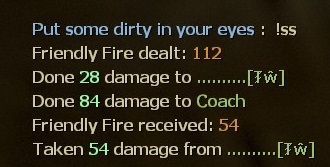
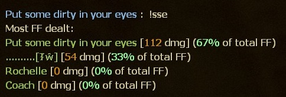

# Description | 內容
Display all friendly fire dealt and received

> __Note__ <br/>
This plugin is private, Please contact [me](https://github.com/fbef0102/Game-Private_Plugin#私人插件列表-private-plugins-list)<br/>
此為私人插件, 請聯繫[本人](https://github.com/fbef0102/Game-Private_Plugin#私人插件列表-private-plugins-list)

* Video | 影片展示
<br/>None

* Image | 圖示
	* Display friendly fire dealt and received
		> 造成與受到的友傷
		<br/>
	* Display all friendly fire stats
		> 所有玩家的友傷統計
		<br/>

* Apply to | 適用於
```
L4D1
L4D2
```

* <details><summary>Changelog | 版本日誌</summary>

	* v1.1 (2022-12-8)
		* New Cvar, Reset All FF data when next game starts

	* v1.0 (2022-12-6)
		* Initial Release
</details>

* Require | 必要安裝
	1. [[INC] Multi Colors](https://github.com/fbef0102/L4D1_2-Plugins/releases/tag/Multi-Colors)

* Similar Plugin | 相似插件
	1. [l4dffannounce](https://github.com/fbef0102/L4D1_2-Plugins/tree/master/l4dffannounce): Notifies selected team(s) when someone is on final strike and add glow
		> 顯示誰他馬TK我

	2. [anti-friendly_fire](https://github.com/fbef0102/L4D1_2-Plugins/tree/master/anti-friendly_fire): shoot your teammate = shoot yourself
		> 反彈傷害

	3. [anti-friendly_fire_V2](/Plugin_插件/Anti_Griefer_防惡意路人/anti-friendly_fire_V2): shoot teammate = shoot yourself V2
		> 隊友開槍射你會反彈傷害，第二版本
		
	4. [anti-friendly_fire_RPG](/Plugin_插件/Anti_Griefer_防惡意路人/anti-friendly_fire_RPG): shoot teammate = shoot yourself RPG
		> 隊友開槍射你會反彈傷害，RPG版本

* <details><summary>ConVar | 指令</summary>

	* cfg/sourcemod/l4d_friendly_fire_stats.cfg
		```php
		// 0=Plugin off, 1=Plugin on.
		l4d_friendly_fire_stats_enable "1"

		// Reset All FF data when 0=Map Change, 1=Next Game starts/Survival begins, 2=Next New Round.
		l4d_friendly_fire_stats_reset_when "1"
		```
</details>

* <details><summary>Command | 命令</summary>

	* **Display friendly fire dealt and received.**
		```php
		sm_ss
		```

	* **Display All friendly fire dealt stats.**
		```php
		sm_sse
		```
</details>

- - - -
# 中文說明
顯示造成與受到的友傷以及兇手，有友傷統計

* 原理
	* 輸入!ss找出對你開槍的王八蛋
	* 輸入!sse查看所有人的友傷統計

* 功能
	* 指令控制開關