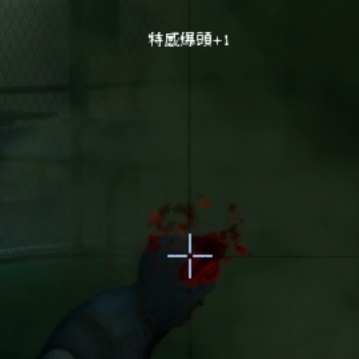

# Description | 內容
Play Reward Sound when headshot

> __Note__ <br/>
This plugin is private, Please contact [me](https://github.com/fbef0102/Game-Private_Plugin#私人插件列表-private-plugins-list)<br/>
此為私人插件, 請聯繫[本人](https://github.com/fbef0102/Game-Private_Plugin#私人插件列表-private-plugins-list)

* [Video | 影片展示](https://youtu.be/w-6BEfBey64)

* Image | 圖示
	* Text and reward sound
	> 爆頭提示與音效
	<br/>

* Apply to | 適用於
```
L4D1
L4D2
```

* <details><summary>Changelog | 版本日誌</summary>

    * v1.0 (2022-11-27)
	    * Request by Yabi
	    * Initial Release
</details>

* Require | 必要安裝
    1. [[INC] Multi Colors](https://github.com/fbef0102/L4D1_2-Plugins/releases/tag/Multi-Colors)

* <details><summary>ConVar | 指令</summary>

	* cfg/sourcemod/l4d_headshot_reward_sound.cfg
	```php
	// Common Infected headshot sound file (relative to to sound/, empty=Disable)
    l4d_headshot_reward_sound_common_file "ui/littlereward.wav"

    // 0=Plugin off, 1=Plugin on.
    l4d_headshot_reward_sound_enable "1"

    // Special Infected headshot sound file (relative to to sound/, empty=Disable)
    l4d_headshot_reward_sound_infected_file "ui/bigreward.wav"

    // Changes how message displays. (0: Disable, 1:In chat, 2: In Hint Box, 3: In center text)
    l4d_headshot_reward_sound_type "3"
	```
</details>

* <details><summary>Command | 命令</summary>
    
    None
</details>

- - - -
# 中文說明
特感或普通感染者爆頭的時候有獎勵提示與音效

* 原理
    * 開槍爆頭有提示與音效
    * Tank與Witch也會有

* 功能
    * 可設置不同位置的訊息提示
    * 可設置播放不同的音效檔案