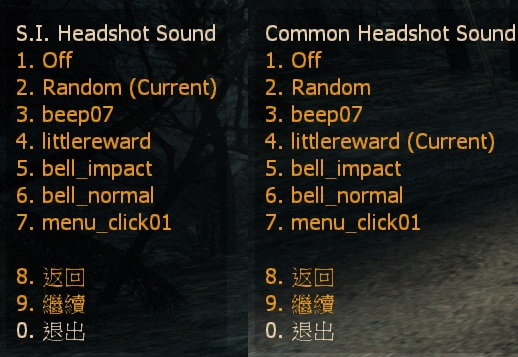

# Description | 內容
Play Reward Sound when headshot

> __Note__ <br/>
This plugin is private, Please contact [me](https://github.com/fbef0102/Game-Private_Plugin#私人插件列表-private-plugins-list)<br/>
此為私人插件, 請聯繫[本人](https://github.com/fbef0102/Game-Private_Plugin#私人插件列表-private-plugins-list)

* [Video | 影片展示](https://youtu.be/w-6BEfBey64)

* <details><summary>Image</summary>

	* S.I. headshot text
    <br/>

	* Common infected headshot text
    <br/>

	* Menu select sound
    <br/>
</details>

* Apply to | 適用於
    ```
    L4D1
    L4D2
    ```

* Translation Support | 支援翻譯
	```
	English
	繁體中文
	简体中文
	```

* <details><summary>Changelog | 版本日誌</summary>

    * v1.1 (2023-3-9)
        * Add sound select menu, player can choose S.I headshot sound and C.I. headshot sound personally
        * Add Data Config
        * Translation Support
        * Cookie Save

    * v1.0 (2022-11-27)
	    * Request by Yabi
	    * Initial Release
</details>

* Require | 必要安裝
    1. [[INC] Multi Colors](https://github.com/fbef0102/L4D1_2-Plugins/releases/tag/Multi-Colors)

* <details><summary>ConVar | 指令</summary>

	* cfg/sourcemod/l4d_headshot_reward_sound.cfg
        ```php
        // Common Infected headshot sound file by default (relative to sound/, empty=Disable)
        l4d_headshot_reward_sound_common_file "ui/littlereward.wav"

        // 0=Plugin off, 1=Plugin on.
        l4d_headshot_reward_sound_enable "1"

        // Special Infected headshot sound file by default (relative to sound/, empty=Disable)
        l4d_headshot_reward_sound_infected_file "ui/bigreward.wav"

        // Changes how message displays. (0: Disable, 1:In chat, 2: In Hint Box, 3: In center text)
        l4d_headshot_reward_sound_type "3"
        ```
</details>

* <details><summary>Command | 命令</summary>
    
	* **Open menu for headshot sound personally**
		```php
		sm_headshot
		```
</details>

* Notice
    * Save settings in database, players don't have to select sound from menu every time.

* <details><summary>Data Example</summary>

	* data/l4d_headshot_reward_sound.cfg
		```php
        "SI"
        {
            "num"		"3" // how many names below
            "1"
            {
                "Name"		"Off" //do not modify
                "Path"		"off" //do not modify
            }
            "2"
            {
                "Name"		"Random" //do not modify
                "Path"		"random" //do not modify
            }
            "3"
            {
                "Name"		"beep07" //Name whatevert you want
                "Path"		"ui/beep07.wav" //sound path, relative to sound/
            }
        }
		```
</details>

- - - -
# 中文說明
特感或普通感染者爆頭的時候有獎勵提示與音效

* <details><summary>圖示</summary>

	* 特感爆頭提示
    <br/>

	* 殭屍爆頭提示
    <br/>

	* 玩家自己設置爆頭音效
    <br/>
</details>

* 原理
    * 開槍爆頭有提示與音效
    * Tank與Witch也會有
    * 玩家輸入```!headshot```可設置自己的特感爆頭音效與殭屍爆頭音效
      * 自動本地儲存玩家的設定，下一次新遊戲時不需要重新選擇

* 功能
    * 可設置不同位置的訊息提示
    * 可設置預設的爆頭音效

* <details><summary>Data設定範例</summary>

	* data/l4d_headshot_reward_sound.cfg
		```php
        "SI"
        {
            "num"		"3" // 以下名字數量
            "1"
            {
                "Name"		"Off" //不要修改
                "Path"		"off" //不要修改
            }
            "2"
            {
                "Name"		"Random" //不要修改
                "Path"		"random" //不要修改
            }
            "3"
            {
                "Name"		"beep07" // 名稱自取
                "Path"		"ui/beep07.wav" // 填寫音效檔案路徑，路徑相對於sound/ 資料夾
            }
        }
		```
</details>