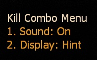
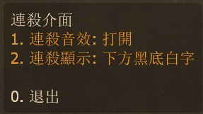

# Description | 內容
Display Kill Combo and play sound when killing special infected

> __Note__ <br/>
This plugin is private, Please contact [me](https://github.com/fbef0102/Game-Private_Plugin#私人插件列表-private-plugins-list)<br/>
此為私人插件, 請聯繫[本人](https://github.com/fbef0102/Game-Private_Plugin#私人插件列表-private-plugins-list)

* [Video | 影片展示](https://youtu.be/klrjfJlCVNI)

* Image
    <br/>
    <br/>

* <details><summary>How does it work?</summary>

    * Display multi kill text and play sound when player keep killing special infected
	* Type ```!kc``` -> turn on/off sound and hint
</details>

* Require | 必要安裝
	1. [left4dhooks](https://forums.alliedmods.net/showthread.php?t=321696)
	2. [[INC] Multi Colors](https://github.com/fbef0102/L4D1_2-Plugins/releases/tag/Multi-Colors)

* <details><summary>ConVar | 指令</summary>

	* cfg/sourcemod/l4d_kill_combo.cfg
        ```php
        // 0=Plugin off, 1=Plugin on.
        l4d_kill_combo_enable "1"

        // Accumulate S.I kill combo within this time
        l4d_kill_combo_time "4.0"

        // Reset Count combo if receive this amount of damage during combo (0=off)
        l4d_kill_combo_damage "10.0"

        // 0=Accumulate kill combo from first kill. 1=Accumulate kill combo if keep killing S.I.
        l4d_kill_combo_type "1"

        // Play sound file when first kill (relative to to sound/, empty=No Sound)
        l4d_kill_combo_sound_1 "ui/littlereward.wav"

        // Play sound file when double kill (relative to to sound/, empty=No Sound)
        l4d_kill_combo_sound_2 "ui/beep07.wav"

        // Play sound file when triple kill (relative to to sound/, empty=No Sound)
        l4d_kill_combo_sound_3 "ui/beep22.wav"

        // Play sound file when 4th kill (relative to to sound/, empty=No Sound)
        l4d_kill_combo_sound_4 "ui/beepclear.wav"

        // Play sound file when 5th kill (relative to to sound/, empty=No Sound)
        l4d_kill_combo_sound_5 "ui/gift_drop.wav"

        // Play sound file when 6th kill (relative to to sound/, empty=No Sound)
        l4d_kill_combo_sound_6 "ui/bigreward.wav"

        // Play sound file when 7th kill (relative to to sound/, empty=No Sound)
        l4d_kill_combo_sound_7 "ui/menu_enter05.wav"

        // Play sound file when 8th kill (relative to to sound/, empty=No Sound)
        l4d_kill_combo_sound_8 "ui/survival_medal.wav"

        // Play sound file when 9+ kill (relative to to sound/, empty=No Sound)
        l4d_kill_combo_sound_multi "ui/survival_teamrec.wav"

        // If 1, Announce player's kill combo in chatbox (0=off)
        l4d_kill_combo_notify_all "1"

        // If player's kill combo >= this valve, announce kill combo in chatbox
        l4d_kill_combo_notify_number "5"
        ```
</details>

* <details><summary>Command | 命令</summary>
    
	* **Open menu for kill combo**
		```php
		sm_kc
		```
</details>

* Apply to | 適用於
    ```
    L4D1
    L4D2
    ```

* <details><summary>Translation Support | 支援翻譯</summary>

	```
	English
	繁體中文
	简体中文
	```
</details>

* <details><summary>Changelog | 版本日誌</summary>

    * v1.0 (2022-12-7)
	    * Initial Release
</details>

- - - -
# 中文說明
連續擊殺特感會有提示與音效

* 圖示
    <br/>
    <br/>
* 原理
    * 連續擊殺特感有提示與音效
    * 擊殺Tank也會有
    * 玩家輸入```!kc```可設置自己開關提示與音效

* 用意在哪?
    * 模仿CS連殺提示，爽而已

* <details><summary>指令中文介紹 (點我展開)</summary>

	* cfg/sourcemod/l4d_kill_combo.cfg
        ```php
        // 0=關閉插件, 1=啟動插件
        l4d_kill_combo_enable "1"

        // 4秒內累積特感擊殺
        l4d_kill_combo_time "4.0"

        // 在累積特感擊殺期間如果受到10滴以上的傷害則停止計算 (0=關閉這項功能)
        l4d_kill_combo_damage "10.0"

        // 0=從第一個殺死的特感開始，計算4秒內累積的特感擊殺數
        // 1=只要4秒內持續殺死特感，特感擊殺數可以不斷累積
        l4d_kill_combo_type "1"

        // 首殺的音效 (路徑相對於 sound 資料夾, 空白=無音效)
        l4d_kill_combo_sound_1 "ui/littlereward.wav"

        // 雙殺的音效 (路徑相對於 sound 資料夾, 空白=無音效)
        l4d_kill_combo_sound_2 "ui/beep07.wav"

        // 三連殺的音效 (路徑相對於 sound 資料夾, 空白=無音效)
        l4d_kill_combo_sound_3 "ui/beep22.wav"

        // 4連殺的音效 (路徑相對於 sound 資料夾, 空白=無音效)
        l4d_kill_combo_sound_4 "ui/beepclear.wav"

        // 5連殺的音效 (路徑相對於 sound 資料夾, 空白=無音效)
        l4d_kill_combo_sound_5 "ui/gift_drop.wav"

        // 6連殺的音效 (路徑相對於 sound 資料夾, 空白=無音效)
        l4d_kill_combo_sound_6 "ui/bigreward.wav"

        // 7連殺的音效 (路徑相對於 sound 資料夾, 空白=無音效)
        l4d_kill_combo_sound_7 "ui/menu_enter05.wav"

        // 8連殺的音效 (路徑相對於 sound 資料夾, 空白=無音效)
        l4d_kill_combo_sound_8 "ui/survival_medal.wav"

        // 9連殺以上的音效 (路徑相對於 sound 資料夾, 空白=無音效)
        l4d_kill_combo_sound_multi "ui/survival_teamrec.wav"

        // 為1時，將自己的擊殺數顯示給所有玩家 + 並在頭上冒出獎盃的特效
        l4d_kill_combo_notify_all "1"

        // 當自己的擊殺數大於或等於此指令值，在聊天框打印自己的擊殺數，顯示給所有玩家
        l4d_kill_combo_notify_number "5"
        ```
</details>

* <details><summary>命令中文介紹 (點我展開)</summary>
    
	* **打開擊殺介面**
		```php
		sm_kc
		```
</details>