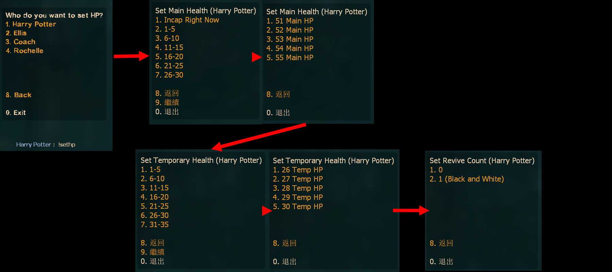
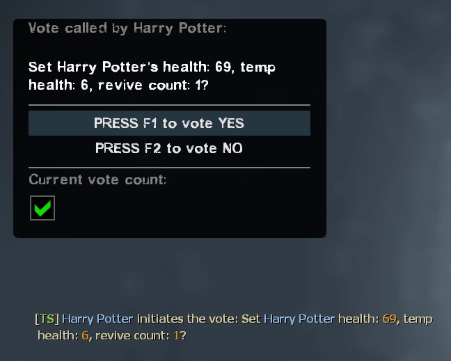
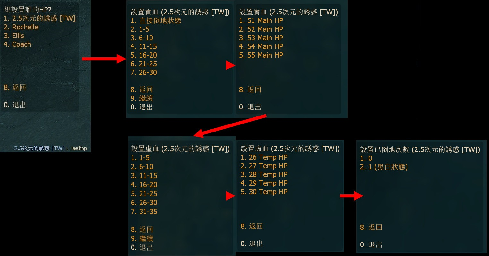
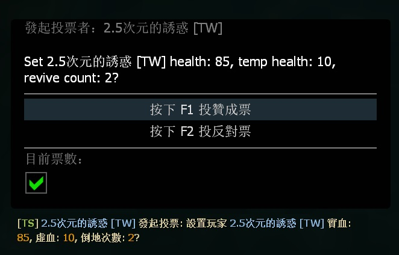

# Description | 內容
Allow to give survivors health and select the amount of HP from menu

> __Note__ <br/>
This plugin is private, Please contact [me](https://github.com/fbef0102/Game-Private_Plugin#私人插件列表-private-plugins-list)<br/>
此為私人插件, 請聯繫[本人](https://github.com/fbef0102/Game-Private_Plugin#私人插件列表-private-plugins-list)

* Video | 影片展示
<br/>None

* Image
	* Free to modify custom difficulty and damage, image for reference only
	<br/>
	<br/>
	<br/>

* <details><summary>How does it work?</summary>

	* Admin types ```!admin->Player Commands->Set Player HP``` -> select player -> main health and temporary health -> set player's hp.
	* Non-admin player can type ```!sethp``` -> select main health and temporary health -> call vote to set player's hp.
</details>

* Require | 必要安裝
	1. [left4dhooks](https://forums.alliedmods.net/showthread.php?t=321696)
	2. [[INC] Multi Colors](https://github.com/fbef0102/L4D1_2-Plugins/releases/tag/Multi-Colors)
	3. [Heartbeat](https://forums.alliedmods.net/showthread.php?t=322132)
	4. [builtinvotes](https://github.com/fbef0102/Game-Private_Plugin/releases/tag/builtinvotes)

* <details><summary>ConVar | 指令</summary>

	* cfg/sourcemod/l4d_sethp_player.cfg
		```php
		// 0=Plugin off, 1=Plugin on.
		l4d_sethp_player_enable "1"

		// If 1, Add 'Set Player HP' item in admin menu under 'Player commands' category (Need ADMFLAG_BAN flag)
		l4d_sethp_player_adminmenu "1"

		// Max health can set (can set 100 above)
		l4d_sethp_player_hp_max "100"

		// Players with these flags can set player health directly without vote (Empty = Everyone, -1: Nobody)
		l4d_sethp_player_admin_flag "dz"

		// Delay to start another vote after vote ends.
		l4d_sethp_player_delay "3"

		// How many players at least to vote to set player health.
		l4d_sethp_player_vote_need_player "2"
		```
</details>

* <details><summary>Command | 命令</summary>
	
	* **Opens menu to select players, Give health and set the amount of HP**
		```php
		sm_sethp
		```
</details>

* Apply to | 適用於
	```
	L4D1 
	L4D2
	```

* <details><summary>Translation Support | 支援翻譯</summary>

	```
	English
	繁體中文
	简体中文
	```
</details>

* <details><summary>Changelog | 版本日誌</summary>

	* v1.1 (2024-8-9)
		* Update translation
		* Update cvars
		* Update menu

	* v1.0 (2024-7-30)
		* Initial Release
</details>

- - - -
# 中文說明
打開選單設置倖存者的血量

* 圖示
	<br/>
	<br/>
	<br/>

* 原理
	* 管理員可以輸入 ```!admin->玩家指令->設置玩家血量``` -> 選擇玩家 -> 選擇實血與虛血 -> 設置玩家的血量
	* 非管理員玩家可以輸入 ```!sethp``` -> 選擇玩家 -> 選擇實血與虛血 -> 發起投票設置玩家的血量

* <details><summary>指令中文介紹 (點我展開)</summary>

	* cfg/sourcemod/l4d_sethp_player.cfg
		```php
		// 0=關閉插件, 1=啟動插件
		l4d_sethp_player_enable "1"

		// 為1時，在管理員選單的 '玩家指令' 分類內增加 "設置玩家血量" (所需權限: ADMFLAG_BAN)
		l4d_sethp_player_adminmenu "1"

		// 最大可以設置的血量 (可以設置超過100)
		l4d_sethp_player_hp_max "100"

		// 擁有這些權限的玩家，可以直接設置血量無須經過投票程序 (留白 = 任何人都能, -1: 無人)
		l4d_sethp_player_admin_flag "dz"

		// 發起新投票的冷卻時間
		l4d_sethp_player_delay "3"

		// 發起投票所需的 真人倖存者與感染者人數
		l4d_sethp_player_vote_need_player "2"
		```
</details>

* <details><summary>命令中文介紹 (點我展開)</summary>
	
	* **打開"設置玩家血量"選單**
		```php
		sm_sethp
		```
</details>