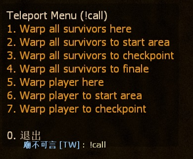
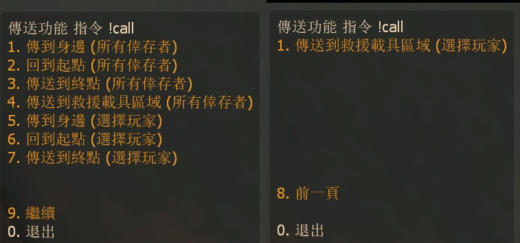

# Description | 內容
Teleport Call Menu, adm can teleport players to start area, end checkpoint, final rescue vehicle zone, or to admin self

> __Note__ <br/>
This plugin is private, Please contact [me](https://github.com/fbef0102/Game-Private_Plugin#私人插件列表-private-plugins-list)<br/>
此為私人插件, 請聯繫[本人](https://github.com/fbef0102/Game-Private_Plugin#私人插件列表-private-plugins-list)

* [Video | 影片展示](https://youtu.be/iux1bUZycjM)

* Image
	<br/>

* <details><summary>How does it work?</summary>

	* Admin type ```!call``` to open menu
	* Teleport players to
		* Start area
		* End checkpoint
		* Final rescue vehicle zone
		* Admin self position
</details>

* Require | 必要安裝
	1. [left4dhooks](https://forums.alliedmods.net/showthread.php?t=321696)
	2. [[INC] Multi Colors](https://github.com/fbef0102/L4D1_2-Plugins/releases/tag/Multi-Colors)

* <details><summary>ConVar | 指令</summary>

	* cfg/sourcemod/l4d_teleport_call.cfg
		```php
		// 0=Plugin off, 1=Plugin on.
		l4d_teleport_call_enable "1"

		// Changes how message displays. (0: Disable, 1:In chat, 2: In Hint Box, 3: In center text)
		l4d_teleport_call_announce_type "1"
		```
</details>

* <details><summary>Command | 命令</summary>

	* **Teleport Call Menu (Adm required: ADMFLAG_ROOT)**
		```php
		sm_call
		```
</details>

* Apply to | 適用於
	```
	L4D1
	L4D2
	```

* <details><summary>Similar Plugin | 相似插件</summary>

	1. [l4d_wind](https://github.com/fbef0102/L4D1_2-Plugins/tree/master/l4d_wind): Create a survivor bot in game + Teleport player
		> 新增Bot + 傳送玩家到其他位置上
</details>

* <details><summary>Translation Support | 支援翻譯</summary>

	```
	English
	繁體中文
	简体中文
	```
</details>

* <details><summary>Changelog | 版本日誌</summary>

	* v1.2h (2023-12-12)
		* Update translation
		* Add new item in menu
		* Teleport player to final rescue vehicle only after vehicle is ready

	* v1.1h (2023-6-20)
		* Require left4dhooks v1.33 or above
		* Renamed "l4d_telpeort_call" to "l4d_teleport_call"

	* v1.0h (2022-11-23)
		* Initial Release
</details>

- - - -
# 中文說明
呼叫傳送功能選單，能傳送玩家到起點、終點、救援載具區域、身邊

* 圖示
	* 傳送選單
	<br/>

* 原理
	* 管理員輸入!call打開選單，可以傳送玩家到
		* 起點
		* 終點
		* 救援載具區域
		* 身邊位置

* <details><summary>指令中文介紹 (點我展開)</summary>

	* cfg/sourcemod/l4d_teleport_call.cfg
		```php
		// 0=關閉插件, 1=啟動插件
		l4d_teleport_call_enable "1"

		// 提示該如何顯示. (0: 不提示, 1: 聊天框, 2: 黑底白字框, 3: 螢幕正中間)
		l4d_teleport_call_announce_type "1"
		```
</details>

* <details><summary>命令中文介紹 (點我展開)</summary>

	* **打開傳送選單 (權限: ADMFLAG_ROOT)**
		```php
		sm_call
		```
</details>