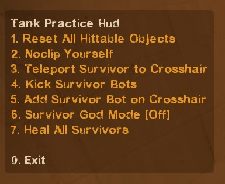

# Description | 內容
Tank can use menu to reset all hittable and enter practice mode

> __Note__ <br/>
This plugin is private, Please contact [me](https://github.com/fbef0102/Game-Private_Plugin#私人插件列表-private-plugins-list)<br/>
此為私人插件, 請聯繫[本人](https://github.com/fbef0102/Game-Private_Plugin#私人插件列表-private-plugins-list)

* [Video | 影片展示](https://youtu.be/fZM2ixRRovs)

* Image | 圖示
	<br/>
	<br/>
	<br/>
	<br/>

* <details><summary>How does it work?</summary>

	* Tank player types ```!hittable``` -> Open menu -> Reset hittable or control bots -> Have Fun
	* For people who want to practice tank hittable in versus mode
</details>

* Require | 必要安裝
	1. [left4dhooks](https://forums.alliedmods.net/showthread.php?t=321696)
	2. [[INC] Multi Colors](https://github.com/fbef0102/L4D1_2-Plugins/releases/tag/Multi-Colors)

* <details><summary>ConVar | 指令</summary>

	* cfg/sourcemod/l4d2_tank_hittable_reset.cfg
		```php
		// 0=Plugin off, 1=Plugin on.
		l4d2_tank_hittable_reset_enable "1"

		// If 1, Automatically show menu to the tank player when spawn
		l4d2_tank_hittable_reset_display_on_spawn "1"
		```
</details>

* <details><summary>Command | 命令</summary>

	* **Open Tank Practice Menu**
		```php
		sm_hittable
		sm_tk
		```
</details>

* <details><summary>Related Official ConVar</summary>

	* Tank Never Lost Range
		```php
		sm_cvar z_frustration_spawn_delay 99999999
		sm_cvar z_frustration_los_delay 99999999
		```

	* Forces survivor bots to stand still
		```php
		sm_cvar sb_stop 1
		```

	* Survivor Bot, SI Bot, CI won't attack
		```php
		sm_cvar nb_blind 1
		```
</details>

* Apply to | 適用於
	```
	L4D1
	L4D2
	```

* <details><summary>Translation Support | 支援翻譯</summary>

	```
	English
	繁體中文
	简体中文
	```
</details>

* <details><summary>Related Plugin | 相關插件</summary>

	1. [l4d2_tank_props_glow](https://github.com/fbef0102/L4D2-Plugins/tree/master/l4d2_tank_props_glow): When a Tank punches a Hittable it adds a Glow to the hittable which all infected players can see. + Stop tank props from fading whilst the tank is alive
		* Tank打到的物件都會產生光圈，只有特感能看見 + Tank死亡之後車子自動消失
</details>

* <details><summary>Changelog | 版本日誌</summary>

	* v1.1 (2024-6-4)
		* Upate Translation
		* Only intected team can use menu

	* v1.0 (2024-6-1)
		* Initial Release
</details>

- - - -
# 中文說明
Tank可以重置所有物件的位置並練習如何揮打車子

* 原理
	* Tank玩家輸入```!hittable```可以打開介面，控制物件與倖存者Bot
	<br/>
	
* 用意在哪?
	* 給Tank玩家練習打車子與物件，適合專門打對抗模式的伺服器

* <details><summary>指令中文介紹 (點我展開)</summary>

	* cfg/sourcemod/l4d2_tank_hittable_reset.cfg
		```php
		// 0=關閉插件, 1=啟動插件
		l4d2_tank_hittable_reset_enable "1"

		// 為1時，自動顯示選單介面給Tank玩家
		l4d2_tank_hittable_reset_display_on_spawn "1"
		```
</details>

* <details><summary>命中文介紹 (點我展開)</summary>

	* **打開Tank練習選單介面**
		```php
		sm_hittable
		sm_tk
		```
</details>

* <details><summary>相關的官方指令中文介紹 (點我展開)</summary>

	* Tank永遠不會失去控制權
		```php
		sm_cvar z_frustration_spawn_delay 99999999
		sm_cvar z_frustration_los_delay 99999999
		```

	* 強制倖存者Bot站住不動
		```php
		sm_cvar sb_stop 1
		```

	* 停止所有倖存者Bot、特感Bot、普通感染者進攻
		```php
		sm_cvar nb_blind 1
		```
</details>