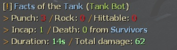

# Description | 內容
Show how long is tank alive, how much damage done, and tank incap/death/punch/rock/car statistics

> __Note__ <br/>
This plugin is private, Please contact [me](https://github.com/fbef0102/Game-Private_Plugin#私人插件列表-private-plugins-list)<br/>
此為私人插件, 請聯繫[本人](https://github.com/fbef0102/Game-Private_Plugin#私人插件列表-private-plugins-list)

* Video | 影片展示
<br/>None

* Image
	* example
	<br/>

* Apply to | 適用於
	```
	L4D1 any mode
	L4D2 any mode
	```

* Translation Support | 支援翻譯
	```
	English
	繁體中文
	简体中文
	```

* <details><summary>Changelog | 版本日誌</summary>

	* v1.4 (2023-4-27)
		* Translation Support
		* Support Versus mode (only 1 tank alive)

	* v1.3
	    * More accurate damage done to tank
	    * Initial Release
</details>

* Require | 必要安裝
	1. [left4dhooks](https://forums.alliedmods.net/showthread.php?t=321696)
	2. [[INC] Multi Colors](https://github.com/fbef0102/L4D1_2-Plugins/releases/tag/Multi-Colors)

* Similar Plugin | 相似插件
	1. [l4d2_tdr](https://github.com/fbef0102/Game-Private_Plugin/tree/main/l4d2_tdr): Displays Damage Information on Tank Death.
		> Tank死亡時顯示對Tank造成傷害統計表

* <details><summary>ConVar | 指令</summary>

	None
</details>

* <details><summary>Command | 命令</summary>

	None
</details>

- - - -
# 中文說明
Tank死亡時顯示Tank存活多長時間、對倖存者造成的 倒地/死亡/總傷害/拳頭/石頭/車子 統計表

* 圖示
	* 統計表
	<br/>

* 原理
	* 適用於對抗模式，但只支援場上一隻Tank的統計
	* 適用於戰役/生存/寫實模式，支援場上多隻Tank的統計
