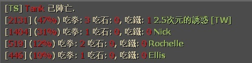

# Description | 內容
Displays how much damage done to tank + rock/punch/hittable from tank statistics on tank death.

> __Note__ <br/>
This plugin is private, Please contact [me](https://github.com/fbef0102/Game-Private_Plugin#私人插件列表-private-plugins-list)<br/>
此為私人插件, 請聯繫[本人](https://github.com/fbef0102/Game-Private_Plugin#私人插件列表-private-plugins-list)

* Video | 影片展示
<br/>None

* Image | 圖示
<br/>

* <details><summary>How does it work?</summary>

	* Display statistics on tank death or round ends.
	* Support multi tanks stats
</details>

* Require | 必要安裝
	1. [left4dhooks](https://forums.alliedmods.net/showthread.php?t=321696)
	2. [[INC] Multi Colors](https://github.com/fbef0102/L4D1_2-Plugins/releases/tag/Multi-Colors)

* <details><summary>ConVar | 指令</summary>

	* cfg/sourcemod/l4d_tank_dmg_report.cfg
		```php
		// 0=Plugin off, 1=Plugin on.
		l4d_tank_dmg_report_enable "1"

		// 0=Displays stats to players privately. 1=Displays all stats info publicly.
		l4d_tank_dmg_report_type "1"

		// If 1, Display more stats: rocks + punches + hittables.
		l4d_tank_dmg_report_rph "1"
		```
</details>

* <details><summary>Command | 命令</summary>

	None
</details>

* Apply to | 適用於
	```
	L4D1
	L4D2
	```

* <details><summary>Translation Support | 支援翻譯</summary>

	```
	English
	繁體中文
	简体中文
	```
</details>

* <details><summary>Related Plugin | 相關插件</summary>

	1. [l4d2_assist](https://github.com/fbef0102/L4D1_2-Plugins/tree/master/l4d2_assist): Show damage done to S.I. by survivors
		> 每個特感死亡時顯示對特感傷害統計表

	2. [l4d_tank_count](https://github.com/fbef0102/Game-Private_Plugin/tree/main/l4d_tank_count): Show how long is tank alive, how much damage done, and tank incap/death/punch/rock/car statistics
		> Tank死亡時顯示Tank存活多長時間、對倖存者造成的 倒地/死亡/總傷害/拳頭/石頭/車子 統計表
</details>

* <details><summary>Changelog | 版本日誌</summary>

	* v1.1h (2024-11-23)
		* Update cvars
		* Add translation
		* Add rocks/punch/hittable stats
		* Support multi tanks on the field

	* v1.0h (2023-8-22)
		* Remake Code
		* More accurate damage done to tank
</details>

- - - -
# 中文說明
Tank死亡時，顯示對Tank造成傷害統計表 + 顯示受到的 拳頭/石頭/車子 統計

* 圖示
<br/>

* 原理
	* Tank死亡時或回合結束時，顯示傷害統計表
	* 按照傷害排序
	* 支援多隻Tank

* <details><summary>指令中文介紹 (點我展開)</summary>

	* cfg/sourcemod/l4d_tank_dmg_report.cfg
		```php
		// 0=關閉插件, 1=啟動插件
		l4d_tank_dmg_report_enable "1"

		// 0=私下顯示統計給有造成傷害的玩家. 1=顯示統計表給所有玩家
		l4d_tank_dmg_report_type "1"

		// 為1時，新增統計: 吃拳 + 吃石 + 吃鐵.
		l4d_tank_dmg_report_rph "1"
		```
</details>