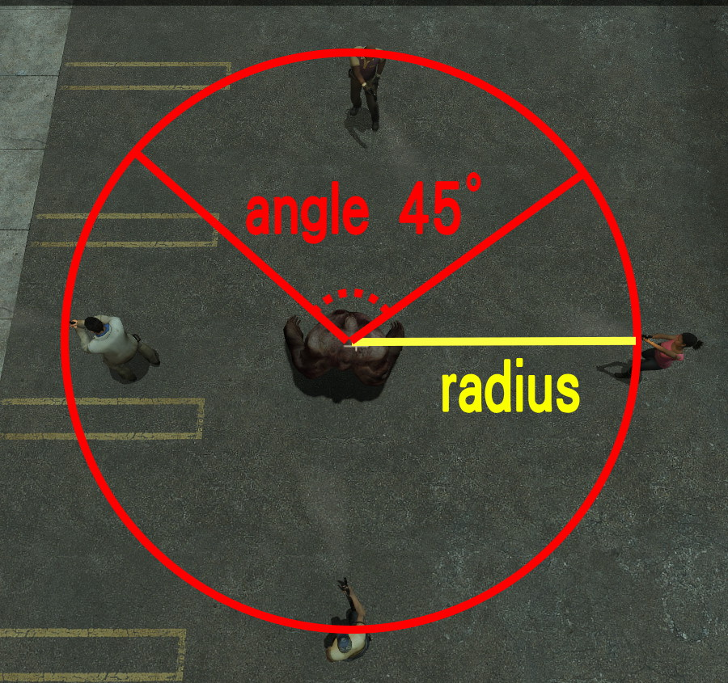
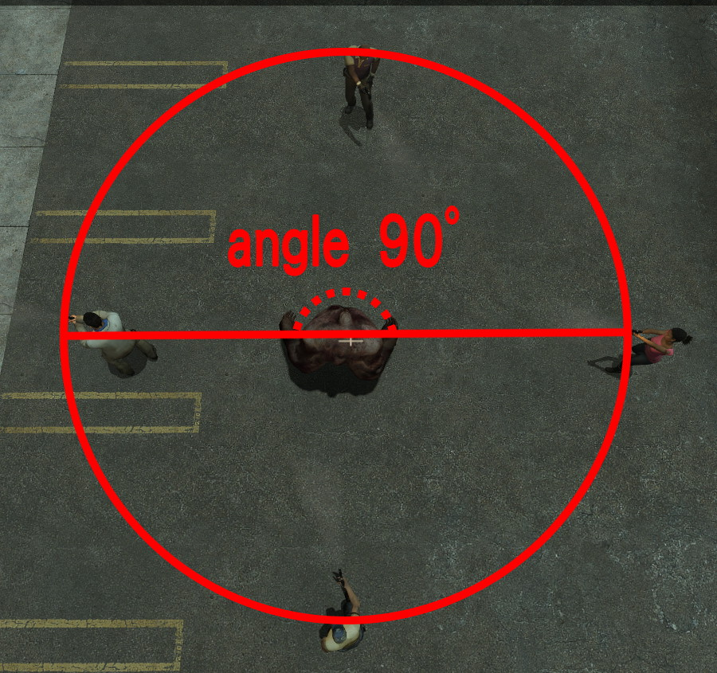
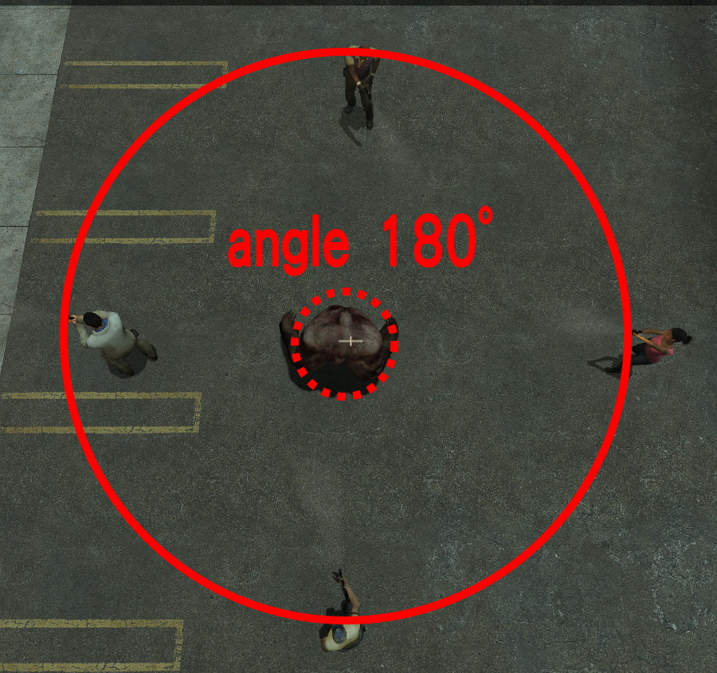

# Description | 內容
Adjust Tank punch range and hit multi survivors with one punch

> __Note__ <br/>
This plugin is private, Please contact [me](https://github.com/fbef0102/Game-Private_Plugin#私人插件列表-private-plugins-list)<br/>
此為私人插件, 請聯繫[本人](https://github.com/fbef0102/Game-Private_Plugin#私人插件列表-private-plugins-list)

* [Video | 影片展示](https://youtu.be/doB0R6oMYOo)

* Image | 圖示
	<br/>
	<br/>
	<br/>

* <details><summary>How does it work?</summary>

	* Tank can punch multi survivors around or behind him
</details>

* <details><summary>FAQ</summary>

	* How to adjust cvars?
		* ```l4d_tank_punch_range_radius``` => radius
		* ```l4d_tank_punch_range_angle``` => angle
		<br/>
		<br/>
		<br/>
</details>

* Require | 必要安裝
	1. [[INC] Multi Colors](https://github.com/fbef0102/L4D1_2-Plugins/releases/tag/Multi-Colors)

* <details><summary>ConVar | 指令</summary>

	* cfg/sourcemod/l4d_tank_punch_range.cfg
		```php
		// 0=Plugin off, 1=Plugin on.
		l4d_tank_punch_range_enable "1"

		// Tank punch distance
		l4d_tank_punch_range_radius "118"

		// Tank punch angle (0~180 degree)
		l4d_tank_punch_range_angle "180"
		```
</details>

* <details><summary>Command | 命令</summary>

	None
</details>

* Apply to | 適用於
	```
	L4D1
	L4D2
	```

* <details><summary>Changelog | 版本日誌</summary>

	* v1.0 (2024-8-1)
		* Initial Release
</details>

- - - -
# 中文說明
Tank可以大範圍一拳打倒周圍的倖存者

* 原理
	* Tank可以一拳打倒旁邊或背後的倖存者

* <details><summary>問題區</summary>

	* 如何調整指令
		* ```l4d_tank_punch_range_radius``` => 周圍半徑
		* ```l4d_tank_punch_range_angle``` => 周圍角度
		<br/>
		<br/>
		<br/>
</details>

* <details><summary>指令中文介紹 (點我展開)</summary>

	* cfg/sourcemod/l4d_tank_punch_range.cfg
		```php
		// 0=關閉插件, 1=啟動插件
		l4d_tank_punch_range_enable "1"

		// Tank大範圍揮拳的距離
		l4d_tank_punch_range_radius "118"

		// Tank大範圍揮拳的角度 (0~180度)
		l4d_tank_punch_range_angle "180"
		```
</details>