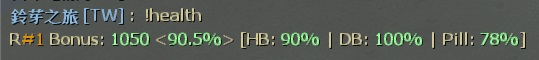

# Description | 內容
Override versus score depending on survivor health and damage bonus

> __Note__ <br/>
This plugin is private, Please contact [me](https://github.com/fbef0102/Game-Private_Plugin#私人插件列表-private-plugins-list)<br/>
此為私人插件, 請聯繫[本人](https://github.com/fbef0102/Game-Private_Plugin#私人插件列表-private-plugins-list)

* Video | 影片展示
<br/>None

* Image | 圖示
	* Display Versus Bonus
		> 輸入!bonus顯示通關獎勵分數
		<br/>
	* Override Versus Bonus when make it to saferoom
		> 改變通關之後的獎勵分
		<br/>

* Apply to | 適用於
	```
	L4D2 Versus
	```
	
* Translation Support | 支援翻譯
	```
	English
	繁體中文
	简体中文
	```

* <details><summary>Changelog | 版本日誌</summary>

	* v1.0h (2023-3-9)
		* Request by 乘风破浪
		* Individual plugin
		* Remake code, convert code to latest syntax
		* Fix warnings when compiling on SourceMod 1.11.
		* Optimize code and improve performance
		* Translation Support
		* Add first aid kits bonus score and adrenaline shot bonus score

	* v2.2.4
	    * [Original Work by Visor](https://github.com/SirPlease/L4D2-Competitive-Rework/blob/master/addons/sourcemod/scripting/l4d2_hybrid_scoremod_zone.sp)
</details>

* Require | 必要安裝
	1. [left4dhooks](https://forums.alliedmods.net/showthread.php?t=321696)
	2. [[INC] Multi Colors](https://github.com/fbef0102/L4D1_2-Plugins/releases/tag/Multi-Colors)

* <details><summary>ConVar | 指令</summary>

	* cfg/sourcemod/l4d2_versus_scoremod.cfg
		```php
		// If 1, enable adrenaline shots bounus
		l4d2_versus_scoremod_adrenalines_bonus_enable "1"

		// Unused adrenaline shots HP worth = map bonus HP value / this
		l4d2_versus_scoremod_adrenalines_hp_factor "8.0"

		// Unused adrenaline shots can not be worth more than this (max adrenaline shot bonus)
		l4d2_versus_scoremod_adrenalines_max_bonus "25"

		// Total Survivor Bonus = this * Number of Survivors * Map Distance
		l4d2_versus_scoremod_bonus_per_survivor_multiplier "0.5"

		// If 1, enable kits/defibrillators bounus
		l4d2_versus_scoremod_kits_bonus_enable "1"

		// Unused kits/defibrillators worth = map bonus HP value / this
		l4d2_versus_scoremod_kits_hp_factor "4.0"

		// Unused kits/defibrillators can not be worth more than this (max kit/defibrillator bonus)
		l4d2_versus_scoremod_kits_max_bonus "50"

		// Permanent Health Bonus = this * Map Bonus; rest goes for Temporary Health Bonus
		l4d2_versus_scoremod_permament_health_proportion "0.75"

		// If 1, enable pills bounus
		l4d2_versus_scoremod_pills_bonus_enable "1"

		// Unused pills HP worth = map bonus HP value / this
		l4d2_versus_scoremod_pills_hp_factor "6.0"

		// Unused pills can not be worth more than this (max pill bonus)
		l4d2_versus_scoremod_pills_max_bonus "30"

		// Tiebreaker score for those cases when both teams make saferoom
		l4d2_versus_scoremod_tiebreaker_bonus "0"
		```
</details>

* <details><summary>Command | 命令</summary>

	* **Display Versus Bonus**
		```php
		sm_health
		sm_damage
		sm_bonus
		```

	* **Display Versus Scoremod+ Map info**
		```php
		sm_mapinfo
		```
</details>

* Data Example
	* data/mapinfo.txt
		```php
		"MapInfo"
		{
			"c1m1_hotel" //Map Name
			{
				"max_distance"		"400" // This map distance score (Optional)
			}
			"c1m4_atrium"
			{
				"max_distance"		"800"
			}
		}
		```

- - - -
# 中文說明
根據玩家的血量與傷害改變對抗模式的過關分數

* 原理
	* 對抗模式下修改過關分數，過關分數有
		* 玩家的血量分－實血越多，分數越高
		* 玩家的傷害分－受到傷害越多，分數越低
		* 玩家的醫療物品分－倖存者隊伍攜帶越多治療包、電擊器、藥丸、腎上腺素，分數越高
	* 每個分數計算方式不同，也受到地圖距離分數的影響 (~~計算方式複雜，還是別問比較好~~)

* 功能
	* 可修改血量分、傷害分比重
	* 可修改地圖距離分數
	* 可設置隊伍平分的時候給予額外的獎勵分數
	* 可設置是否計算治療包、電擊器、藥丸、腎上腺素

* Data設定範例
	* data/mapinfo.txt
		```php
		"MapInfo"
		{
			"c1m1_hotel"//地圖名
			{
				"max_distance"		"400" //這張地圖的路程距離分數，數字越大，分數越高 (可以不填寫)
			}
			"c1m4_atrium"
			{
				"max_distance"		"800"
			}
		}
		```
