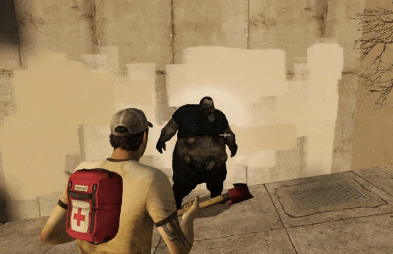

# Description | 內容
Modify Chainsaw and each melee weapon damages dealt to Commons/S.I./Tank/Witch

> __Note__ <br/>
This plugin is private, Please contact [me](https://github.com/fbef0102/Game-Private_Plugin#私人插件列表-private-plugins-list)<br/>
此為私人插件, 請聯繫[本人](https://github.com/fbef0102/Game-Private_Plugin#私人插件列表-private-plugins-list)

* Video | 影片展示
<br/>None

* Image | 圖示
    | Before (裝此插件之前)  			| After (裝此插件之後) |
    | -------------|:-----------------:|
    |||
    |||

* <details><summary>How does it work?</summary>

    * (Before) Melee weapons in l4d2 are too powerful
        * One-Melee kill Boomer/Jockey/Smoker/Hunter/Spitter (No matter health)
        * Two-Melee kill Charger (No matter health)
        * 20-Melee kill Tank (No matter health)
        * 4-Melee kill Witch (No matter health)
    * (After) Modify Chainsaw damages dealt to Commons/S.I./Tank/Witch
    * (After) Modify each melee damages dealt to Commons/S.I./Tank/Witch
        * Support All official melee weapon
        * Support custom melee weapon
        * A common zombie still instantly dies on a headshot by melee (No matter what damage).
    * To modify each gun weapons' damage, please check "Related Plugin" below
</details>

* Require | 必要安裝
    1. [left4dhooks](https://forums.alliedmods.net/showthread.php?t=321696)
    2. [sourcescramble](https://github.com/nosoop/SMExt-SourceScramble/releases)
    3. [charging_takedamage_patch](https://github.com/fbef0102/L4D2-Plugins/tree/master/charging_takedamage_patch)

* <details><summary>ConVar | 指令</summary>

    * cfg/sourcemod/l4d2_melee_modify_damage.cfg
        ```php
        // 0=Plugin off, 1=Plugin on. Modify Chainsaw and each melee weapon damages dealt to Commons/S.I./Tank/Witch
        // A common zombie still instantly dies on a headshot by melee.
        l4d2_melee_modify_damage_enable "1"

        // Set wounds only when the zombie is going to die.
        l4d2_melee_modify_damage_common_wound_dead "1"
        ```
</details>

* <details><summary>Command | 命令</summary>
    
    None
</details>

* <details><summary>API | 串接</summary>

    ```php
    Registers a library name: l4d2_melee_modify_damage
    ```
</details>

* <details><summary>Data Config</summary>

    * Modify each melee damages dealt to Commons/S.I./Tank/Witch
    * ```data/l4d2_melee_modify_damage.cfg```
        ```php
        "l4d2_melee_modify_damage"
        {
            "chainsaw"	//chainsaw
            {
                "Enable"		"1"     // Enable
                "Tank"			"100"   // modify damage to Tank
                "Witch"			"-1"    // modify damage to Witch, -1=Default damage
                "Common"		"100"   // modify damage to Commons
                "Smoker"		"100"   // modify damage to Smoker
                "Boomer"		"100"   // modify damage to Boomer
                "Hunter"		"100"   // modify damage to Hunter
                "Spitter"		"100"   // modify damage to Spitter
                "Jockey"		"100"   // modify damage to Jockey
                "Charger"		"100"   // modify damage to Charger
            }

            //Melee default settings
            "melee_default"
            {
                // 1=Enable, 0=Disable
                "Enable"		"1"
                
                // Meleee damage to Tank (-1: damage unchaged)
                "Tank"			"500"
                
                // Meleee damage to Witch (-1: damage unchaged)
                "Witch"			"250"
                
                // Meleee damage to Common Infected (-1: damage unchaged)
                "Common"		"250"
                
                // Meleee damage to Smoker (-1: damage unchaged)
                "Smoker"		"390.0" 
                
                // Meleee damage to Boomer (-1: damage unchaged)
                "Boomer"		"390"
                
                // Meleee damage to Tank (-1: damage unchaged)
                "Hunter"		"390"
                
                // Meleee damage to Spitter (-1: damage unchaged)
                "Spitter"		"390"
                
                // Meleee damage to Jockey (-1: damage unchaged)
                "Jockey"		"390"
                
                // Meleee damage to Charger (-1: damage unchaged)
                "Charger"		"390"
                
                // Meleee damage multi if hit head
                "HeadShot_multi"
                {
                    "Tank"			"2.0"
                    "Witch"			"2.0"
                    //"Common"		"2.0" //Doesn't work. A common zombie still instantly dies on a headshot by melee. (無效, 近戰爆頭殭屍依然瞬間死亡)
                    "Smoker"		"2.0"
                    "Boomer"		"2.0"
                    "Hunter"		"2.0"
                    "Spitter"		"2.0"
                    "Jockey"		"2.0"
                    "Charger"		"2.0"
                }
                
                // Meleee damage multi if hit Leg
                "Leg_multi"
                {
                    "Tank"			"1.0"
                    "Witch"			"1.0"
                    "Common"		"1.0"
                    "Smoker"		"0.5"
                    "Boomer"		"0.5"
                    "Hunter"		"0.5"
                    "Spitter"		"0.5"
                    "Jockey"		"0.5"
                    "Charger"		"0.5"
                }
            }

            // Add other melee weapon if you want
            ...
        }
        ```
</details>

* <details><summary>Known Conflicts</summary>
    
    If you don't use any of these plugins at all, no need to worry about conflicts.
    1. [Nerf Damage To Commons](https://forums.alliedmods.net/showthread.php?t=330085)
        * Disable nerf damage for melee weapon and Chainsaw
    2. [Common Infected Health - Damage Received](https://forums.alliedmods.net/showthread.php?t=332832)
        * Disable damage modify for melee weapon and Chainsaw
</details>

* Apply to | 適用於
    ```
    L4D2
    ```

* <details><summary>Related Plugin | 相關插件</summary>

    1. [l4d2_gun_damage_modify](https://github.com/fbef0102/L4D2-Plugins/tree/master/l4d2_gun_damage_modify): Modify every weapon damage done to Tank, SI, Witch, Common in l4d2
        * 修改每一種槍械武器對普通殭屍/Tank/Witch/特感 的傷害倍率
    1. [l4d2_melee_durability](/Plugin_插件/Real_Realism_真寫實模式/l4d2_melee_durability): Every melee weapons have durability, once run out durability, the melee weapon will be removed
        * 每個近戰武器都有耐久值，揮砍殭屍會消耗耐力，當耐久值耗盡時移除近戰武器
</details>

* <details><summary>Changelog | 版本日誌</summary>

    * v1.4 (2024-8-11)
        * Optimize Code
        * Update Gamedata

    * v1.3 (2024-8-6)
        * Optimize Code

    * v1.2 (2024-7-23)
        * Melee won't one-swing-kill hunter when poucing
        * Melee won't one-swing-kill jockey when leaping

    * v1.1 (2024-1-27)
        * Modify melee damage multiplier by HeadShot or Leg

    * v1.0 (2024-1-25)
        * Initial Release
</details>

- - - -
# 中文說明
修改電鋸與每一種近戰武器對 普通殭屍/Tank/Witch/特感 的傷害值

* 原理
    * 修改電鋸對 普通殭屍/Tank/Witch/特感 的傷害值
    * 修改每一種近戰武器對 普通殭屍/Tank/Witch/特感 的傷害值
        * 支援所有官方近戰武器
        * 支援三方圖的近戰武器
        * 使用近戰爆頭 普通殭屍，依然會瞬間死亡 (無論傷害高低)
    * 如要修改槍械武器的傷害值，請查看 "相關插件" 部分

* 用意在哪?
    * 官方預設中(安裝此插件之前)，近戰過於強大到可以
        * 一刀砍死特感 (無論血量多高)
        * 兩刀砍死Charger (無論血量多高)
        * 20刀砍死Tank (無論血量多高)
        * 四刀砍死Witch (無論血量多高)

* <details><summary>指令中文介紹 (點我展開)</summary>

    * cfg/sourcemod/l4d2_melee_modify_damage.cfg
        ```php
        // 0=關閉插件, 1=啟動插件.
        // 近戰爆頭 普通殭屍，依然會瞬間死亡
        l4d2_melee_modify_damage_enable "1"

        // 普通殭屍 1=確定死亡時才會有傷口, 0=每次被近戰或電鋸砍到會有傷口
        l4d2_melee_modify_damage_common_wound_dead "1"
        ```
</details>

* <details><summary>文件設定範例</summary>

    * 修改每一種近戰武器對 普通殭屍/Tank/Witch/特感 的傷害值
    * ```data/l4d2_melee_modify_damage.cfg```
        ```php
        "l4d2_melee_modify_damage"
        {
            "chainsaw"	//電鋸
            {
                "Enable"		"1"     // 1=啟用修改
                "Tank"			"100"   // 對Tank造成的傷害值
                "Witch"			"-1"    // 對Witch造成的傷害值, 寫-1=預設傷害
                "Common"		"100"   // 對普通殭屍造成的傷害值
                "Smoker"		"100"   // 對Smoker造成的傷害值
                "Boomer"		"100"   // 對Boomer造成的傷害值
                "Hunter"		"100"   // 對Hunter造成的傷害值
                "Spitter"		"100"   // 對Spitter造成的傷害值
                "Jockey"		"100"   // 對Jockey造成的傷害值
                "Charger"		"100"   // 對Charger造成的傷害值
            }

            //近戰武器 預設數值
            "melee_default"
            {
                // 1=開, 0=關
                "Enable"		"1"
                
                // 近戰對Tank的傷害 (-1: 不修改)
                "Tank"			"500"
                
                // 近戰對Witch的傷害 (-1: 不修改)
                "Witch"			"250"
                
                // 近戰對普通殭屍的傷害 (-1: 不修改)
                "Common"		"250"
                
                // 近戰對Smoker的傷害 (-1: 不修改)
                "Smoker"		"390.0" 
                
                // 近戰對Boomer的傷害 (-1: 不修改)
                "Boomer"		"390"
                
                // 近戰對Tank的傷害 (-1: 不修改)
                "Hunter"		"390"
                
                // 近戰對Spitter的傷害 (-1: 不修改)
                "Spitter"		"390"
                
                // 近戰對Jockey的傷害 (-1: 不修改)
                "Jockey"		"390"
                
                // 近戰對Charger的傷害 (-1: 不修改)
                "Charger"		"390"
                
                // 擊中頭部的近戰傷害倍率
                "HeadShot_multi"
                {
                    "Tank"			"2.0"
                    "Witch"			"2.0"
                    //"Common"		"2.0" //無效, 近戰爆頭殭屍依然瞬間死亡
                    "Smoker"		"2.0"
                    "Boomer"		"2.0"
                    "Hunter"		"2.0"
                    "Spitter"		"2.0"
                    "Jockey"		"2.0"
                    "Charger"		"2.0"
                }
                
                // 擊中腿部的近戰傷害倍率
                "Leg_multi"
                {
                    "Tank"			"1.0"
                    "Witch"			"1.0"
                    "Common"		"1.0"
                    "Smoker"		"0.5"
                    "Boomer"		"0.5"
                    "Hunter"		"0.5"
                    "Spitter"		"0.5"
                    "Jockey"		"0.5"
                    "Charger"		"0.5"
                }
            }

            // 自行增加任何三方圖的近戰
            ..
        }
        ```
</details>

* <details><summary>會衝突的插件</summary>
    
    如果沒安裝以下插件就不需要擔心衝突
    1. [Nerf Damage To Commons](https://forums.alliedmods.net/showthread.php?t=330085)
        * 關閉此插件中的 "近戰與電鋸" 削弱傷害
    2. [Common Infected Health - Damage Received](https://forums.alliedmods.net/showthread.php?t=332832)
        * 關閉此插件中的 "近戰與電鋸" 對普通殭屍的傷害數值調整
</details>