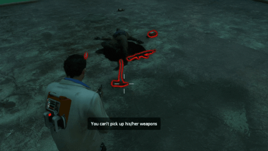

# Description | 內容
Lock the weapons and items dropped by dead survivors, no one else can pick up.

> __Note__ <br/>
This plugin is private, Please contact [me](https://github.com/fbef0102/Game-Private_Plugin#私人插件列表-private-plugins-list)<br/>
此為私人插件, 請聯繫[本人](https://github.com/fbef0102/Game-Private_Plugin#私人插件列表-private-plugins-list)

* [Video | 影片展示](https://youtu.be/TEQUEbWQkCg)

* Image | 圖示
	* You can't take death player's weapons and items (無法撿起死亡玩家的武器與物品)
    <br/>

* Require | 必要安裝
    1. [left4dhooks](https://forums.alliedmods.net/showthread.php?t=321696)
    2. [[INC] l4d2_weapons](/left4dead2/scripting/include/l4d2_weapons.inc)

* <details><summary>ConVar | 指令</summary>

	* cfg/sourcemod/l4d_death_weapon_lock.cfg
		```php
        // 0=Plugin off, 1=Plugin on.
        l4d_death_weapon_lock_enable "1"

        // Glow color (RGB) for weapons and items droped by dead survivors and lock. [0 0 0: No Glow]
        l4d_death_weapon_lock_color_lock "255 0 0"

        // Glow color (RGB) for weapons and items droped by dead survivors and unlock.　[0 0 0: No Glow]
        l4d_death_weapon_lock_color_unlock "0 255 0"

        // Glow range for weapons and items drooped by dead survivors.
        // Value: 0 = Unlimited range, others = Glow range.
        l4d_death_weapon_lock_range "200"

        // Lock time for weapons and items droped by dead survivors.
        // Value: -1 = Lock Forever, 0.0 = Unlock instantly, others = Lock time.
        l4d_death_weapon_lock_lock_time "-1"

        // If 1, everyone can pick up weapons and items if owner has left the server
        l4d_death_weapon_lock_left_unlock "1"
		```
</details>

* <details><summary>Command | 命令</summary>
    
    None
</details>

* Apply to | 適用於
    ```
    L4D2
    ```

* <details><summary>Translation Support | 支援翻譯</summary>

	```
	English
	繁體中文
	简体中文
	```
</details>

* <details><summary>Related Plugin | 相關插件</summary>

	1. [drop_secondary](https://github.com/fbef0102/L4D2-Plugins/tree/master/drop_secondary): Survivor players will drop their secondary weapon (including melee) when they die
		> 死亡時掉落第二把武器
</details>

* <details><summary>Changelog | 版本日誌</summary>

    * v1.0h (2023-11-28)
        * Initial Release
</details>

- - - -
# 中文說明
無法撿起其他死亡玩家掉落的武器與物品 (避免被撿走)

* 原理
    * 玩家死亡時掉落的武器與物品，鎖住並產生紅色光環，任何人不能撿起他掉落的武器與物品
    * 如果玩家離開伺服器或超過一定時間後，光環變成綠色，任何人可以撿起

* <details><summary>指令中文介紹 (點我展開)</summary>

	* cfg/sourcemod/l4d_death_weapon_lock.cfg
		```php
        // 0=關閉插件, 1=啟動插件
        l4d_death_weapon_lock_enable "1"

        // 倖存者死亡時掉落的武器與物品，鎖住的光環顏色，填入RGB三色 (三個數值介於0~255，需要空格) [0 0 0: 不加顏色]
        l4d_death_weapon_lock_color_lock "255 0 0"

        // 倖存者死亡時掉落的武器與物品，解鎖的光環顏色，填入RGB三色 (三個數值介於0~255，需要空格) [0 0 0: 不加顏色]
        l4d_death_weapon_lock_color_unlock "0 255 0"

        // 光環顏色範圍
        // 0 = 無限制
        l4d_death_weapon_lock_range "200"

        // 倖存者死亡時掉落的武器與物品 鎖住時間，超過一定時間後，任何人可以撿起
        // -1 = 永遠鎖住, 0.0 = 不鎖, 其他數值 = 鎖住時間.
        l4d_death_weapon_lock_lock_time "-1"

        // 為1時，如果玩家離開伺服器則任何人可以撿起
        l4d_death_weapon_lock_left_unlock "1"
		```
</details>
