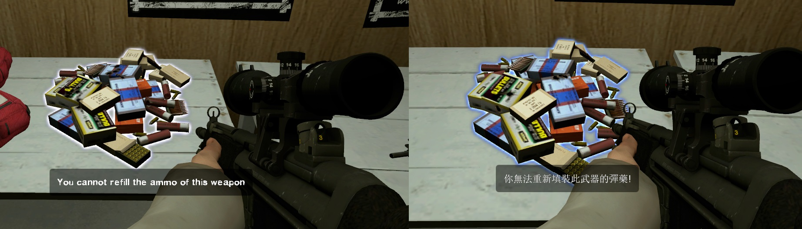

# Description | 內容
Cannot refill the ammo of the weapons

> __Note__ <br/>
This plugin is private, Please contact [me](https://github.com/fbef0102/Game-Private_Plugin#私人插件列表-private-plugins-list)<br/>
此為私人插件, 請聯繫[本人](https://github.com/fbef0102/Game-Private_Plugin#私人插件列表-private-plugins-list)

* Video | 影片展示
<br/>None

* Image | 圖示
    * Display message when can't refill ammo
    <br/>

* <details><summary>How does it work?</summary>

    * Cannot refill the ammo of some weapons from ammo pile, depending on the cvar you set.
</details>

* Require | 必要安裝
    1. [[INC] Multi Colors](https://github.com/fbef0102/L4D1_2-Plugins/releases/tag/Multi-Colors)

* <details><summary>ConVar | 指令</summary>

    * cfg/sourcemod/l4d_weapon_block_ammo_pile.cfg
        ```php
        // 0=Plugin off, 1=Plugin on.
        l4d_weapon_block_ammo_pile_enable "1"

        // Player with these flag can refill ammo (Empty=Everyone, -1=No one)
        l4d_weapon_block_ammo_pile_flags "z"

        // (L4D2) Empty string to block all. Cannot refill the ammo of these weapon IDs in this plugin, separate by commas (no spaces). See plugin source code for more details.
        // "weapon_smg",						1
        // "weapon_pumpshotgun",				2
        // "weapon_autoshotgun",				3
        // "weapon_rifle",						4
        // "weapon_hunting_rifle",				5
        // "weapon_smg_silenced",				6
        // "weapon_shotgun_chrome",			    7
        // "weapon_rifle_desert",				8
        // "weapon_sniper_military",			9
        // "weapon_shotgun_spas",				10
        // "weapon_rifle_ak47",				    11
        // "weapon_smg_mp5",					12
        // "weapon_rifle_sg552",				13
        // "weapon_sniper_awp",				    14
        // "weapon_sniper_scout",				15
        l4d_weapon_block_ammo_pile_weapon "14,15"

        // (L4D1) Empty string to block all. Cannot refill the ammo of these weapon IDs in this plugin, separate by commas (no spaces). See plugin source code for more details.
        // "weapon_smg",						1
        // "weapon_pumpshotgun",				2
        // "weapon_autoshotgun",				3
        // "weapon_rifle",						4
        // "weapon_hunting_rifle",				5
        l4d_weapon_block_ammo_pile_weapon "1,2,3,4,5"

        // How message displays. (0: Disable, 1:In chat, 2: In Hint Box, 3: In center text)
        l4d_weapon_block_ammo_pile_announce_type "2"

        // Cannot refill ammo sound file (relative to to sound/, empty=disable)
        l4d_weapon_block_ammo_pile_denied_soundfile "buttons/button11.wav"

        // 1 = Bot cannot refill the ammo either, 0 = Bot can refill the ammo
        l4d_weapon_block_ammo_pile_bot "0"
        ```
</details>

* <details><summary>Command | 命令</summary>
    
    None
</details>

* Apply to | 適用於
    ```
    L4D1
    L4D2
    ```

* <details><summary>Translation Support | 支援翻譯</summary>

    ```
    English
    繁體中文
    简体中文
    ```
</details>

* <details><summary>Related Plugin | 相關插件</summary>

    1. [Reserve (Ammo) Control](https://forums.alliedmods.net/showthread.php?t=334274): Individually control weapons's reserve counts independent of the ammo_* cvars.
        * 每一種槍枝都有獨立的備用彈藥
    2. [l4d_infinite_clip](/Plugin_插件/Weapons_武器/l4d_infinite_clip): Weapons now have infinite clip without reload + Chainsaw now is always refilled
        * 指定的武器可以無限射擊，不需要換彈夾 + 電鋸擁有無限油量
</details>

* <details><summary>Changelog | 版本日誌</summary>

    * v1.0 (2024-3-27)
        * Initial Release
</details>

- - - -
# 中文說明
指定的武器無法填裝彈藥

* 原理
    * 根據指令設定，指定的武器無法從子彈堆填裝彈藥

* <details><summary>指令中文介紹 (點我展開)</summary>

    * cfg/sourcemod/l4d_weapon_limits.cfg
        ```php
        // 0=關閉插件, 1=啟動插件
        l4d_weapon_block_ammo_pile_enable "1"

        // 擁有這些權限的玩家，可以不受插件限制拿取彈藥 (留白 = 任何人都能, -1: 無人)
        l4d_weapon_block_ammo_pile_flags "z"

        // (L4D2) 空=限制全武器. 填入武器的ID，指定這些武器無法填裝彈藥, 逗號分隔（不須空格）. 請打開源碼查看武器的ID列表
        // "weapon_smg",						1
        // "weapon_pumpshotgun",				2
        // "weapon_autoshotgun",				3
        // "weapon_rifle",						4
        // "weapon_hunting_rifle",				5
        // "weapon_smg_silenced",				6
        // "weapon_shotgun_chrome",			    7
        // "weapon_rifle_desert",				8
        // "weapon_sniper_military",			9
        // "weapon_shotgun_spas",				10
        // "weapon_rifle_ak47",				    11
        // "weapon_smg_mp5",					12
        // "weapon_rifle_sg552",				13
        // "weapon_sniper_awp",				    14
        // "weapon_sniper_scout",				15
        l4d_weapon_block_ammo_pile_weapon "14,15"

        // (L4D1) 空=限制全武器. 填入武器的ID，指定這些武器無法填裝彈藥, 逗號分隔（不須空格）. 請打開源碼查看武器的ID列表
        // "weapon_smg",						1
        // "weapon_pumpshotgun",				2
        // "weapon_autoshotgun",				3
        // "weapon_rifle",						4
        // "weapon_hunting_rifle",				5
        l4d_weapon_block_ammo_pile_weapon "1,2,3,4,5"

        // 提示該如何顯示. (0: 不提示, 1: 聊天框, 2: 黑底白字框, 3: 螢幕正中間)
        l4d_weapon_block_ammo_pile_announce_type "2"

        // 無法填裝彈藥的提示音效檔案 (路徑相對於 sound 資料夾, 空=關閉音效)
        l4d_weapon_block_ammo_pile_denied_soundfile "buttons/button11.wav"

        // 1 = Bot 也不行填裝彈藥, 0 = Bot 可以填裝彈藥
        l4d_weapon_block_ammo_pile_bot "0"
        ```
</details>