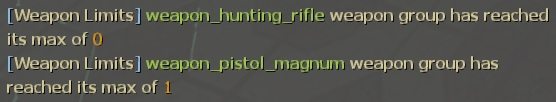

# Description | 內容
Restrict weapons individually or together

> __Note__ <br/>
This plugin is private, Please contact [me](https://github.com/fbef0102/Game-Private_Plugin#私人插件列表-private-plugins-list)<br/>
此為私人插件, 請聯繫[本人](https://github.com/fbef0102/Game-Private_Plugin#私人插件列表-private-plugins-list)

* Video | 影片展示
    <br/>None

* Image | 圖示
    <br/>

* <details><summary>How does it work?</summary>

    * When limit reached, any of players can't pick up specific weapons or melees
    * Open cfg/server.cfg and write down limit. For example:
        ```php
        // l4d_weapon_limits_add　<limit number> <give ammo if weapon limited is reached> <weapon/melee class name>
        l4d_weapon_limits_add 3 1 weapon_smg
        l4d_weapon_limits_add 3 1 weapon_smg_silenced
        l4d_weapon_limits_add 3 1 weapon_pumpshotgun
        l4d_weapon_limits_add 3 1 weapon_shotgun_chrome
        l4d_weapon_limits_add 1 0 weapon_pistol_magnum
        l4d_weapon_limits_add 0 1 weapon_hunting_rifle
        l4d_weapon_limits_add 2 0 weapon_melee
        l4d_weapon_limits_add 1 0 fireaxe
        l4d_weapon_limits_add 1 0 crowbar

        // Add other custom melee if you want
        // meleejb, finger are from custom map: Zengcheng
        l4d_weapon_limits_add 1 0 meleejb 
        l4d_weapon_limits_add 1 0 finger 
        ```

    * All weapons
        ```php
        weapon_pistol
        weapon_pistol_magnum
        weapon_pumpshotgun
        weapon_shotgun_chrome
        weapon_smg
        weapon_smg_silenced
        weapon_autoshotgun
        weapon_shotgun_spas
        weapon_hunting_rifle
        weapon_sniper_military
        weapon_smg
        weapon_rifle
        weapon_rifle_desert
        weapon_rifle_ak47
        weapon_grenade_launcher
        weapon_rifle_m60
        weapon_chainsaw
        weapon_smg_mp5
        weapon_rifle_sg552
        weapon_sniper_scout
        weapon_sniper_awp
        weapon_melee
        ```

    * All melee class name
        ```php
        baseball_bat
        cricket_bat
        crowbar
        electric_guitar
        fireaxe
        frying_pan
        katana
        machete
        tonfa
        knife
        golfclub
        pitchfork
        shovel
        ... //Add other custom melee if you want
        ```
</details>

* Require | 必要安裝
    1. [left4dhooks](https://forums.alliedmods.net/showthread.php?t=321696)
    2. [[INC] Multi Colors](https://github.com/fbef0102/L4D1_2-Plugins/releases/tag/Multi-Colors)
    3. [[INC] l4d2_weapons](/left4dead2/scripting/include/l4d2_weapons.inc)
    4. Optional - [l4d_multiple_equipment](/Plugin_插件/Nothing_Impossible_無理改造版/l4d_multiple_equipment)

* <details><summary>ConVar | 指令</summary>

    * cfg/sourcemod/l4d_weapon_limits.cfg
        ```php
        // Time interval bewteen weapon limit notify. (0=off)
        l4d_weapon_limits_cooltime_block "3.0"
        ```
</details>

* <details><summary>Command | 命令</summary>
    
    * **Add a weapon limit**
        ```php
        l4d_weapon_limits_add　<limit number> <give ammo if weapon limited is reached> <weapon/melee class name>
        ```
</details>

* Apply to | 適用於
    ```
    L4D2
    ```

* [L4D1 Version | 適用於L4D1的版本](https://github.com/fbef0102/L4D1_2-Plugins/tree/master/l4d_limitweapon)

* <details><summary>Translation Support | 支援翻譯</summary>

    ```
    English
    繁體中文
    简体中文
    ```
</details>

* <details><summary>Related Plugin | 相關插件</summary>

    1. [l4d_multiple_equipment](/Plugin_插件/Nothing_Impossible_無理改造版/l4d_multiple_equipment): Carry 2 weapons or items in each slot (No conflict)
        > 每個人可以攜帶兩種武器或物品 (與此插件不衝突)
</details>

* <details><summary>Changelog | 版本日誌</summary>

    * v2.4 (2024-5-11)
        * Support Custom Melee
        * Fixed melee error

    * v2.2 (2023-12-13)
        * Compatible with l4d_multiple_equipment v1.2h or above by harry
        * Support each melee class limit
        * Translation Support
        * Fixed player can not pick up the same weapon
        * Fixed player can still break the limit can pick up weapon

    * v2.1
        * Remove some cmds

    * v2.0
        * [By CanadaRox, Stabby, Forgetest, A1m`, robex](https://github.com/SirPlease/L4D2-Competitive-Rework/blob/master/addons/sourcemod/scripting/l4d_weapon_limits.sp)
</details>

- - - -
# 中文說明
限制每個武器可以拿取的數量，超過就不能拿取

* 原理
    * 當要撿起武器時，計算隊友之中已經拿取的數量，超過便不能撿起武器 
    * 可以進一步限制每個近戰種類
    * 適用真人玩家與Bot

* <details><summary>使用步驟</summary>

    * 打開 ```cfg/server.cfg``` 文件並寫下想要限制的武器，譬如
        ```php
        // l4d_weapon_limits_add <限制數量> <如果不能撿起限制的武器是否給彈藥> <武器/近戰 名稱>
        // 不用寫所有武器，只寫想要限制數量的武器或近戰
        l4d_weapon_limits_add 3 1 weapon_smg
        l4d_weapon_limits_add 3 1 weapon_smg_silenced
        l4d_weapon_limits_add 3 1 weapon_pumpshotgun
        l4d_weapon_limits_add 3 1 weapon_shotgun_chrome
        l4d_weapon_limits_add 1 0 weapon_pistol_magnum
        l4d_weapon_limits_add 2 0 weapon_melee
        l4d_weapon_limits_add 0 1 weapon_hunting_rifle
        l4d_weapon_limits_add 1 0 fireaxe
        l4d_weapon_limits_add 1 0 crowbar

        // 可以自行新增三方圖近戰武器
        // meleejb, finger 近戰武器來自地圖: 廣州增城
        l4d_weapon_limits_add 1 0 meleejb 
        l4d_weapon_limits_add 1 0 finger 
        ```

    * 所有武器名稱
        ```php
        手槍 => weapon_pistol
        麥格農手槍 => weapon_pistol_magnum
        木製單發散彈槍 => weapon_pumpshotgun
        鐵製單發散彈槍 => weapon_shotgun_chrome
        Uzi烏茲衝鋒槍 => weapon_smg
        消音衝鋒槍 => weapon_smg_silenced
        自動連發散彈槍 => weapon_autoshotgun
        自動連發戰鬥散彈槍=> weapon_shotgun_spas
        獵槍 => weapon_hunting_rifle
        軍用狙擊槍 => weapon_sniper_military
        Uzi烏茲衝鋒槍 => weapon_smg
        M16步槍 => weapon_rifle
        三連發步槍 => weapon_rifle_desert
        AK47 => weapon_rifle_ak47
        榴彈發射器 => weapon_grenade_launcher
        M60機關槍 => weapon_rifle_m60
        電鋸 => weapon_chainsaw
        CSS-MP5衝鋒槍 => weapon_smg_mp5
        CSS-SG552步槍 => weapon_rifle_sg552
        CSS-Scout狙擊槍 => weapon_sniper_scout
        CSS-AWP狙擊槍 => weapon_sniper_awp
        近戰武器 => weapon_melee
        ```

    * 所有近戰武器名稱
        ```php
        baseball_bat => 球棒
        cricket_bat => 板球拍
        crowbar => 鐵撬
        electric_guitar => 電吉他
        fireaxe => 斧頭
        frying_pan => 平底鍋
        katana => 武士刀
        machete => 開山刀
        tonfa => 警棍
        knife => 小刀
        golfclub => 高爾夫球棒
        pitchfork => 草叉
        shovel => 鐵鏟
        ... //自行新增三方圖近戰武器名稱
        ```
</details>

* <details><summary>指令中文介紹 (點我展開)</summary>

    * cfg/sourcemod/l4d_weapon_limits.cfg
        ```php
        // 訊息提示的間隔. (0=不提示)
        l4d_weapon_limits_cooltime_block "3.0"
        ```
</details>

* <details><summary>命令中文介紹 (點我展開)</summary>
    
    * **限制武器數量**
        ```php
        l4d_weapon_limits_add <限制數量> <如果不能撿起限制的武器是否給彈藥> <武器/近戰 名稱>
        ```
</details>