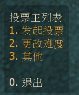
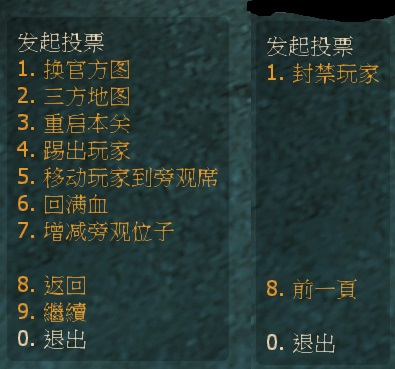
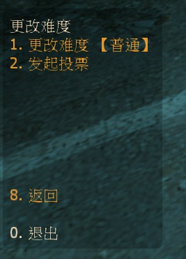
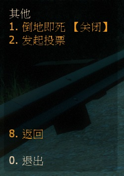
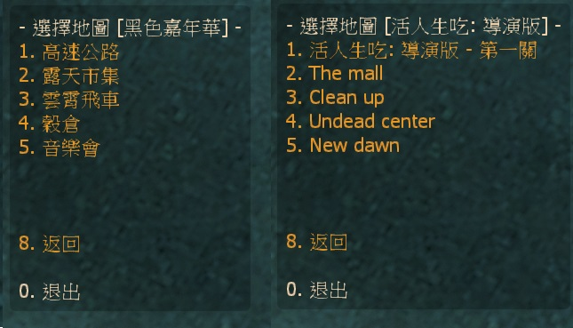

# 中文說明
新型的投票系統

> __Note__
<br/>此為私人插件，請聯繫[本人](https://github.com/fbef0102/Game-Private_Plugin#私人插件列表-private-plugins-list)
<br/>此插件只有中文沒有英文

* 影片展示
<br/>無

* 圖示
	* 輸入!v打開投票菜單
	<br/>
	* 子菜單"發起投票"
	<br/>
	* 子菜單"更改難度"
	<br/>
	* 子菜單"其他"
	<br/>
	* 官方圖與三方圖可以選擇關卡
	<br/>


* 適用於
	```
	L4D2
	```

* <details><summary>版本日誌</summary>

	* v1.0h (2023-5-12)
		* Initial Release
</details>

* 必要安裝
	1. [left4dhooks](https://forums.alliedmods.net/showthread.php?t=321696)
	2. [[INC] Multi Colors](https://github.com/fbef0102/L4D1_2-Plugins/releases/tag/Multi-Colors)
	3. [builtinvotes](https://github.com/L4D-Community/builtinvotes/action)
	4. [sourcescramble](https://github.com/nosoop/SMExt-SourceScramble/releases)

* <details><summary>指令</summary>

	* cfg/sourcemod/l4d2_vote_change.cfg
		```php
		// 擁有這權限的人無法被投票踢出伺服器 (留白 = 任何人無法被踢, -1: 所有人都可以被踢)
		l4d2_vote_change_Kick_immune_flag "z"

		// 擁有這權限的人無法被投票永久封禁 (留白 = 任何人無法被永久封禁, -1: 所有人都可以被永久封禁)
		l4d2_vote_change_ban_immune_flag "z"

		// 過X秒後才能再發起投票.
		l4d2_vote_change_delay "60"

		// 0=插件關閉, 1=插件開啟.
		l4d2_vote_change_enable "1"

		// 倖存者與特感隊伍總共要有X位真人玩家在場才能發起投票.
		l4d2_vote_change_required "1"

		// 如果為1, 旁觀者可以發起投票
		l4d2_vote_change_spectator_call_vote "1"

		// 如果為1, 旁觀者可以參與投票 (按F1同意, 按F2不同意)
		l4d2_vote_change_spectator_join_vote "1"
		```
</details>

* <details><summary>命令</summary>

	* **打開投票菜單**
		```php
		sm_v
		```

	* **管理員可以強制通過 (權限: ADMFLAG_BAN)**
		```php
		sm_p
		```

	* **管理員可以強制否則 (權限: ADMFLAG_BAN)**
		```php
		sm_f
		```
</details>

* 原理
	* 輸入!v -> 選擇項目 -> 發起投票 -> F1同意 或 F2不同意

* 功能
	* 任何人發起投票後，管理員可輸入!p一票同意；!f一票否決。

* 投票菜單表
	* 主列表：
		* 发起投票
		* 更改难度
		* 其他

	* 子菜單 "發起投票"
		* 換官方圖		(可以選擇關卡)
		* 三方圖		(能自動識別三方圖，可以選擇關卡)
		* 重啟本關		(重新回合，非重新刷圖)
		* 踢出玩家		(不可踢出管理員)
		* 移動玩家到旁觀席
		* 回滿血
		* 增減旁觀		(4~30個位子)
		* 封禁玩家     	(不可封禁管理員)

	* 子菜單 "更改難度"
		* 更改難度		(簡單、一般、進階、專家)

	* 子菜單 "其他"
		* 倒地即死		(開啟、關閉)


	
