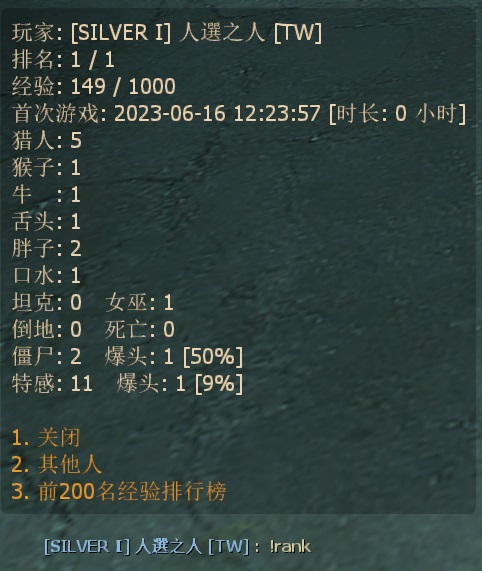
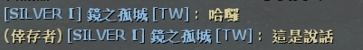
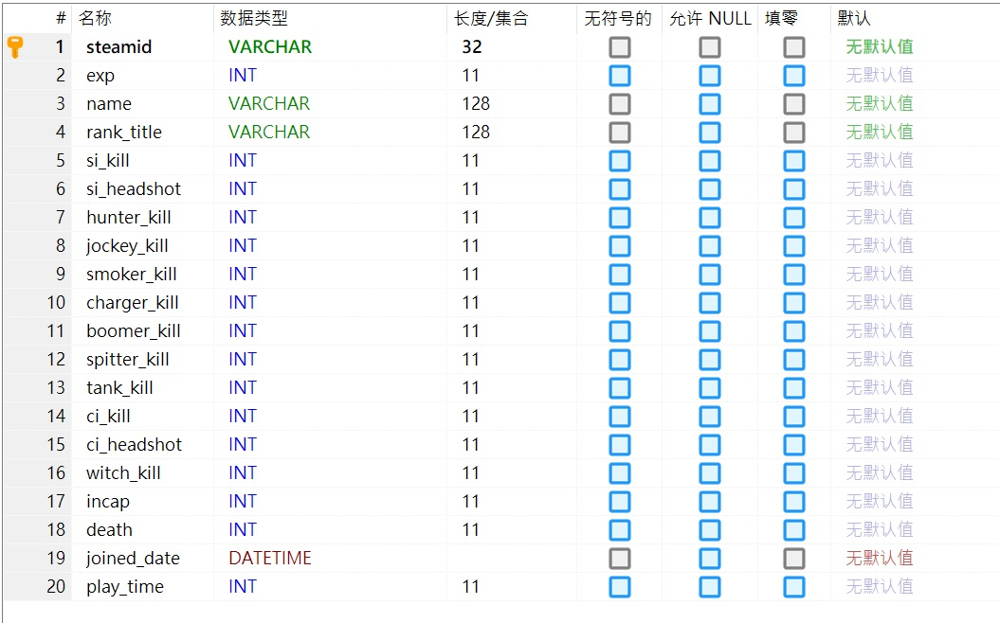

# 中文說明
殺死殭屍與特感獲得經驗值與頭銜名稱，輸入!rank顯示排行榜選單

> __Note__
<br/>此為私人插件，請聯繫[本人](https://github.com/fbef0102/Game-Private_Plugin#私人插件列表-private-plugins-list)
<br/>此插件只有中文沒有英文

* 影片展示
<br/>無

* <details><summary>圖示</summary>

	* 打開 Rank System 選單
	<br/>
	* 玩家聊天時，名子前面給予Rank稱號
	<br/>
	* 自訂Rank階級
	<br/>
	* 支援跨伺服器儲存資料庫
	<br/>
</details>

* 原理
	* 殺死殭屍與特感獲得經驗值，根據玩家的經驗值獲得對應的頭銜名稱
	* 友傷黑槍隊友、滅團、倒地、死亡，扣除經驗值
	* 將頭銜名稱加入到玩家的名字前
	* 輸入!rank隨時查看自己或他人資料
	* 必須會設定資料庫，否則此插件無法運作

* 功能
	* 可設置殺死不同的特感獲得不同的經驗值，查看指令設置
	* 可自訂階級名稱，位於```configs\l4d_ranking_system_V3.cfg```

* 必要安裝
	1. [left4dhooks](https://forums.alliedmods.net/showthread.php?t=321696)
	2. [[INC] Multi Colors](https://github.com/fbef0102/L4D1_2-Plugins/releases/tag/Multi-Colors)
	3. [simple-chatprocessor](https://github.com/fbef0102/L4D1_2-Plugins/tree/master/simple-chatprocessor)
	4. [smlib](https://github.com/fbef0102/L4D1_2-Plugins/releases/tag/smlib-Colors)
	5. 可選 - [readyup](/Plugin_插件/Server_伺服器/readyup)
	6. 可選 - [l4d2_skill_detect](https://github.com/fbef0102/L4D2-Plugins/tree/master/l4d2_skill_detect)

* <details><summary>指令</summary>

	* cfg/sourcemod/l4d_ranking_system.cfg
		```php
		// 0=插件關閉, 1=插件開啟.
		l4d_ranking_system_allow "1"

		// 至少需要X位真人玩家在場才能獲得經驗值.
		l4d_ranking_system_player_require "2"

		// 儲存經驗值、稱號、排行系統的資料庫設定. (支援 MySQL & SQLite)
		l4d_ranking_system_database "rank"

		// 殺死Smoker所獲得的經驗值 (0=關閉)
		l4d_ranking_system_smoker_killed "5"

		// 殺死Boomer所獲得的經驗值 (0=關閉)
		l4d_ranking_system_boomer_illed "3"

		// 殺死Hunter所獲得的經驗值 (0=關閉)
		l4d_ranking_system_hunter_killed "4"

		// 空爆Hunter所獲得的戰力值\n需安裝插件l4d2_skill_detect by Harry
		l4d_ranking_system_hunter_skeeted "8"

		// 殺死Jockey所獲得的經驗值 (0=關閉)
		l4d_ranking_system_jockey_killed "6"

		// 空爆Jockey所獲得的戰力值\n需安裝插件l4d2_skill_detect by Harry
		l4d_ranking_system_jockey_skeeted "12"

		// 殺死Charger所獲得的經驗值 (0=關閉)
		l4d_ranking_system_charger_killed "7"

		// 秒殺衝鋒的Charger所獲得的戰力值\n需安裝插件l4d2_skill_detect by Harry
		l4d_ranking_system_charger_leveled "14"

		// 殺死Spitter所獲得的經驗值 (0=關閉)
		l4d_ranking_system_spitter_killed "3"

		// 殺死Witch所獲得的經驗值 (0=關閉)
		l4d_ranking_system_witch_killed "100"

		// 殺死Tank所獲得的經驗值 (0=關閉)
		l4d_ranking_system_tank_killed "30"

		// 殺死普通感染者所獲得的經驗值 (0=關閉)
		l4d_ranking_system_zombie_killed "1"

		// 當殺死 1=Smoker, 2=Boomer, 4=Hunter, 8=Spitter, 16=Jockey, 32=Charger, 64=Tank, 128=Witch, 256=普通感染者時 提示獲得經驗值. 數字相加起來 (0=關閉提示, 511=全部)
		l4d_ranking_system_zombie_notify_flag "511"

		// 當玩家 1=連線進服後, 2=離開伺服器時, 4=加入倖存者時 提示所有人該玩家的排名. 數字相加起來 (0=關閉提示, 7=全部)
		l4d_ranking_system_join_leave_notify_flag "7"

		// 玩家在聊天室框聊天時，1=玩家名稱會加上稱號，0=玩家名稱不加稱號
		l4d_ranking_system_rank_display_name "1"

		// '經驗排行榜' 顯示多少個排名玩家?
		l4d_ranking_system_top_rank_numbers "200"

		// 團滅損失XX經驗值. (0=關閉)
		l4d_ranking_system_survivor_mission_lost "50"

		// 倖存者倒地損失XX經驗值. (0=關閉)
		l4d_ranking_system_survivor_incap "50"

		// 倖存者死亡損失XX經驗值. (0=關閉)
		l4d_ranking_system_survivor_death "50"

		// 友傷黑死隊友損失XX經驗值. (0=關閉)
		l4d_ranking_system_survivor_ff_kill "200"

		// 倖存者攻擊隊友損失友傷乘上X倍的經驗值. (0=關閉)
		l4d_ranking_system_survivor_ff_multi "2"
		```
</details>

* <details><summary>命令</summary>

	* **打開 Rank System 選單**
		```php
		sm_rank
		sm_rankmenu
		sm_rk
		```
</details>

* <details><summary>API | 串接</summary>

    * ```scripting\include\l4d_ranking_system.inc```
        ```php
        Registers a library name: l4d_ranking_system
        ```
</details>

* <details><summary>文件設定</summary>

	* ```configs\l4d_ranking_system_V3.cfg``` 設置階級頭銜名稱
	* 經驗值最大只到2147483647，超過會發生bug，認真你就輸了 (有誰他馬的會達到這個21億點經驗值)
		```php
		"l4d_ranking_system"
		{
			"Rank"
			{
				"num"		"18" // 自訂有18個階級頭銜
				"1" // 當玩家的經驗值介於 0~999, 得到 "SILVER Ⅰ" 稱號
				{
					"Name"		"SILVER Ⅰ" 
					"Point_Min"	"0"
					"Point_Max"	"1000"
				}
				"2" // 當玩家的經驗值介於 1000~1999, 得到 "SILVER Ⅱ" 稱號
				{
					"Name"		"SILVER Ⅱ"
					"Point_Min"	"1000"
					"Point_Max"	"2000"
				}
				... // 以下類推
			}
		}
		```
</details>

* <details><summary>資料庫設定</summary>

	* 以下方法二選一
		1. MySQL: 支援跨伺服器，儲值經驗值，設定指令 ```l4d_ranking_system_database "rank"```，然後設定文件 *sourcemod\configs\databases.cfg*
			```php
			// 資料庫中自動創建表格，名稱是 "Ranking_System_V3"
			"rank"
			{
				"driver"			"default"
				"host"				"x.x.x.x"
				"database"			"yourdatabase"
				"user"				"youruser"
				"pass"				"yourpass"
				"port"				"yourport"
			}
			```
			
		2. SQLite: 本地資料庫，設定指令 ```l4d_ranking_system_database "rank"```，然後設定文件 *sourcemod\configs\databases.cfg*
			```php
			// 資料庫位於 ```sourcemod\data\sqlite\rank_system.sq3``` (自動創建)
			"rank"
			{
				"driver"			"sqlite"
				"database"			"rank_system"
			}
			```
</details>

* 適用於
	```
	L4D1
	L4D2
	```

* <details><summary>版本日誌</summary>

	* v1.6h (2024-7-18)
		* Add l4d2_skill_detect
		* Update database, add field "hunter_skeet", "jockey_skeet", "charger_level" 

	* v1.5h (2024-2-28)
		* Replace OnClientPutInServer with OnClientPostAdminCheck to fix client can't load data from database

	* v1.4h (2024-1-20)
		* Compatible with [simple-chatcolors](/Plugin_插件/Fun_娛樂/simple-chatcolors) by harry
		* Add API

	* v1.3h (2023-12-10)
		* Detect ff damage if incap teammate
		* 數據庫顯示中文

	* v1.2h (2023-6-16)
		* Delete l4d2_skill_detect

	* v1.1h (2023-6-15)
		* Add smlib and simple-chatprocessor

	* v1.0h (2023-5-12)
		* Initial Release
</details>