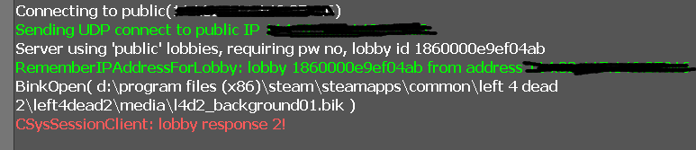

# 問題總攬
> 2025/8/25 更新 by [Harry](https://steamcommunity.com/profiles/76561198026784913)
- [問題總攬](#問題總攬)
    - [為什麼進不去伺服器?](#為什麼進不去伺服器)
    - [為什麼sourcemod下載有分兩種?](#為什麼sourcemod下載有分兩種)
    - [為什麼啟動伺服器後無法開啟遊戲?](#為什麼啟動伺服器後無法開啟遊戲)
    - [Sourcemod支援區域伺服器嗎?](#sourcemod支援區域伺服器嗎)

- - - -
## 為什麼進不去伺服器

* <details><summary>問題1: 控制台出現<b>Invalid host version, expecting 2226, got 2225</b></summary>

    

    * 原因: 遊戲與伺服器的版本不同
    * 解決方式: 確認遊戲與伺服器升級到最新版本
        * 遊戲: [驗證遊戲檔案的完整性](/Tutorial_教學區/Chinese_繁體中文/Game/README.md#驗證遊戲檔案的完整性)
        * 伺服器: [更新專屬伺服器](/Tutorial_教學區/Chinese_繁體中文/Server/安裝伺服器與插件/README.md#如何更新專屬伺服器)
</details>

* <details><summary>問題2: 控制台出現<b>RememberIPAddressForLobby: lobby xxxx from address xxxxx, lobby response</b></summary>

    

    * 原因: 官方的Bug，伺服器已被人占用匹配，但你發現伺服器內根本沒人
    * 解決方式:
        1. [安裝l4dtoolz](/Tutorial_教學區/Chinese_繁體中文/Server/安裝其他檔案教學/README.md#安裝l4dtoolz)
        2. 確保文件```cfg/server.cfg```(沒有文件請自己創立) 有寫上指令，並重啟伺服器
        3. 重啟伺服器，[自己開大廳匹配](/Tutorial_教學區/Chinese_繁體中文/Server/安裝伺服器與插件#如何從大廳匹配到專屬伺服器)
            * 若出現一樣的訊息不行，再請朋友開大廳匹配試試
</details>

* <details><summary>問題3: 畫面出現<b>connection failed after 10 retries</b></summary>

    

    * 原因: 找不到伺服器
    * 解決方式: 確認伺服器存在並且透過公網IP，不要虛擬IP，且必須保證外網能連線進這個公網IP
    * [如何進去我的伺服器](/Tutorial_教學區/Chinese_繁體中文/Server/安裝伺服器與插件/README.md#如何進去我的伺服器)
</details>

* <details><summary>問題4: 畫面出現<b>Server is enforcing consistency for this file</b></summary>

    

    * 原因: 模組衝突或三方圖太多，伺服器的檔案與你的檔案不一致
    * 解決方式:
        * 法一：你自己把模組或三方圖都刪除
        * 法二：
            * 區域房請房主在遊戲控制台打上```sv_consistency 0```
            * 專屬伺服器請到伺服器後台輸入```sv_consistency 0```
            * 如果是你自己創建大廳請打開遊戲控制台輸入```sv_consistency 0```
</details>

* <details><summary>問題5: 控制台已經輸入<b>sv_consistency 0</b>，畫面還是出現<b>Server is enforcing consistency for this file</b></summary>

    

    * 原因: 檔案衝突太多了，多到無法忽視，遊戲救不你了
    * 解決方式: 把模組或三方圖全都刪除，[驗證遊戲檔案的完整性](/Tutorial_教學區/Chinese_繁體中文/Game/README.md#驗證遊戲檔案的完整性)
</details>

* <details><summary>問題6: 阻擋連線，畫面出現<b>steam please remove "-insecure" from the launch options...</b></summary>

    

    * 原因: 啟動選項有輸入```-insecure```
    * 解決方式: 到[啟動選項](/Tutorial_教學區/Chinese_繁體中文/Game/README.md#設定啟動選項)把```-insecure```刪除
</details>

* <details><summary>問題7: 斷線，畫面出現<b>No Steam Logon</b></summary>

    

    * 原因: 玩家連線到伺服器之後，伺服器會傳送玩家給steam的伺服器驗證確認，你是不是正版玩家、盜版玩家、網軍、帳號異常、駭客等等。
        <br/>如果無法驗證或無法識別你的steam帳號，伺服器就會把你踢出去，就連[CSGO職業比賽途中](https://www.youtube.com/watch?v=YfIeQCEGglc)都會出現這問題，大部分都跟網路有關。
        1. 1%是玩家的網路與steam之間出了問題，99%是steam的伺服器出了問題
        2. Steam沒有登入或Steam被登出
        3. 你不是用正版
        4. 你或者伺服器網路改變了
        5. 網路與伺服器不相容 (常見的原因是國外玩家在大陸伺服器被網路長城剔除)
    * 解決方式: 
        1. 離開遊戲，網路重連並確保順暢，重新啟動Steam平台
        2. 安裝[新版的l4dtoolz](/Tutorial_教學區/Chinese_繁體中文/Server/安裝其他檔案教學/README.md#安裝l4dtoolz)，```cfg/server.cfg```寫上```sv_steam_bypass 1```，開啟本功能會削弱伺服器安全性, 且禁止家庭共享功能將失效, 有效降低No Steam logon問題
        3. 再不行就去跟Steam Valve抱怨
</details>

* <details><summary>問題8: 斷線，畫面出現<b>STEAM UserID STEAM_XXXXXXXXX is banned</b></summary>

    

    * 原因: 你被伺服器封鎖了列入黑名單
    * 解決方式: 認命吧，請去跟伺服器管理員溝通
</details>

* <details><summary>問題9: 斷線，畫面出現<b>Map does not match the version on the server</b></summary>

    

    * 原因: 地圖與伺服器的版本不同
    * 解決方式: 確認你所使用的地圖跟伺服器安裝的地圖，版本是一樣的，最好的方式是從同一個網站上下載
</details>

* <details><summary>問題10: 斷線，畫面出現<b>STEAM validation rejected</b></summary>

    

    * 原因一: 你的遊戲與專屬伺服器都在同一台電腦上同時運作，steam平台無法分辨
        * 解決方式: 
        * 法一: 使用不同台電腦安裝專屬伺服器，最好是裝在不同的區域網路
        * 法二: 
            先steam平台上執行Left 4 Dead 2 -> 伺服器的主目錄下刪除```steam_appid.txt```文件 -> 啟動專屬伺服器 -> 與朋友或路人開大廳匹配
        <br/>
        <br/>-> 如果畫面依然出現<b>STEAM validation rejected</b> -> 重開遊戲 -> 直接加入伺服器房間

    * 原因二: steam帳號驗證失敗，steam沒有登入或網路被改變
        * 解決方式: 重啟steam平台登入

    * 原因三: 伺服器裡面已經有你的steam帳戶在裡面，通常發生於你遊戲崩潰或斷線，但伺服器的分身還在裡面（不動了）
        * 解決方式: 
        * 法一: 請管理員把伺服器內的分身踢出去
        * 法二: 重啟伺服器
        * 法三: 分身不動等待被伺服器自動踢出 (伺服器會每隔一段時間偵測玩家是否無回應網路數據，無回應會踢出伺服器)

    * 原因四: 你使用離線模式遊玩單人模式，但伺服器一直要求驗證你的線上steam帳戶
        * 解決方式: 遊戲控制台輸入```sv_lan 1```
</details>

* <details><summary>問題11: 斷線，畫面出現<b>區域伺服器，僅限本地用戶端</b></summary>

    

    * 原因: 伺服器限制只有相同網域的玩家才能進入
    * 解決方式: 
        1. 到伺服器後台檢查指令```sv_lan```是否為0
        2. 關閉伺服器，[執行專屬伺服器](/Tutorial_教學區/Chinese_繁體中文/Server/安裝伺服器與插件/README.md#如何執行專屬伺服器)的時候，網路務必選擇**網際網路**
        3. 檢查cfg文件不能修改```sv_lan```
        4. 如果伺服器有運行參數，請輸入```+sv_lan 0```
</details>

* <details><summary>問題12: 斷線，出現<b>The session is longer available</b>、<b>该会话已不可用</b>、<b>server requires lobby reservation but is unreserved.</b></summary>

    * 不同的顯示版本
    <br/>
    <br/>
    <br/>

    * 原因: 客戶端連線時要求檢查伺服器的動態大廳cookie，但動態大廳cookie已被移除
    * 解決方式: 
        1. [安裝l4dtoolz](/Tutorial_教學區/Chinese_繁體中文/Server/安裝其他檔案教學/README.md#安裝l4dtoolz)
        2. 確保文件```cfg/server.cfg```(沒有文件請自己創立) 有寫上指令，並重啟伺服器
        3. 確保插件l4d_unreservelobby已安裝
</details>

* <details><summary>問題13: 斷線，出現<b>Failed to join session because the session did not have enough open slots</b>、<b>会话没有足够的空位</b></summary>

    

    * 原因: 伺服器滿人(對抗/清道夫: 8人已滿, 戰役/生存/寫實: 4人已滿)，第九位以上的玩家無法加入
    * 解決方式: 
        1. [安裝l4dtoolz](/Tutorial_教學區/Chinese_繁體中文/Server/安裝其他檔案教學/README.md#安裝l4dtoolz)
        2. 確保文件```cfg/server.cfg```(沒有文件請自己創立) 有寫上指令，並重啟伺服器
        3. 確保插件l4d_unreservelobby已安裝
        4. 確定伺服器最大玩家數量上限沒有滿
</details>

* <details><summary>問題14: 進不去遊戲，時常Loading到一半卡住，打開控制台出現<b>Downloading http://........</b></summary>

    

    * 原因: 伺服器有自製的檔案，而你沒有，所以伺服器強迫你下載伺服器準備的自製檔案
    * 解決方式: 
        * 法一: 選項→多人連線→自訂伺服器內容→無
        <br/>
        * 法二: 等待他自己下載完畢
        * 法三: 去換伺服器遊玩吧
</details>

* <details><summary>問題15: 進不去遊戲，時常Loading到一半卡住無回應</summary>

    * 原因一: 模組或三方圖太多
    * 原因二: 遊戲檔案損毀
    * 解決方式: 把模組或三方圖全都刪除，[驗證遊戲檔案的完整性](/Tutorial_教學區/Chinese_繁體中文/Game/README.md#驗證遊戲檔案的完整性)
</details>

* <details><summary>問題16: 模組或三方圖裝太多，進不去遊戲，我不想要刪除模組或三方圖，請問該怎麼做？</summary>

    既然你不願意刪除模組或三方圖，那沒人可以幫你，可以自己去玩單機模式
</details>

- - - -
## 為什麼sourcemod下載有分兩種

* <details><summary>說明 (點我展開)</summary>

    [Sourcemod](https://www.sourcemod.net/downloads.php)與[Metamod](https://www.sourcemm.net/)官網上有Stable Builds和Dev Builds
    <br/>
    <br/>
    * Stable Builds 是穩定版本
        * 🟦建議安裝此版本
        * 是經過Sourcemod團隊測試之後無任何重大的bug才提供下載
        * 伺服器穩定且不易崩潰，穩定度高
        * 大部分的插件作者編寫源碼都是透過Stable Builds版本編譯
        * 建議運行最新的穩定版本，每六個月更新一次最新版本
        * 當有最新版本時，你不需要著急去更新

    * Dev Builds 是開發版本
        * 🟥不建議安裝此版本
        * 版本還在測試階段，Sourcemod團隊目前正在改良開發的新版本
        * 也許會有新功能可以用，但這是寫源碼的開發者才需要考慮的
        * 伺服器不穩定且容易出問題，想要把伺服器當白老鼠測試可以安裝
</details>

- - - -
## 為什麼啟動伺服器後無法開啟遊戲

* <details><summary>說明 (點我展開)</summary>

    我明明啟動的是Left 4 Dead 2 Dedicated Server，為什麼steam會顯示我是遊玩Left 4 Dead 2，而且還不能打開遊戲
    <br/>

    * 原因: steam平台 與 Left 4 Dead 的問題，從遊戲發售至今沒有解決過，再問就是Valve吃大便
    * 解決方式: 
    * 法一: 使用不同台電腦安裝專屬伺服器
    * 法二: 專屬伺服器的主目錄刪除```steam_appid.txt```文件 -> 再啟動專屬伺服器
    <br/>
</details>

- - - -
## Sourcemod支援區域伺服器嗎
> 區域伺服器也稱區域房，英文名是Listen Server
* **不支援**，盡管[Sourcemod官方](https://wiki.alliedmods.net/Installing_SourceMod_(simple))一再強調SourceMod不能運作在區域伺服器上，依然有許多人把Sourcemod安裝到區域房並開房與朋友遊玩
* 推薦大家把[Sourcemod安裝在專屬伺服器](/Tutorial_教學區/Chinese_繁體中文/Server/安裝伺服器與插件/README.md)，所有插件都支援專屬伺服器且較穩定，[與專屬伺服器有巨大差別](/Tutorial_教學區/Chinese_繁體中文/Server/安裝區域房與插件/README.md#與專屬伺服器有何差別)

* <details><summary>為什麼不支援?</summary>

    * 因為區域房你既是玩家也是伺服器，會導致很多插件在運行上有問題，特別是跟語音有關的插件無法在區域房運作
    * Liunx系統無法安裝Sourcemod在區域房
</details>

* <details><summary>我安裝放入很多插件會怎麼樣?</summary>

    * 區域房資源有限，裝多了插件會變得比較卡，畢竟遊戲只是讓你開房跟大家遊玩而非變成伺服器
    * 有些插件不支援區域房，即使硬裝也不會運作還反而拖累伺服器變得卡頓
    * 大部分插件作者不會理你也不會幫助你區域房安裝插件出現問題，除非安裝專屬伺服器
</details>

* <details><summary>為什麼有些人依然會安裝區域房?</summary>

    * 原因一：淺顯易懂的操作
        * 開區域房不需要太多專業知識與操作，也不需要設定網路等等
    * 原因二：單純跟朋友遊玩
        * 插件不需要太多，畢竟Sourcemod有簡單的換圖、踢人、處死功能，應付各種突發狀況足夠了
    * 原因三：自己測試插件
        * 有些插件作者專門開區域房測試自己寫的插件
    * 原因四：測試並研究遊戲
        * 有些玩家會自己開房測試遊戲各種玩法，借助Sourcemod能節省時間與精力
        1. 譬如生成Tank觀察他的攻擊方式，然後學會反擊
        2. 研究地圖路線並嘗試速通
        3. 學會當Hunter自我練習高撲
        4. 開發者製作nav或者製作地圖
</details>