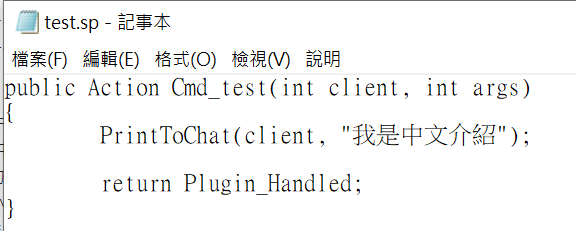

# 插件問題總攬
> 2025/8/25 更新
- [總攬](#問題總攬)
    - [前言準備](#前言準備)
    - [為什麼插件沒有運作](#為什麼插件沒有運作)
    - [常見的插件錯誤訊息](#常見的插件錯誤訊息)
    - [常見的編譯錯誤訊息](#常見的編譯錯誤訊息)
    - [我能否修改源碼](#我能否修改源碼)
    - [哪裡能詢問插件問題](#哪裡能詢問插件問題)
    - [插件可以有中文嗎](#插件可以有中文嗎)
    - [為什麼會有亂碼](#為什麼會有亂碼)
    - [插件不拿源碼會怎樣](#插件不拿源碼會怎樣)
    - [模組跟插件差別在哪?](#模組跟插件差別在哪)

- - - -
## 前言準備
> 以下教學，可以先看，等回會用到
* [如何檢查版本](/Tutorial_教學區/Chinese_繁體中文/Server/安裝伺服器與插件/README.md#如何檢查版本)
* [如何編譯源碼](/Tutorial_教學區/Chinese_繁體中文/Server/安裝伺服器與插件/README.md#如何編譯源碼)
* [如何安裝插件](/Tutorial_教學區/Chinese_繁體中文/Server/安裝伺服器與插件/README.md#如何安裝插件)
* [如何檢查插件成功運作](/Tutorial_教學區/Chinese_繁體中文/Server/安裝伺服器與插件/README.md#如何檢查插件成功運作)

- - - -
## 為什麼插件沒有運作
> 在你向插件作者抱怨 **"插件沒有作用"** 之前，可以先來做些自我檢查
* <details><summary>檢查流程 (點我展開)</summary>

  1. 只要依照插件說明書，都會成功運作，請先確認
    <br/>✔ 有安裝插件的最新版本
    <br/>✔ 有安裝說明書指示的必要檔案
    <br/>✔ 有依照說明書指示的重要步驟
    <br/>✔ 有安裝插件輔助的文件
    <br/>✔ Sourcemod版本符合插件的要求

  2. 到伺服器後台上，輸入```sm plugins info xxxxxx```
      - xxxxxx為插件的檔案名稱
      - 插件檔案位於```addons/sourcemod/plugins```，副檔名是.smx
        ```php
        ] sm plugins info test
        Filename: test.smx
        Title: [L4D & L4D2] Test
        Author: HarryPotter
        Version: 1.0
        Error: Error detected in plugin startup (see error logs)
        ```
    - 檢查Author是否跟原作者一樣，**否則插件肯定不是他寫的**
    - 檢查Version是否跟作者貼文上所寫的版本一樣
    - 檢查是否有Error

  3. 看見Error代表此插件無法成功載入，請到```sourcemod/logs```資料夾查看errors_開頭的文件，閱讀錯誤原因並嘗試解決
    <br/>
    - 若看不懂錯誤原因請洽作者，將錯誤原文發給開發者，無須一堆廢話
    - 🟥要是你有修改源碼請誠實招來，當原作者發現錯誤的行數不相符會放生不想鳥你
        <details><summary>錯誤原文範例 (點我展開)</summary>

          ```php
          L 03/28/2022 - 02:24:27: [SM] Exception reported: XXXXXXXXXXXXXXXXXXXX
          L 03/28/2022 - 02:24:27: [SM] Blaming: xxxxxxxxxx.smx
          L 03/28/2022 - 02:24:27: [SM] Call stack trace:
          L 03/28/2022 - 02:24:27: [SM]   [0] ThrowNativeError
          L 03/28/2022 - 02:24:27: [SM]   [1] Line 5394, C:\Servers\L4D2\left4dead2\addons\sourcemod\scripting\xxxxxxxxxx.sp::ValidateAddress
          L 03/28/2022 - 02:24:27: [SM]   [2] Line 6131, C:\Servers\L4D2\left4dead2\addons\sourcemod\scripting\xxxxxxxxxx.sp::Native_CDirector_IsAnySurvivorInStartArea
          L 03/28/2022 - 02:24:27: [SM]   [4] L4D_IsAnySurvivorInStartArea
          L 03/28/2022 - 02:24:27: [SM]   [5] Line 172, f:\Stuff\EVERYTHING ELSE\Left 4 Dead 2 Dedicated Servers\left4dead2\addons\sourcemod\scripting\xxxxxxxxxx.sp::OnPluginStart
          ```
        </details>

  4. 重新安裝插件之後，重啟伺服器，檢查插件是否成功運作，直到沒有error為止才能安心 
</details>

* <details><summary>問題1: 查看插件卻顯示: <b>XXX.smx is not loaded.</b></summary>

  <br/>

  * 原因: 你沒有把.smx檔案放入正確的路徑
  * 解決方式: 請確認.smx檔案位於 ```addons/sourcemod/plugins``` 資料夾底下
</details>

- - - -
## 常見的插件錯誤訊息
> * 嘗試解決錯誤，重啟伺服器，直到沒有error為止
> * 如果錯誤還是存在或看不懂錯誤訊息，直接洽談作者，將錯誤原文發給開發者

* <details><summary>錯誤1: <b>Native XXXXX was not found</b></summary>

  ```php
  [SM] Unable to load plugin "left4dhooks.smx": Native "DHookParam.GetAddress" was not found
  ```

  * 原因: 沒有安裝必要檔案
  * 解決方式: 嘗試重新安裝說明書指示的必要檔案
</details>

* <details><summary>錯誤2: <b>File could not be opened: 系統找不到指定的檔案。</b></summary>

  ```php
  [SM] Error parsing gameconfig file "D:\Left 4 Dead 2 Test Server\left4dead2\addons\sourcemod\gamedata\all4dead2.txt":
  [SM] Error 1 on line 0, col 0: Stream failed to open
  [SM] Exception reported: Unable to open all4dead2: File could not be opened: 系統找不到指定的檔案。
  ```

  * 原因: 沒有放好所有文件
  * 解決方式: 插件需要的翻譯檔案或者輔助文件，必須要放到適當的資料夾上 (路徑與名稱必須正確無誤)
    - 翻譯文件.txt 放入addons/sourcemod/translations
      <details>
      <summary>判斷是否為翻譯文件 (點我展開)</summary>
      此處為範例
      
      ```
      "Phrases"
      {
        "You're spectating. Join any team to play."
        {
          "en"	"You're spectating. Join any team to play."
          "zho"	"輸入 !join 加入遊戲..."
          "chi"	"输入 !join 加入游戏..."
        }	
        "[AFK] Inactivity detected! 1"
        {
          "#format"		"{1:d}"
          "en"	"[AFK] Inactivity detected! You'll be moved to spectators in {1} seconds!"
          "zho"	"[AFK] 偵測閒置! 你將於 {1} 秒後強制旁觀."
          "chi"	"[AFK] 探测闲置! 你将于 {1} 秒后强制旁观."
        }	

        ...
      }
      ```
      </details>
      
    - Gamedata文件.txt 放入addons/sourcemod/gamedata
      <details>
      <summary>判斷是否為Gamedata文件 (點我展開)</summary>
      此處為範例
      
      ```
      "Games"
      {
        "left4dead2" //credit: ProdigySim, Shadowysn
        {
          "Addresses"
          {
            "NextBotCreatePlayerBot.jumptable"
            {
              "windows"
              {
                "signature"	"CTerrorPlayer::ReplaceWithBot.jumptable"
                "offset"	"7"
              }
            }
          }
          "Signatures"
          {
            "TakeOverBot"
            {
              "library"	"server"
              "linux"		"@_ZN13CTerrorPlayer11TakeOverBotEb"
              "windows"	"\x55\x8B\xEC\x81\xEC\x2A\x2A\x2A\x2A\xA1\x2A\x2A\x2A\x2A\x33\xC5\x89\x45\xFC\x53\x56\x8D\x85"
              /* 55 8B EC 81 EC ? ? ? ? A1 ? ? ? ? 33 C5 89 45 FC 53 56 8D 85 */
            }
          }
        }

        ...
      }
      ```
      </details>
      
    - 其他文件依照說明書指示放入
</details>

* <details><summary>錯誤3: <b>File Not Found</b></summary>

  ```php
  Exception reported: File Not Found: addons\sourcemod\data\l4d_elevator_info.cfg
  ```

  * 與錯誤2同理
</details>

* <details><summary>錯誤4: <b>unsupported feature set; code is too new</b></summary>

  ```php
  [l4d2_supply_woodbox.smx] Unable to load plugin (unsupported feature set; code is too new)
  ```

  * 原因: 你的Sourcemod版本太舊了啦
  * 解決方式: 直接從[Sourcemod官網](https://www.sourcemod.net/downloads.php?branch=stable)更新重裝
</details>

* <details><summary>錯誤5: <b>Unable to load plugin (bad header).</b></summary>

  ```php
  [SM] Failed to load plugin "l4dinfectedbots.smx": Unable to load plugin (bad header).
  ```

  * 原因: 你的Sourcemod版本與插件版本不符
  * 解決方式: 
    * 法一: 從[Sourcemod官網](https://www.sourcemod.net/downloads.php?branch=stable)更新重裝
    * 法二: 自己拿源碼編譯
</details>

* <details><summary>錯誤6: <b>Failed to find signature</b></summary>

  ```php
  [left4dhooks.smx] Failed to find signature: "IsVisibleToPlayer"
  ```

  * 原因: signature 無效或過期
  * 解決方式: 直接回報作者，告訴你的系統是windows還是linux
</details>

* <details><summary>錯誤7: <b>String formatted incorrectly</b></summary>

  ```php
  [SM] Exception reported: String formatted incorrectly - parameter 6 (total 5)
  ```

  * 原因: 源碼內部的參數出錯
  * 解決方式: 直接回報作者
</details>

* <details><summary>錯誤8: <b>Plugin only supports XXXX..</b></summary>

  ```php
  [SM] Failed to load plugin "test.smx": Plugin only supports CSGO..
  ```

  * 原因: 插件不支援你的遊戲
  * 解決方式: 
    * 法一: 刪除插件，從此不用
    * 法二: 洽談作者，希望能支援你玩的遊戲
</details>

* <details><summary>錯誤9: <b>incompatible with this game.</b></summary>

  ```php
  [SM] Failed to load plugin "nextmap.smx": Nextmap is incompatible with this game.
  ```

  * 原因: 插件不支援你的遊戲
  * 解決方式: 刪除插件，從此不用
</details>

* <details><summary>錯誤10: <b>Invalid Entity index</b></summary>

  ```php
  Exception reported: Invalid Entity index -1 (-1)
  ```

  * 原因: 源碼內部的實體檢查有問題
  * 解決方式: 直接回報作者
</details>

* <details><summary>錯誤11: <b>is not in game</b></summary>

  ```php
  Exception reported:  Client 11 is not in game
  ```

  * 原因: 源碼內部的客戶端檢查有問題
  * 解決方式: 直接回報作者
</details>

* <details><summary>錯誤12: <b>Handle XXXXXX is invalid</b></summary>

  ```php
  Exception reported: Handle 9330066f is invalid
  ```

  * 原因: 源碼內部的物件有問題
  * 解決方式: 直接回報作者
</details>

* <details><summary>錯誤13: <b>Language phrase XXXXX not found</b></summary>

  ```php
  Exception reported: Language phrase "BAW_3" not found (arg 6)
  ```

  * 原因: 找不到翻譯文件裡面對應的翻譯句子
  * 解決方式: 確認你有安裝插件需要的翻譯文件，如果有了但是報錯請回報給作者
</details>

- - - -
## 常見的編譯錯誤訊息
> * [請依照正確的流程進行編譯](/Tutorial_教學區/Chinese_繁體中文/Server/安裝伺服器與插件/README.md#如何編譯源碼)，不要再透過網路上的編譯
> * 如果錯誤還是存在或看不懂錯誤訊息，直接洽談作者，將錯誤原文發給開發者
> * 如果源碼有被你修改導致編譯有錯誤，原作者不會鳥你，只能自己研究或請教論壇上的大佬們

> __Note__ 
> <br/>錯誤訊息只要是warning開頭的，都可以忽略。如果還是很在意，直接回報給作者修改。

* <details><summary>警告1: <b>symbol is assigned a value that is never used</b></summary>

  ```php
  test.sp(34) : warning 204: symbol is assigned a value that is never used: "ZC_TANK"
  ```

  * 原因: 變數沒有使用
  * 解決方式: 可忽略
</details>

* <details><summary>警告2: <b>should return an explicit value</b></summary>

  ```php
  test.sp(55) : warning 242: function "Cmd_test" should return an explicit value
  ```

  * 原因: 涵式沒有回傳數值
  * 解決方式: 可忽略
</details>

* <details><summary>警告3: <b>inconsistent indentation</b></summary>

  ```php
  test.sp(42) : warning 217: inconsistent indentation (did you mix tabs and spaces?)
  ```

  * 原因: 程式排版沒有對齊
  * 解決方式: 可忽略
</details>

* <details><summary>警告4: <b>tag mismatch</b></summary>

  ```php
  test.sp(58) : warning 213: tag mismatch (expected "float", got "int")
  ```

  * 原因: 變數值對不上
  * 解決方式: 可忽略，但建議回報給作者
</details>

* <details><summary>錯誤1: <b>cannot read from file</b></summary>

  ```php
  test.sp(9) : error 417: cannot read from file: "multicolors"
  ```

  * 原因: 沒有安裝必要的.inc檔案
  * 解決方式: 嘗試重新安裝說明書指示的必要檔案
</details>

* <details><summary>錯誤2: <b>new-style declarations are required</b></summary>

  ```php
  test.sp(55) : error 147: new-style declarations are required
  ```

  * 原因: 程式並不是新語法，Sourcemod自從1.7版本之後語法大改，在那以前的舊語法如果重新編譯可能會有問題，通常你只要不是拿到十年前的源始碼，不會有這種錯誤
  * 解決方式: 回報給作者
</details>

* <details><summary>錯誤3: <b>expected token: ";"</b></summary>

  ```php
  test.sp(42) : error 001: expected token: ";", but found "return"
  ```

  * 原因: 程式行尾端沒有;符號
  * 解決方式: 回報給作者
</details>

* <details><summary>錯誤4: <b>undefined symbol XXXXXXX</b></summary>

  ```php
  test.sp(57) : error 017: undefined symbol "CPrintToChat"
  ```

  * 原因: 不存在此涵式或變數
  * 解決方式: 回報給作者
</details>

- - - -
## 我能否修改源碼
* <details><summary>說明 (點我展開)</summary>

  * Sourcemod不限制任何人修改，歡迎任何人編輯並發布自己的作品，讓遊戲玩法更豐富多元
  * 拿到網路上或別人的源碼，如果你有想法或者單純漢化或者修正錯誤可以自己修改
  * 請記得標記原開發者，擅自修改作者名稱讓人誤會是完全缺德的行為
  * 一但你修改源碼之後，如果插件有錯誤想要回報，**大部分的原插件作者完全不會鳥你**
  * 遇到技術或程式上的問題，可以請教論壇上的大佬們，我通常建議把你修改後的源碼發給對方過目
</details>

- - - -
## 哪裡能詢問插件問題
* <details><summary>說明 (點我展開)</summary>

  * 英文圈: [AlliedModders](https://forums.alliedmods.net/index.php)，建議註冊一個用戶
    * 英文網站，只能全英文交流，只會中文建議找會說中文的大佬尋求幫助
    * 我們要詢問的是Sourcemod，而非AMX Mod X，小心別PO錯版
      * [插件需求與想法](https://forums.alliedmods.net/forumdisplay.php?f=60): 貼出你的新點子或需求，
      * [插件綜合討論](https://forums.alliedmods.net/forumdisplay.php?f=58): 一般討論伺服器或插件現況，
      * [插件源碼問題](https://forums.alliedmods.net/forumdisplay.php?f=107): 有源碼程式上的問題需要幫助
    * 插件有問題請直接找到原作者對應的貼文底下留言，不要找不相關的人事物
    * 如果比較害羞或是想找某一位大佬幫忙，到個人檔案私訊對方
      <br/>

  * 中文圈: QQ群、貼吧、巴哈姆特電玩資訊站、B站
    * 我建議到B站搜尋，很多作者親自發佈影片展示自己寫的插件
</details>

* <details><summary><b>潛規則</b></summary>
    
  如果提出願意付費，能吸引很多大佬前來幫忙
</details>

- - - -
## 插件可以有中文嗎
* <details><summary>說明 (點我展開)</summary>

  * Sourcemod是以英文為主，一切編碼讀取與執行命令都是英文，不能改成中文是很正常的
    * 插件名稱不能改成中文
    * 指令說明與數值不能改成中文
    * 插件讀取的.cfg指令文件不能寫中文也不能有中文註釋說明
    * 別提韓文、日文、德文，只能英文
    * 🟥 伺服器讀取太多中文文字導致伺服器崩潰，所以想吃鱉可以試試看。
  * 只要是輸出文字給玩家看訊息，基本上可以寫中文，有中文需求請詢問插件作者
    * 譬如翻譯文件、作者利用第三方輔助文件等等，可以改成多國語言
</details>

- - - -
## 為什麼會有亂碼
* <details><summary>提問1: 文件內是亂碼</summary>

  

  * 原因: 編碼不對
  * 解決方式: 文件的編碼請確認為UTF-8，可以用筆記本另存新檔的時候設定
  <br/>
</details>

* <details><summary>提問2: 文件顯示正常，但遊戲不行</summary>

  文件內的中文顯示正常，明明編譯也過，都依照說明書安裝，插件也沒有報錯，為什麼遊戲中會出現亂碼？
  <br/>
  <br/>

  * 原因: 編碼不對
  * 解決方式: 文件的編碼請確認為UTF-8，可以用筆記本另存新檔的時候設定
  <br/>
</details>

* <details><summary>提問3: 看不到簡體中文</summary>

  顯示簡體中文的時候會是亂碼
  * 原因: 你的電腦系統不支援簡體中文，無法顯示簡體字
  * 解決方式: 電腦系統添加語言，選擇簡體中文
</details>

- - - -
## 插件不拿源碼會怎樣
* 源碼是.sp檔案，插件是.smx檔案，如果是我，都一定會拿源碼然後自己編譯成插件，所以我擁有的每個插件都有源碼
  * 因為每個人安裝的Sourcemod平台版本不同，自己拿到電腦上編譯最安全也符合你所安裝的Sourcemod版本
  * 只要源碼編譯時失敗代表此插件肯定無法使用，如果懂源碼的人會自己修改，不懂源碼的人最好請人修改

* <details><summary>直接拿插件安裝不拿源碼會怎麼樣?</summary>

  答案: 淺在風險與問題很多
   <details><summary>狀況一: 無法成功運作，最新版本不支援</summary>

    * 十年前寫好的插件也許十年前能使用，但是放到現在版本可能已經無法適用或者被淘汰
    * 這時候怎麼辦? 當然是去看源碼並修改，所以保留源碼是很重要的
  </details>

  <details><summary>狀況二: 伺服器卡頓，功能不完整</summary>

    * 十年前Sourcemod程式語法還不完善，很多作者當時用粗暴並且暴力的方式達成很多功能
    * sm從1.7之後語法大改，sm1.11之後新增Dhooks、Voicehook、GeoIPCity各種功能並優化，大幅改善伺服器崩潰與卡頓的機率
    * 如果有保存源碼，會請人大幅改善源碼
  </details>

  <details><summary>狀況三: 插件有問題或需求</summary>

    * 當你突然發現插件有問題、或者想新增功能，你要請教別人，卻沒有源碼，這時候別人會叫你去吃屎
    * 沒源碼的人請別人重新寫插件，費時又費力還可能收很貴的報酬費(像我就是)，有源碼的人就好辦事
    * 網路上當然有反編譯出源碼的或者叫AI寫程式，但是反編譯的源碼比原本的源碼難看又難寫一百倍，只要別人看到反編譯的源碼也是叫你去吃屎
    * 退一萬步來說，只有看到源碼才知道插件是否有任何問題要改善
  </details>

  <details><summary>狀況四: 自由漢化，更改指令彈性高</summary>

    * 當你想要看很多英文訊息，想要漢化或修改，其實許多作者也懶得幫忙寫中文翻譯或者不可能就為了你一個人幫忙改訊息
    * 但是有源碼就方便多，自己想改捨就改捨，不要刻意亂改源碼都沒問題
  </details>

  <details><summary>狀況五: 插件內容偷塞政治或者炸服程式</summary>

    * 沒有源碼你也不知道作者塞了甚麼炸服程式碼，被陷害莫名被Ban也找不出原因，傻傻的
    * 只要不公開源碼，作者想塞任何東西在程式碼都是可以
  </details>

  <details><summary>狀況六: 拿到插件，卻不知道作者</summary>

    * 假如插件有bug想回報，這時候你發現不知道要找誰，那個提供插件的人可能不是作者只是給你懶人包罷了
    * 插件有問題理應先回報給作者知道，只有作者最能知道怎麼修復並快速解決，找不到作者或者作者退休不再維護才需要找其他大佬
  </details>
</details>

* <details><summary>作者提供插件不提供源碼怎麼辦?</summary>

  * 根據Sourcemod的License授權公約，有人提供.smx就必須要提供.sp檔案。以上都是官腔屁話，我相信沒人關切License授權公約是捨
  <br/>
  * 想盡辦法要拿到源碼避免後續問題，如果願意付錢那很好，
  * 但是作者百般不願意提供源碼那就不要使用了，寧願拿到有源碼的插件也不要被坑
</details>

* <details><summary>結論</summary>

  1. 不要拿來路不明的插件
  2. 不要拿沒有源碼的插件
  3. 拿到源碼要知道作者是誰
  4. 如插件有問題，請攜帶源碼請教大佬
</details>

- - - -
## 模組跟插件差別在哪
| 比較           | 模組           		| 插件            |
| ----------    |:-----------------:|:-------------:|
| 英文        	| mod    	| 	plugin |
| 副檔名        | .vpk      					|   .smx         |
| 來源          | Steam工作仿訂閱武器皮膚或是網站上下載三方圖都算是mod      					|   網站上找別人寫好的         |
| 程式架構      | 某些模組會使用VScript腳本達成功能     | Sourcepawn程式語言達成功能 |
| 使用方式      | 訂閱或放到addons資料夾安裝即可生效     |  還要裝sourcemod才會生效 |
| 差別          | 影響客戶端的遊戲文件   	   |   影響伺服器端的遊戲文件  |
| 擅長領域       | 改動模型、角色、武器、皮膚、地圖  	   |   改動9+多人戰役到10VS10對抗大亂鬥都行  |
| 對象          | 幾乎只會對有裝模組的玩家生效，沒有裝模組的玩家不會生效不受影響    	|   只要裝上去就會影響伺服器在內的全體玩家，即使玩家自己的電腦上沒有安裝插件也會生效  |
| 區域房 (Local Server)       | 99%模組只能在自己開區域房時生效    						|   少部分插件不支援區域房使用  |
| 專屬伺服器 (Dedicated Server)   | 少部分模組有支援專屬伺服器    			|   所有插件均支援專屬伺服器  |
| 兼容              | 90%的模組容易互相打架衝突，幾乎不兼容，很常出現我使用了A模組就不能使用B模組的情況  |   大部分的插件互相兼容，只要作者願意，互相補助強化功能效果都是可行的  |
| 崩潰             | 模組產生的崩潰很難找出來，甚至沒有崩潰日誌可以看，尋找錯誤全靠猜測  |   🟦 插件有錯誤會有錯誤日誌，有崩潰日誌可以看，尋找問題很好解決  |

* <details><summary>總結與個人建議</summary>

    1. 🟥 伺服器只安裝插件不安裝模組，插件取代模組，能少裝模組就不要裝!!
    2. 🟦 伺服器只安裝插件與地圖，玩家只安裝角色、武器、皮膚模組與地圖，這是我十年來的開服方式
</details>

* <details><summary>問題1: 我放地圖到伺服器裡面，玩家會自動下載嗎？</summary>

    * 不會，請玩家必須自行下載地圖
</details>

* <details><summary>問題2: 我放角色模型的模組到伺服器裡面，玩家會看到一樣的模型嗎？</summary>

    * 不會，想讓每個玩家都有相同的角色模型，玩家必須自行下載相同的模組
</details>

* <details><summary>問題3: 我發現很多好玩的模組，可不可以放到伺服器上？</summary>

    * 我他馬一律都不建議放，出問題自己找模組作者
</details>

* <details><summary>問題4: 模組也會導致伺服器崩潰嗎?</summary>

    * 如果模組作者寫得不好，高機率會，我感覺比插件出事的機率還高
    * 有些奇葩的三方圖與模組自帶腳本干擾伺服器運作，地圖也會導致崩潰不用懷疑
    * 就像爛插件導致崩潰，也會有爛模組與爛的三方圖導致崩潰
    * 當伺服器有崩潰或異常bug，我一律建議刪除所有mod與地圖
</details>


