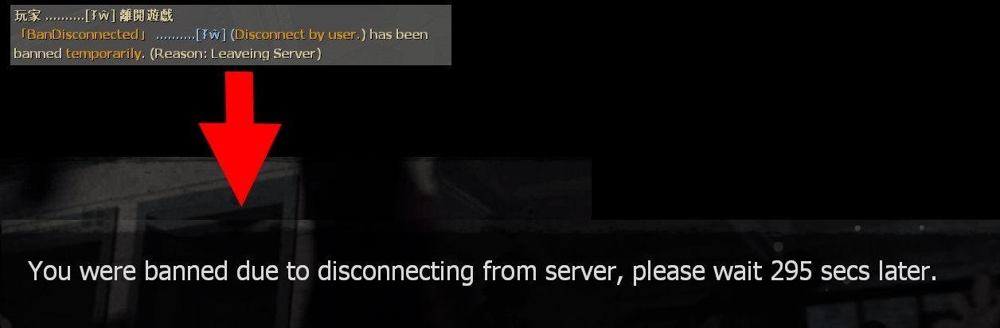

# Description | 內容
Auto ban players who have disconnected from the server for short time + Tracks recently-disconnected players and lets you ban them

> __Note__ <br/>
This plugin is private, Please contact [me](/#私人插件列表-private-plugins-list)<br/>
此為私人插件, 請聯繫[本人](/#私人插件列表-private-plugins-list)

* Image | 圖示
	<br/>
	<br/>

* Apply to | 適用於
	```
	Any Source Game
	```

* <details><summary>How does it work?</summary>

	* Auto ban players who have disconnected from the server
		* Ban for short time, wait for 5 mins later to rejoin server again
	* The player will not get auto ban if disconnect reason is
		* Crash
		* Kick
		* Timed out
		* VAC Status Checker
		* This Steam accout does not own this game
		* Your client has failed to reply to a query in time
		* No Steam logon
		* No Response
	* The player will not get auto ban
		* During Map change
		* While connecting to server (Not load in server yet)
	* Say ```!admin->Player Commands->Ban Disconnected Player```, Tracks all players who has left server. 
	* Support Sourceban++
</details>

* Require | 必要安裝
	1. [[INC] Multi Colors](https://github.com/fbef0102/L4D1_2-Plugins/releases/tag/Multi-Colors)

* <details><summary>ConVar | 指令</summary>

	* cfg/sourcemod/bandisconnected.cfg
		```php
		// List size of ban disconnected players menu
		bandisconnected_max "100"

		// If 1, Enable Auto Ban when player disconnects.
		bandisconnected_enable_auto_ban "1"

		// Ban player who disconnects within x seconds after joining server. (0=Always Ban when player disconnects)
		bandisconnected_ban_within_join_seconds "60"

		// If 1, disable Auto Ban when player crashed.
		bandisconnected_crash_ban_disable "1"

		// Ban How many mins for disconnected player. (Mins, 0=Permanent Ban)
		bandisconnected_ban_mins "5"

		// Players with these flags have immune to not be banned automatically. (Empty = Everyone, -1: Nobody)
		bandisconnected_immue_flag "z"

		// If 1, notify someone disconnected and get banned.
		bandisconnected_notify_ban "1"
		```
</details>

* <details><summary>Command | 命令</summary>

	* **Ban a player after they have disconnected! (Access Required: ADMFLAG_BAN)**
		```php
		sm_bandisconnected <steamid> <minutes|0> [reason] <ip> <name>
		sm_bandc <steamid> <minutes|0> [reason] <ip> <name>
		```

	* **List all disconnected players! (Access Required: ADMFLAG_BAN)**
		```php
		sm_listdisconnected
		```
</details>

* <details><summary>Changelog | 版本日誌</summary>

	* v1.2 (2024-12-17)
		* Update cvars
		* Only record sourceban++ if ban is permanent

	* v1.1 (2023-6-14)
		* Fix players got banned when map change

	* v1.0 (2023-5-31)
		* Remake code, convert code to latest syntax
		* Fix warnings when compiling on SourceMod 1.11.
		* Optimize code and improve performance
		* Add autoban if players disconnected from the server with 60 seconds after joined the server
		
	* 1.03
		* [Original Plugin by mad_hamster](https://forums.alliedmods.net/showthread.php?t=135533)
</details>

- - - -
# 中文說明
自動封鎖退出伺服器的玩家，短時間內不能加入 + 查看所有退出伺服器的玩家列表

* 原理
	* 玩家進來伺服器60秒內退出，將會被自動封鎖，不能短時間內再進來伺服器
	* 以下離線原因不會被自動封鎖，
		* Crash => 崩潰
		* Kick => 被踢
		* Timed out => 網路斷線
		* VAC Status Checker => 被VAC
		* This Steam accout does not own this game => 此帳號未擁有遊戲
		* Your client has failed to reply to a query in time  => 沒有回應伺服器的網路數據 (可能是網路斷線)
		* No Steam logon => 沒有偵測到 Steam 正版帳號 (可能是網路斷線)
		* No Response => 玩家無回應 (可能是網路斷線)
	* 以下情況不會被自動封鎖，
		* 正在換圖過程中
		* 正在連線Loading當中離開伺服器時 (還未完全進入伺服器)
	* 玩家離開伺服器之後，伺服器會記錄該位玩家的離開原因、steamid、名子
	* 管理員輸入```!admin->玩家指令->Ban Disconnected Player``` 查看所有離開伺服器的玩家
	* 支援Sourceban++

* 用意在哪?
	* 封鎖進來後秒退的玩家
	* 有的低能玩家頻繁進來又退出又進來

* <details><summary>指令中文介紹 (點我展開)</summary>

	* cfg/sourcemod/bandisconnected.cfg
		```php
		// 在"Ban Disconnected Player"介面上顯示的玩家數量 （所有離開伺服器的玩家列表）
		bandisconnected_max "100"

		// 為1時，自動封鎖退出伺服器的玩家
		bandisconnected_enable_auto_ban "1"

		// 進來伺服器後X秒內又退出的玩家才會被自動封鎖 (0=只要玩家離線就是封鎖)
		bandisconnected_ban_within_join_seconds "60"

		// 為1時，如果玩家崩潰退出則不會被自動封鎖
		bandisconnected_crash_ban_disable "1"

		// 設置封鎖的時間 (單位: 分鐘, 0=永久)
		bandisconnected_ban_mins "5"

		// 擁有這些權限的玩家，不會被自動封鎖 (留白 = 任何人都不會被自動封鎖, -1: 任何人都會被自動封鎖)
		bandisconnected_immue_flag "z"

		// 為1時，提示所有玩家有人被此插件自動封鎖
		bandisconnected_notify_ban "1"
		```
</details>

* <details><summary>命令中文介紹 (點我展開)</summary>

	* **封鎖一個已經退出伺服器的玩家 (權限: ADMFLAG_BAN)**
		```php
		sm_bandisconnected <steamid> <minutes|0> [reason] <ip> <name>
		sm_bandc <steamid> <minutes|0> [reason] <ip> <name>
		```

	* **列出所有離開伺服器的玩家 (權限: ADMFLAG_BAN)**
		```php
		sm_listdisconnected
		```
</details>