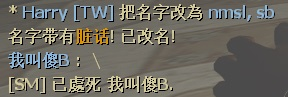

# Description | 內容
Kick player or change name if has invalid or dirty name

> __Note__ <br/>
This plugin is private, Please contact [me](/#私人插件列表-private-plugins-list)<br/>
此為私人插件, 請聯繫[本人](/#私人插件列表-private-plugins-list)

* Apply to | 適用於
    ```
    Any Source Game
    ```

* Image
    <br/>
    <br/>

* <details><summary>How does it work?</summary>

    * Punish player whose name has dirty word (Ban, Kick, Slay....)
    * Modify dirty word table in [configs/smd_invalid_name.cfg](configs/smd_invalid_name.cfg)
</details>

* Require | 必要安裝
    1. [[INC] Multi Colors](https://github.com/fbef0102/L4D1_2-Plugins/releases/tag/Multi-Colors)

* <details><summary>ConVar | 指令</summary>

    * cfg/sourcemod/smd_invalid_name.cfg
        ```php
        // 0=Plugin off, 1=Plugin on.
        smd_invalid_name_enable "1"

        // If 1, Remove all whitespace
        smd_invalid_name_remove_white_space "1"
        ```
</details>

* <details><summary>Data Config</summary>

    * [configs/smd_invalid_name.cfg](configs/smd_invalid_name.cfg)
        > Manual in this file, click for more details...
</details>

* <details><summary>Related | 相關插件</summary>

    1. [sm_regexfilter](/Source_插件/Anti_Griefer_防惡意路人/sm_regexfilter): Filter dirty words via Regular Expressions
        * 禁詞表，任何人打字說出髒話或敏感詞彙，字詞會被屏蔽、禁言並處死玩家
</details>

* <details><summary>Changelog | 版本日誌</summary>

    * v1.1 (2025-2-26)
        * Fixed error

    * v1.0 (2024-1-31)
        * Initial Release
</details>

- - - -
# 中文說明
名字封鎖表，任何人的名字有髒話或敏感詞彙，會踢出玩家或幫玩家改名

* 圖示
    <br/>
    <br/>

* 原理
    * 只要名字有的字詞符合禁詞表內任何一個詞彙，屏蔽字詞並懲罰玩家或幫玩家改名
    * 禁詞表位於[configs/smd_invalid_name.cfg](configs/smd_invalid_name.cfg)，可自行增修
    * 英文字母與西里爾文字(俄文)也適用，自動偵測大小寫

* 用意在哪?
    * 懲罰惡意改名來亂的玩家

* <details><summary>指令中文介紹 (點我展開)</summary>

    * cfg/sourcemod/smd_invalid_name.cfg
        ```php
        // 0=關閉插件, 1=啟動插件
        smd_invalid_name_enable "1"

        // 為1時，忽略空白符號
        smd_invalid_name_remove_white_space "0"
        ```
</details>

* <details><summary>文件設定範例</summary>

    * 禁詞表可自行增修
    * 可設置權限，管理員的名字不會受到插件的審查
    * 敏感字詞可以用其他文字和諧取代
    * [configs/smd_invalid_name.cfg](configs/smd_invalid_name.cfg)
        > 內有中文說明，可點擊查看
</details>

