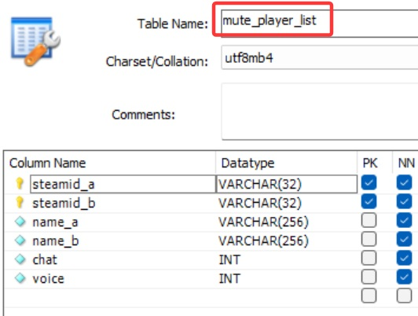

# Description | 內容
Player can personally mute someone chat text and mic voice.

> __Note__ <br/>
This plugin is private, Please contact [me](/#私人插件列表-private-plugins-list)<br/>
此為私人插件, 請聯繫[本人](/#私人插件列表-private-plugins-list)

* Apply to | 適用於
	```
	Any source game
	```
	
* [Video | 影片展示](https://youtu.be/U-ncYt-JVWQ)

* Image
	* Personal mute list
	<br/>
	<br/>
	* Support Database (MySQL & SQLite)
	<br/>

* <details><summary>How does it work?</summary>

	* Type ```!mutemenu``` -> Display Menu -> choose player
		* Mute player mic voice: you won't hear this player's mic voice
		* Mute player chat text: you won't see this player's context in chatbox
	* Support Database (MySQL & SQLite)
		* The player can have same personal mute list even if server restart or disconnect from server.
	* Admin won't be muted, check cvars
</details>

* <details><summary>How to Set Database</summary>

	* Choose one of the following method
		1. MySQL: Database across server, set ConVar ```smd_mute_player_list_database "mute_player_list"``` and write the following in ```sourcemod/configs/databases.cfg```
			```php
			// There would a data table named "mute_player_list" in database
			"mute_player_list"
			{
				"driver"			"mysql"
				"host"				"x.x.x.x"
				"database"			"yourdatabase"
				"user"				"youruser"
				"pass"				"yourpass"
				"port"				"yourport"
			}
			```

		2. SQLite: Local Database, set ConVar ```smd_mute_player_list_database "mute_player_list""``` and write the following in ```sourcemod/configs/databases.cfg```
			```php
			// There would be a file created: sourcemod/data/sqlite/mute_player_list.sq3
			"mute_player_list"
			{
				"driver"			"sqlite"
				"database"			"mute_player_list"
			}
			```
</details>

* Require | 必要安裝
	1. [[INC] Multi Colors](https://github.com/fbef0102/L4D1_2-Plugins/releases/tag/Multi-Colors)
	2. [simple_chatprocessor](https://github.com/fbef0102/Sourcemod-Plugins/tree/main/simple_chatprocessor)

* <details><summary>ConVar | 指令</summary>

	* cfg/sourcemod/smd_mute_player_list.cfg
		```php
		// 0=Plugin off, 1=Plugin on.
		smd_mute_player_list_enable "1"

		// Changes how message displays. (0: Disable, 1:In chat, 2: In Hint Box, 3: In center text)
		smd_mute_player_list_announce_type "1"

		// Players with these flags can use mute voice list. (Empty = Everyone, -1: Nobody)
		smd_mute_player_list_flag_voice ""

		// Players with these flags can use mute chat list. (Empty = Everyone, -1: Nobody)
		smd_mute_player_list_flag_chat ""

		// Players with these flags will not be in the mute voice list. (Empty = Everyone, -1: Nobody)
		smd_mute_player_list_ignore_flag_voice "z"

		// Players with these flags will not be in the mute chat list. (Empty = Everyone, -1: Nobody)
		smd_mute_player_list_ignore_flag_chat "z"

		// Database to save personal mute list. (MySQL & SQLite supported)
		smd_mute_player_list_database "mute_player_list"
		```
</details>

* <details><summary>Command | 命令</summary>

	* **Open menu to mute other player's chat text and mic voice**
		```php
		sm_mutemenu
		```
</details>
	
* Translation Support | 支援翻譯
	```
	translations/smd_mute_player_list.phrases.txt
	```

* <details><summary>Changelog | 版本日誌</summary>

	* v1.6 (2025-11-24)
		* Update translation, cvars
		* Remove data file
		* Support database (MySQL & SQLite)

	* v1.5 (2025-1-8)
		* Fixed error

	* v1.4 (2024-12-7)
		* Update cvars
		* Update translation

	* v1.3 (2024-12-6)
		* Save player's mute list in data file
		* The player can have same personal mute list even if server restart or disconnect from server.

	* v1.2 (2024-8-3)
		* Require simple_chatprocessor 1.8h or above

	* v1.1 (2023-3-13)
		* Admin will not be blocked and muted by other players.

	* v1.0 (2023-3-12)
		* Initial Release
</details>

- - - -
# 中文說明
玩家可以在個人列表上封鎖其他人的語音與聊天文字

* 圖示
	* 封鎖菜單
	<br/>
	<br/>
	* 使用資料庫保存玩家的封鎖名單 (支援 MySQL & SQLite)
	<br/>

* 原理
	* 每一位玩家可以輸入```!mutemenu```，選擇其他玩家採取動作
		* 封鎖語音: 聽不見這位玩家發出的語音 (其他人依然能聽見)
		* 封鎖聊天文字: 看不見這位玩家輸入的聊天文字 (其他人依然能看見)
	* 使用資料庫保存玩家的封鎖名單 (支援 MySQL & SQLite)
		* 即使玩家離開或伺服器重啟，下次加入遊戲依然保留個人的封鎖名單
	* 管理員不會被封鎖，詳細請查看指令

* 用意在哪?
	* 經常有惡意路人進來播放音樂或者輸入文字打廣告，這時候管理員不一定每次都在伺服器裡面
	* 提供玩家自行選擇封鎖對方的語音或聊天文字，讓玩家開心玩遊戲

* <details><summary>如何設定資料庫</summary>

	* 以下方法二選一
		1. MySQL: 支援跨伺服器儲值，設定指令 ``````smd_mute_player_list_database "mute_player_list"``````，然後設定文件 ```sourcemod/configs/databases.cfg```
			```php
			// 資料庫中自動創建表格，名稱是 "mute_player_list"
			"mute_player_list"
			{
				"driver"			"mysql"
				"host"				"x.x.x.x"
				"database"			"yourdatabase"
				"user"				"youruser"
				"pass"				"yourpass"
				"port"				"yourport"
			}
			```
			
		2. SQLite: 本地資料庫儲值，設定指令 ```md_mute_player_list_database "mute_player_list"```，然後設定文件 ```sourcemod/configs/databases.cfg```
			```php
			// 自動創建檔案: sourcemod/data/sqlite/mute_player_list.sq3
			"mute_player_list"
			{
				"driver"			"sqlite"
				"database"			"mute_player_list"
			}
			```
</details>

* <details><summary>指令中文介紹 (點我展開)</summary>

	* cfg/sourcemod/smd_mute_player_list.cfg
		```php
		// 0=關閉插件, 1=啟動插件
		smd_mute_player_list_enable "1"

		// 提示該如何顯示. (0: 不提示, 1: 聊天框, 2: 黑底白字框, 3: 螢幕正中間)
		smd_mute_player_list_announce_type "1"

		// 擁有這些權限的玩家，可以使用"封鎖語音" (留白 = 任何人都能使用, -1:所有人不能使用)
		smd_mute_player_list_flag_voice ""

		// 擁有這些權限的玩家，可以使用"封鎖聊天文字" (留白 = 任何人都能使用, -1:所有人不能使用)
		smd_mute_player_list_flag_chat ""

		// 擁有這些權限的玩家，不會被其他玩家封鎖語音 (留白 = 任何人都不會被封鎖, -1:所有人都可以被封鎖)
		smd_mute_player_list_ignore_flag_voice "z"

		// 擁有這些權限的玩家，不會被其他玩家封鎖聊天文字 (留白 = 任何人都不會被封鎖, -1:所有人都可以被封鎖)
		smd_mute_player_list_ignore_flag_chat "z"

		// 儲存玩家的封鎖清單數據庫. (支援 MySQL & SQLite)
		smd_mute_player_list_database "mute_player_list"
		```
</details>

* <details><summary>命令中文介紹 (點我展開)</summary>

	* **打開選單，選擇其他玩家採取動作，封鎖語音或聊天文字**
		```php
		sm_mutemenu
		```
</details>