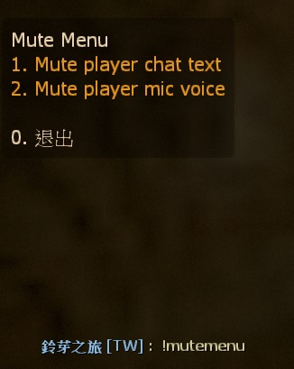
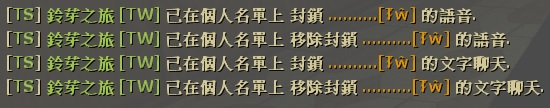

# Description | 內容
Player can personally mute someone chat text and mic voice.

> __Note__ <br/>
This plugin is private, Please contact [me](https://github.com/fbef0102/Game-Private_Plugin#私人插件列表-private-plugins-list)<br/>
此為私人插件, 請聯繫[本人](https://github.com/fbef0102/Game-Private_Plugin#私人插件列表-private-plugins-list)

* [Video | 影片展示](https://youtu.be/U-ncYt-JVWQ)

* Image
	<br/>
	<br/>

* Apply to | 適用於
	```
	Any source game
	```

* <details><summary>How does it work?</summary>

	* Type ```!mutemenu``` -> Display Menu -> choose player
		* Mute player mic voice: you won't hear this player's mic voice
		* Mute player chat text: you won't see this player's context in chatbox
	* Save player's mute list in data file: [data/smd_mute_player_list.cfg](data/smd_mute_player_list.cfg)
		* The player can have same personal mute list even if server restart or disconnect from server.
		* DO NOT MODIFY data file unlesss you know what you are doing
	* Admin won't be muted
</details>

* Require | 必要安裝
	1. [[INC] Multi Colors](https://github.com/fbef0102/L4D1_2-Plugins/releases/tag/Multi-Colors)
	2. [simple_chatprocessor](https://github.com/fbef0102/Sourcemod-Plugins/tree/main/simple_chatprocessor)

* <details><summary>ConVar | 指令</summary>

	* cfg/sourcemod/smd_mute_player_list.cfg
		```php
		// 0=Plugin off, 1=Plugin on.
		smd_mute_player_list_enable "1"

		// Changes how message displays. (0: Disable, 1:In chat, 2: In Hint Box, 3: In center text)
		smd_mute_player_list_announce_type "1"

		// Players with these flags can use mute voice list. (Empty = Everyone, -1: Nobody)
		smd_mute_player_list_flag_voice ""

		// Players with these flags can use mute chat list. (Empty = Everyone, -1: Nobody)
		smd_mute_player_list_flag_chat ""

		// Players with these flags will not be in the mute voice list. (Empty = Everyone, -1: Nobody)
		smd_mute_player_list_ignore_flag_voice "z"

		// Players with these flags will not be in the mute chat list. (Empty = Everyone, -1: Nobody)
		smd_mute_player_list_ignore_flag_chat "z"

		// If 1, save player's personal mute list in data file: data/smd_mute_player_list.cfg
		// The player can have same personal mute list even if server restart or disconnect from server.
		smd_mute_player_list_save_data "1"
		```
</details>

* <details><summary>Command | 命令</summary>

	* **Open menu to mute other player's chat text and mic voice**
		```php
		sm_mutemenu
		```
</details>

* <details><summary>Data Config</summary>

	* [data/smd_mute_player_list.cfg](data/smd_mute_player_list.cfg)
	* DO NOT MODIFY this file unlesss you know what you are doing
		```php
		"smd_mute_player_list"
		{
			// Player A Steam ID 64
			"76561198026784913"
			{
				// Player A Name
				"Name"		"HarryPotter_"

				// Player A's personal mute mic list
				// Player A personally mute Player B's mic voice
				"mute_mic"
				{
					// Player B Steam ID 64
					"76561198835850999" 
					{
						// Player B Name
						"Name"		"I am Retarded"
					}
					"1234567890"
					{
						"Name"		"xxxxxx"
					}
				}

				// Player A's personal mute chat list
				// Player A personally mute Player B's mic chat text
				"mute_chat"
				{
					// Player B Steam ID 64
					"76561198835850999"
					{
						// Player B Name
						"Name"		"I am Retarded"
					}
					"1234567890"
					{
						"Name"		"xxxxxx"
					}
				}
			}
		}
		```
</details>
	
* <details><summary>Translation Support | 支援翻譯</summary>

	```
	English
	繁體中文
	简体中文
	```
</details>

* <details><summary>Changelog | 版本日誌</summary>

	* v1.4 (2024-12-7)
		* Update cvars
		* Update translation

	* v1.3 (2024-12-6)
		* Save player's mute list in data file
		* The player can have same personal mute list even if server restart or disconnect from server.

	* v1.2 (2024-8-3)
		* Require simple_chatprocessor 1.8h or above

	* v1.1 (2023-3-13)
		* Admin will not be blocked and muted by other players.

	* v1.0 (2023-3-12)
		* Initial Release
</details>

- - - -
# 中文說明
玩家可以在個人列表上封鎖其他人的語音與聊天文字

* 圖示
	<br/>
	<br/>

* 原理
	* 每一位玩家可以輸入```!mutemenu```，選擇其他玩家採取動作
		* 封鎖語音: 聽不見這位玩家發出的語音 (其他人依然能聽見)
		* 封鎖聊天文字: 看不見這位玩家輸入的聊天文字 (其他人依然能看見)
	* 儲存玩家的封鎖表於文件: [data/smd_mute_player_list.cfg](data/smd_mute_player_list.cfg)
		* 即使玩家離開或伺服器重啟，下次加入遊戲依然保留個人的封鎖表
		* 不要修改此文件除非你知道這是在幹嗎
	* 管理員不會被封鎖

* 用意在哪?
	* 經常有惡意路人進來播放音樂或者輸入文字打廣告，這時候管理員不一定每次都在伺服器裡面
	* 提供玩家自行選擇封鎖對方的語音或聊天文字，讓玩家開心玩遊戲

* <details><summary>指令中文介紹 (點我展開)</summary>

	* cfg/sourcemod/smd_mute_player_list.cfg
		```php
		// 0=關閉插件, 1=啟動插件
		smd_mute_player_list_enable "1"

		// 提示該如何顯示. (0: 不提示, 1: 聊天框, 2: 黑底白字框, 3: 螢幕正中間)
		smd_mute_player_list_announce_type "1"

		// 擁有這些權限的玩家，可以使用"封鎖語音" (留白 = 任何人都不會被封鎖, -1:任何人都可以被封鎖)
		smd_mute_player_list_flag_voice ""

		// 擁有這些權限的玩家，可以使用"封鎖聊天文字" (留白 = 任何人都不會被封鎖, -1:任何人都可以被封鎖)
		smd_mute_player_list_flag_chat ""

		// 擁有這些權限的玩家，不會被其他玩家封鎖語音 (留白 = 任何人都不會被封鎖, -1:任何人都可以被封鎖)
		smd_mute_player_list_ignore_flag_voice "z"

		// 擁有這些權限的玩家，不會被其他玩家封鎖聊天文字 (留白 = 任何人都不會被封鎖, -1:任何人都可以被封鎖)
		smd_mute_player_list_ignore_flag_chat "z"

		// 為1時，儲存玩家的封鎖表於文件: data/smd_mute_player_list.cfg
		// 即使玩家離開或伺服器重啟，下次加入遊戲依然保留個人的封鎖表
		smd_mute_player_list_save_data "1"
		```
</details>

* <details><summary>命令中文介紹 (點我展開)</summary>

	* **打開選單，選擇其他玩家採取動作，封鎖語音或聊天文字**
		```php
		sm_mutemenu
		```
</details>

* <details><summary>數據文件</summary>

	* [data/smd_mute_player_list.cfg](data/smd_mute_player_list.cfg)
	* 不要修改此文件除非你知道這是在幹嗎
		```php
		"smd_mute_player_list"
		{
			// 玩家A的Steam ID 64
			"76561198026784913"
			{
				// 玩家A的名稱
				"Name"		"HarryPotter_"

				// 玩家A的個人封鎖語音列表
				// 玩家A對玩家B封鎖語音
				"mute_mic"
				{
					// 玩家B的Steam ID 64
					"76561198835850999" 
					{
						// 玩家B的名稱
						"Name"		"智障俄羅斯玩家"
					}
					"1234567890"
					{
						"Name"		"xxxxxx"
					}
				}

				// 玩家A的個人封鎖聊天文字列表
				// 玩家A對玩家B封鎖聊天文字
				"mute_chat"
				{
					// 玩家B的Steam ID 64
					"76561198835850999"
					{
						// 玩家B的名稱
						"Name"		"智障俄羅斯玩家"
					}
					"1234567890"
					{
						"Name"		"xxxxxx"
					}
				}
			}
		}
		```
</details>