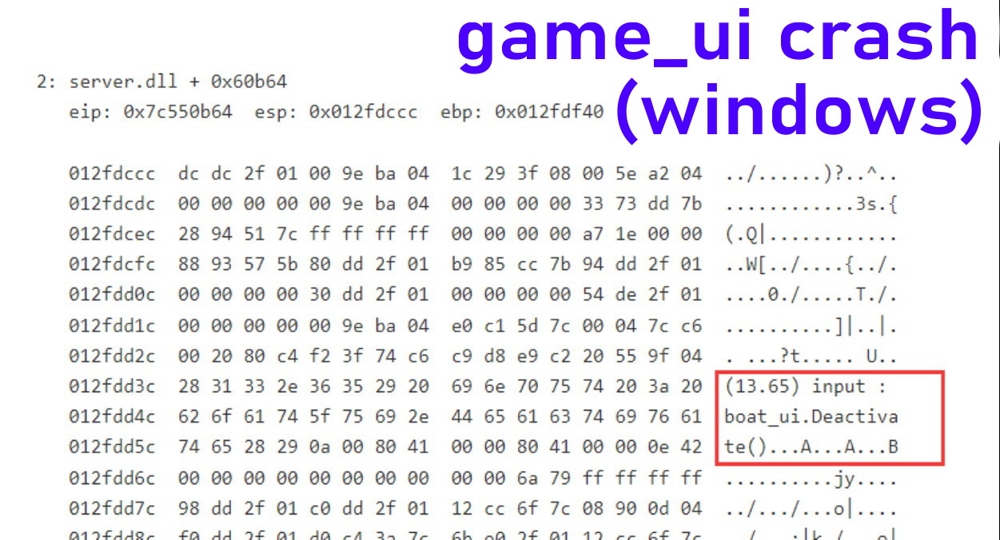
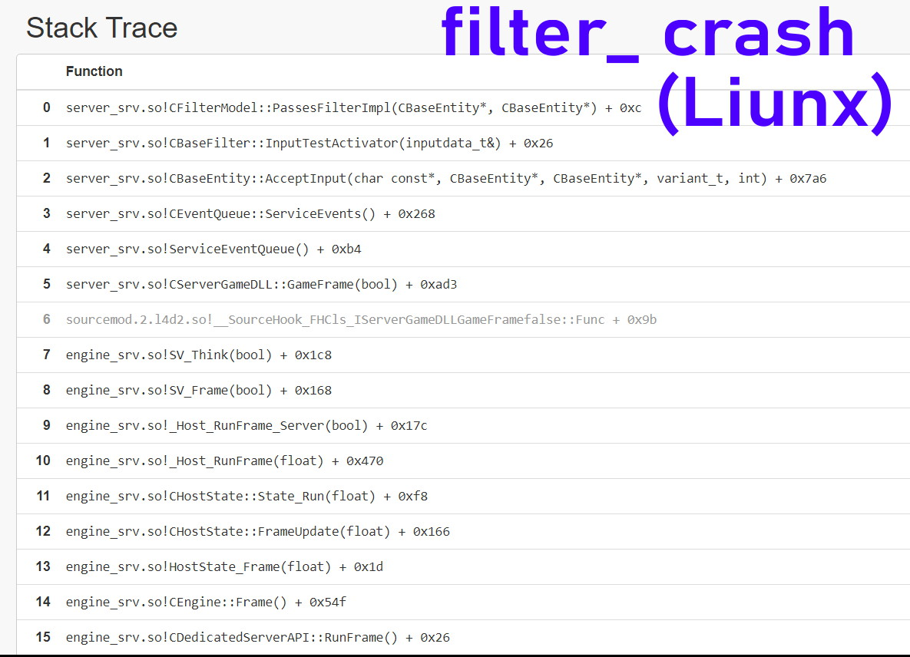
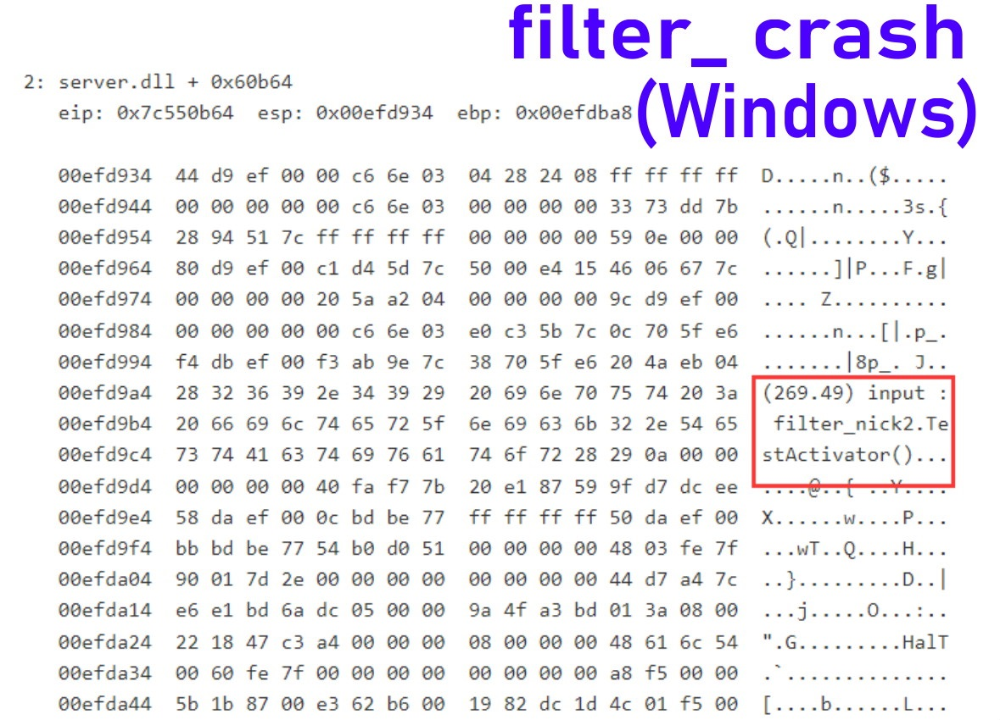
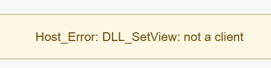
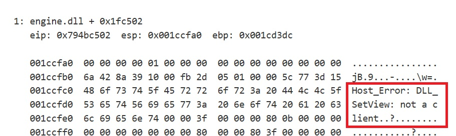

# Description | 內容
Fixes a crash due to null/invalid activator in source engine game entities inputs

* Apply to | 適用於
    ```
    L4D1
    L4D2
    Counter Strike: Source
    Day of Defeat: Source
    Half-Life 2: Deathmatch
    Team Fortress 2
    Black Mesa
    Insurgency
    ```

* <details><summary>Image | 圖示</summary>

    * game_ui crash
    <br/>
    <br/>
    * filter_activator_model crash
    <br/>
    <br/>
    * Camera entity crash
    <br/>
    <br/>
</details>

* <details><summary>How does it work?</summary>

    * Fix the following entities that could cause server crash in any source engine game
        * The game will crash if the Deactivate input is fired on a game_ui that was activated by a player who has since disconnected
            1. [game_ui](https://developer.valvesoftware.com/wiki/Game_ui) entities. More information [here](https://forums.alliedmods.net/showthread.php?t=261039)
        * Filter entities, Calling this input will cause the server to crash if the activator entity no longer exists.
            1. [filter_activator_class](https://developer.valvesoftware.com/wiki/Filter_activator_class) entities.
            2. [filter_activator_context](https://developer.valvesoftware.com/wiki/Filter_activator_context) entities.
            3. [filter_activator_infected_class](https://developer.valvesoftware.com/wiki/Filter_activator_infected_class) entities.
            4. [filter_activator_mass_greater](https://developer.valvesoftware.com/wiki/Filter_activator_mass_greater) entities.
            5. [filter_activator_model](https://developer.valvesoftware.com/wiki/Filter_activator_model) entities.
            6. [filter_activator_name](https://developer.valvesoftware.com/wiki/Filter_activator_name) entities.
            7. [filter_activator_team](https://developer.valvesoftware.com/wiki/Filter_activator_team) entities.
            8. [filter_base](https://developer.valvesoftware.com/wiki/Filter_base) entities.
            9. [filter_damage_type](https://developer.valvesoftware.com/wiki/Filter_damage_type) entities.
            10. [filter_enemy](https://developer.valvesoftware.com/wiki/Filter_enemy) entities.
            11. [filter_health](https://developer.valvesoftware.com/wiki/Filter_health) entities.
            12. [filter_melee_damage](https://developer.valvesoftware.com/wiki/Filter_melee_damage) entities.
            13. [filter_multi](https://developer.valvesoftware.com/wiki/Filter_multi) entities.
        * Camera entity, cause the server to crash if the activator is not a client
            1. [point_viewcontrol](https://developer.valvesoftware.com/wiki/Point_viewcontrol)
            2. [point_viewcontrol_survivor](https://developer.valvesoftware.com/wiki/Point_viewcontrol_survivor)
            3. [point_viewcontrol_multiplayer](https://developer.valvesoftware.com/wiki/Point_viewcontrol_multiplayer)
</details>

* Require | 必要安裝
<br/>None

* <details><summary>Changelog | 版本日誌</summary>

    * v1.1h (2025-10-8)
        * Support any source game
        * Fix point_viewcontrol crash if the activator is not a client

    * v1.0h (2024-3-22)
        * Fixed incorrect offset in l4d2
        * Add support in l4d1
        * Update gamedata
        * Remake code, convert code to latest syntax
        * Fix warnings when compiling on SourceMod 1.11.
        * Fix Filter_xx entities crash

    * v1.0.0
        * [Original Plugin by GoD-Tony](https://forums.alliedmods.net/showthread.php?t=261173)
</details>

- - - -
# 中文說明
修復物件不存在或不合法或玩家離開伺服器，實體輸入所造成的崩潰 (常見於三方地圖)

* 原理
    * 這是所有source引擎的遊戲都會有的bug
    * <details><summary>修復以下實體所造成的崩潰</summary>

        * 當正在操控的玩家突然離開遊戲時，伺服器會立刻崩潰. (常見於三方圖)
            1. [```game_ui```](https://developer.valvesoftware.com/wiki/Game_ui): 反應玩家的鍵盤或滑鼠，用來操控譬如直升機、車子之類的載具
        * 過濾物件 (常見於三方圖)，如果 activator 物件不存在，呼叫TestActivator輸入將導致伺服器崩潰。
            1. [```filter_activator_class```](https://developer.valvesoftware.com/wiki/Filter_activator_class)
            2. [```filter_activator_context```](https://developer.valvesoftware.com/wiki/Filter_activator_context)
            3. [```filter_activator_infected_class```](https://developer.valvesoftware.com/wiki/Filter_activator_infected_class)
            4. [```filter_activator_mass_greater```](https://developer.valvesoftware.com/wiki/Filter_activator_mass_greater)
            5. [```filter_activator_model```](https://developer.valvesoftware.com/wiki/Filter_activator_model)
            6. [```filter_activator_name```](https://developer.valvesoftware.com/wiki/Filter_activator_name)
            7. [```filter_activator_team```](https://developer.valvesoftware.com/wiki/Filter_activator_team)
            8. [```filter_base```](https://developer.valvesoftware.com/wiki/Filter_base)
            9. [```filter_damage_type```](https://developer.valvesoftware.com/wiki/Filter_damage_type)
            10. [```filter_enemy```](https://developer.valvesoftware.com/wiki/Filter_enemy)
            11. [```filter_health```](https://developer.valvesoftware.com/wiki/Filter_health)
            12. [```filter_melee_damage```](https://developer.valvesoftware.com/wiki/Filter_melee_damage)
            13. [```filter_multi```](https://developer.valvesoftware.com/wiki/Filter_multi)
        * 鏡頭實體，如果 activator 物件不是玩家，將導致伺服器崩潰。
            1. [point_viewcontrol](https://developer.valvesoftware.com/wiki/Point_viewcontrol)
            2. [point_viewcontrol_survivor](https://developer.valvesoftware.com/wiki/Point_viewcontrol_survivor)
            3. [point_viewcontrol_multiplayer](https://developer.valvesoftware.com/wiki/Point_viewcontrol_multiplayer)
    </details>